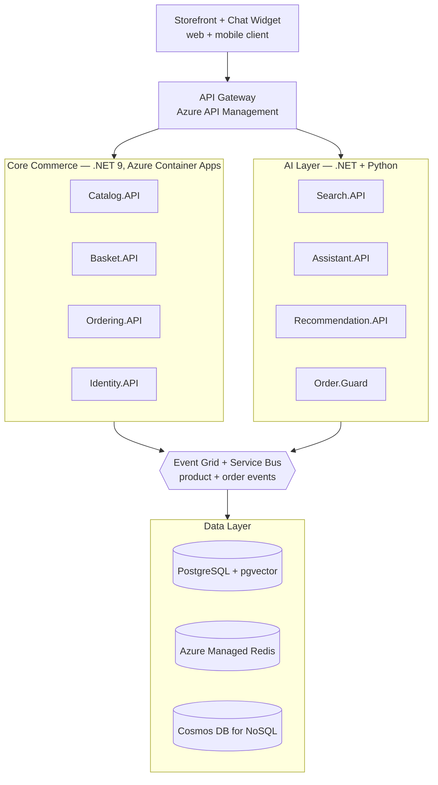

# AI-200 & Rancangan "eShop.AI" — Catatan

> Konteks: Microsoft Certified: Azure AI Cloud Developer Associate (AI-200) · AI · Azure · C# · Python
> Dibuat: 21 Juli 2026

---

## 1. Asumsi: arah yang didorong Microsoft lewat AI-200

Sumber: [Study guide resmi Exam AI-200](https://learn.microsoft.com/credentials/certifications/resources/study-guides/ai-200). Sertifikasi ini **masih sangat baru** — beta sejak Mei 2026, GA sekitar Juli 2026.

Fakta kunci:

- **AI-200 ("Developing AI Cloud Solutions on Azure") bukan sertifikasi tambahan — ini PENERUS LANGSUNG AZ-204 / Azure Developer Associate**, yang resmi pensiun 31 Juli 2026. Sinyal paling kuat: Microsoft sudah tidak menganggap "developer Azure" dan "developer AI" sebagai dua profil terpisah. Baseline sertifikasi developer Azure yang baru, isinya solusi AI.
- Empat domain skill dan bobotnya:
  1. **Develop containerized solutions on Azure (20–25%)** — Azure Container Registry, App Service, Container Apps + revisions, **KEDA event-driven autoscaling**, AKS.
  2. **AI solutions via Azure data management services (25–30%, porsi TERBESAR)** — spesifik ke tiga data store:
     - **Cosmos DB for NoSQL** (vector search / embeddings)
     - **Azure Database for PostgreSQL** (pgvector + pola RAG dengan metadata filter)
     - **Azure Managed Redis** (vector indexing)
  3. **Connect to and consume Azure services (20–25%)** — Service Bus, Event Grid, Azure Functions.
  4. **Secure, monitor, troubleshoot (20–25%)** — Key Vault, App Configuration, OpenTelemetry, KQL.
- **Prompt engineering, dasar Azure OpenAI, atau framework orchestration (Semantic Kernel / AI Foundry Agent Service) TIDAK masuk daftar skill ini.** Itu wilayah AI-102/AI-900. AI-200 sengaja diposisikan sebagai **lapisan plumbing di belakang aplikasi AI** — komponen AI/LLM-nya diasumsikan sudah ada; yang diuji adalah kemampuan men-deploy, menyimpan/mengambil data vektor, mengalirkan event, mengamankan, dan memonitornya secara production-grade.

**Kesimpulan asumsi:** Microsoft mendorong developer .NET/Azure generalis (dulu cukup modal AZ-204) naik kelas jadi **"AI-native backend engineer"** — bukan data scientist, bukan prompt engineer, tapi orang yang tahu membangun fondasi cloud (data vektor, eventing, container elastic, keamanan, observability) agar fitur RAG/agentic beneran stabil di production, bukan cuma demo di notebook.

---

## 2. Role-play: rancangan "eShop.AI" ala lulusan AI-200

Prinsip: pertahankan tulang punggung eShop asli (microservices per bounded context, DDD di Ordering, event bus) tapi tambahkan lapisan AI yang memetakan langsung ke 4 domain skill AI-200 di atas — bukan sekadar "tempel chatbot".

### Diagram arsitektur

### Core Commerce (tetap C#/.NET 9, mirror eShop asli)

- `Catalog.API`, `Basket.API`, `Ordering.API` (DDD, saga status pesanan), `Identity.API` (Microsoft Entra External ID), `Payment.API` — tidak banyak berubah dari eShop asli.

### Lapisan AI baru (di sinilah skill AI-200 dipakai konkret)

- **`Catalog.Indexer`** — Azure Function event-driven (subscribe `ProductCreated/Updated` dari Event Grid), panggil embedding model, tulis vector ke kolom pgvector di Postgres yang sama. Scale-to-zero saat idle, KEDA scale-out saat bulk import → praktik langsung domain #1 (containerized + event-driven scaling).
- **`Search.API`** — hybrid search (full-text + vector similarity) dengan metadata filter (kategori, rentang harga) ke Postgres/pgvector.
- **`Assistant.API`** — asisten belanja RAG: query → vector search → augment prompt → panggil Azure OpenAI → stream jawaban.
- **`Recommendation.API`** — sengaja di Python (FastAPI), sesuai poin "Python programming" di audience profile AI-200. Cache hasil di Azure Managed Redis vector index untuk latency rendah.
- **`Order.Guard`** — Function yang subscribe `OrderPlaced` lewat **Service Bus** (bukan Event Grid) karena butuh dead-letter queue & retry yang reliable untuk deteksi fraud/anomali.

### Data layer — tiga store yang eksplisit disebut AI-200, tiap store sesuai use case

| Store | Dipakai untuk | Alasan |
|---|---|---|
| Postgres + pgvector | Catalog, Search | Data terstruktur, extension tinggal nempel di DB relational yang sudah ada |
| Azure Managed Redis (vector) | Basket, Recommendation | Butuh latency serendah mungkin |
| Cosmos DB for NoSQL (vector) | Riwayat Ordering / log chat Assistant | Schema fleksibel, perlu scale global |

### Eventing

- **Event Grid** — event ringan, banyak subscriber (indexing produk).
- **Service Bus** — proses yang butuh urutan & keandalan (lifecycle order, fraud check, dead-letter).

### Hosting

- Default ke **Azure Container Apps** (revisions untuk blue-green, KEDA untuk autoscale) — AKS baru dipertimbangkan kalau butuh kontrol lebih detail.
- `.NET Aspire` tetap dipakai untuk orkestrasi lokal + service defaults (health check, OpenTelemetry bawaan).

### Security & Observability

- **Key Vault** — API key Azure OpenAI, connection string, akses via Managed Identity (no secret in code).
- **App Configuration** — feature flag nyala/matiin Assistant per region.
- **OpenTelemetry** di semua service → satu trace utuh dari "user tanya assistant" → vector search → panggilan LLM → jawaban balik.
- **Dashboard KQL** untuk biaya token & tingkat halusinasi jawaban.

### Yang masih jadi PR (karena ini "baru rencana", bukan keputusan final)

- Cosmos DB vs tetap Postgres semua untuk Ordering — trade-off konsistensi vs fleksibilitas belum ditimbang serius.
- ACA vs AKS tergantung skala tim ops yang sebenarnya.
- Estimasi biaya token Azure OpenAI perlu dihitung dulu sebelum Assistant di-scale ke semua traffic.
- Evaluasi kualitas RAG (groundedness/relevansi) perlu ada sebelum rilis — fitur AI yang "nyala doang" tanpa evaluasi itu risiko, bukan fitur.

---

## Sumber

- [Study guide for Exam AI-200: Developing AI Cloud Solutions on Azure](https://learn.microsoft.com/credentials/certifications/resources/study-guides/ai-200)
- [New Microsoft Certified: Azure AI Cloud Developer Associate Certification](https://techcommunity.microsoft.com/blog/skills-hub-blog/new-microsoft-certified-azure-ai-cloud-developer-associate-certification/4494116)
- [Microsoft Certified: Azure AI Cloud Developer Associate – Certifications | Microsoft Learn](https://learn.microsoft.com/en-us/credentials/certifications/azure-ai-cloud-developer-associate/)
- [July 2026 announcements — Partner Center (AZ-204 retirement)](https://learn.microsoft.com/partner-center/announcements/2026-july#monthly-microsoft-ai-cloud-partner-program-update)
- Referensi desain: [dotnet/eshop](https://github.com/dotnet/eshop)
