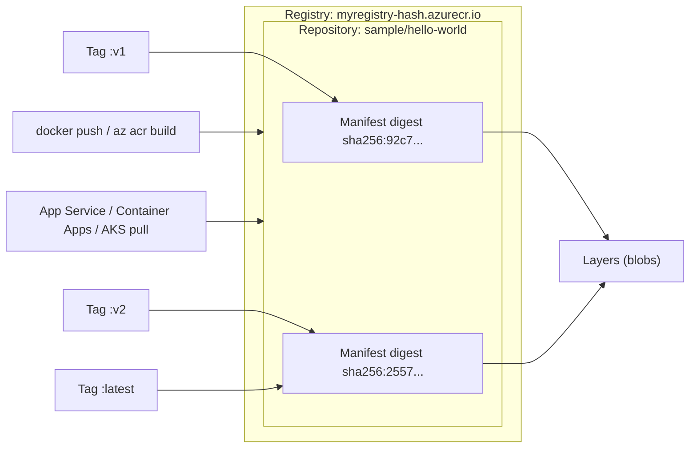

# Azure Container Registry (ACR) + ACR Tasks

> Domain: 1 — Develop containerized solutions on Azure (20–25%)
> Exam: AI-200 — Developing AI Cloud Solutions on Azure
> Status: Draft
> Last reviewed: 2026-07-15
> [← Kembali ke README](README.md)

## 1. Posisi Topik dalam Exam

ACR adalah fondasi seluruh Domain 1: sebelum bisa deploy ke App Service, Container Apps, atau AKS, image harus dibangun dan disimpan di registry privat. Study guide memetakan topik ini pada subheading **"Implement container application hosting"** dengan dua bullet (SRC-002):

| Bullet resmi (parafrase) | Coverage matrix |
|---|---|
| Build, store, version, dan manage container images menggunakan Azure Container Registry | #1 |
| Build dan run images menggunakan Azure Container Registry Tasks | #2 |

Source ID utama: SRC-002 (study guide), SRC-022 (docs hub ACR), SRC-040–SRC-049 (artikel spesifik — lihat [§15](#15-sumber-resmi)).

## 2. Learning Outcomes

Setelah menyelesaikan modul ini, saya mampu:

- Membuat registry dengan pilihan SKU, Domain Name Label (DNL) scope, dan role assignment permissions mode yang tepat, lalu menjelaskan konsekuensi masing-masing pilihan.
- Membedakan registry, repository, image/artifact, manifest, digest, dan tag, serta menerapkan strategi **stable tags vs unique tags** dengan benar.
- Build + push image dengan dua jalur: `docker build`/`docker push` lokal dan **ACR quick task** (`az acr build`) tanpa Docker lokal.
- Menjalankan container di cloud dengan `az acr run` dan menjelaskan tiga jenis ACR Tasks (quick, automatically triggered, multi-step).
- Mengelola image dari Python menggunakan `azure-containerregistry` (list repositories/tags, ubah properti manifest, hapus image).
- Memilih metode autentikasi (individual Entra ID, service principal, managed identity, admin user) dan role RBAC/ABAC dengan least privilege.
- Mendiagnosis masalah login/push/pull dengan `az acr check-health` dan memahami perilaku throttling (HTTP 429).

## 3. Mental Model

**Fakta resmi (SRC-046, SRC-045):** satu **registry** (mis. `myregistry.azurecr.io`) berisi banyak **repository** (mis. `sample/hello-world`); setiap repository berisi image/artifact yang terdiri dari **manifest** (dideskripsikan unik oleh **digest** SHA-256) dan **layers**; satu image dapat memiliki nol atau lebih **tags** (alias yang dapat dibaca manusia). Kumpulan image dengan nama sama tetapi tag berbeda = satu repository.



Penjelasan teks (bila Mermaid tidak dirender): developer mendorong image ke repository di dalam registry, baik lewat `docker push` maupun `az acr build`. Setiap push menghasilkan manifest ber-digest unik; tag hanyalah penunjuk ke satu manifest — dua tag (`:v2` dan `:latest`) bisa menunjuk manifest yang sama, dan layer yang identik dibagi-pakai antar-manifest. Layanan compute (modul d1-02 s.d. d1-04) menarik (pull) image dari registry ini.

Dua bidang operasi yang penting dipisahkan (SRC-043):

- **Control plane** — membuat/mengonfigurasi registry (SKU, network, kebijakan). Role contoh: `Container Registry Contributor and Data Access Configuration Administrator`.
- **Data plane** — push/pull/hapus image di dalam registry. Role contoh: `Container Registry Repository Writer` atau `AcrPush`. Role control plane **tidak otomatis** memberi hak data plane, dan sebaliknya.

## 4. Konsep dan Fitur Kunci

### 4.1 Penamaan registry dan login server (DNL)

**Fakta resmi (SRC-045, SRC-048):**

- Nama registry harus **unik se-Azure, 5–50 karakter alfanumerik** (lowercase pada pembuatan via CLI), **tanpa karakter dash** (`-`).
- **Domain Name Label (DNL)** mencegah *subdomain takeover*: bila registry dihapus dan namanya dipakai ulang pihak lain, DNS name berbeda karena hash unik. Opsi: `Unsecure` (DNS apa adanya, tanpa proteksi), `TenantReuse`, `SubscriptionReuse`, `ResourceGroupReuse`, `NoReuse`.
- Untuk semua opsi selain `Unsecure`, format login server menjadi `registryname-hash.azurecr.io` (mis. `contosoacrregistry-e7ggejfuhzhgedc8.azurecr.io`). **Pilihan DNL scope permanen** — tidak dapat diubah setelah registry dibuat.
- Konsekuensi: referensi downstream (Dockerfile, Kubernetes YAML, Helm chart) harus memakai **login server lengkap termasuk hash**, bukan sekadar nama registry.

### 4.2 Versioning: stable tags vs unique tags

**Fakta resmi (SRC-040):**

- **Stable tags** (mis. `:1`, `:1.0`) — dipakai ulang dan terus menerima update (patch keamanan/framework). Rekomendasi resmi: gunakan untuk **base images**, dan **hindari untuk deployment** karena isi tag bisa berubah dan menimbulkan inkonsistensi antar-node produksi.
- **Unique tags** — tag baru untuk setiap push. Rekomendasi resmi: gunakan untuk **deployments**, terutama pada environment yang scale ke banyak node. Pola: date-time stamp, Git commit (catatan resmi: hanya *semi*-stable karena base image update memakai commit yang sama), manifest digest, atau **build ID** (disebut kemungkinan terbaik karena inkremental dan bisa dikorelasikan ke build).
- Update pada stable tag membuat image lama menjadi **untagged (orphaned) manifest** yang tetap memakan storage — bersihkan berkala via auto-purge atau retention policy (retention policy untuk untagged manifests: fitur Premium, SRC-044).
- **Lock** tag yang sedang dideploy (set atribut `write-enabled` = `false`) agar tidak terhapus tak sengaja — bisa dimasukkan ke release pipeline.

### 4.3 SKU (pricing plan): Basic / Standard / Premium

**Fakta resmi (SRC-044):**

| Aspek | Basic | Standard | Premium |
|---|---|---|---|
| Included storage | 10 GiB | 100 GiB | 500 GiB |
| Storage limit | 40 TiB | 40 TiB | 100 TiB |
| Webhooks | 2 | 10 | 500 |
| Private link/private endpoints | — | — | ✔ |
| Geo-replication | — | — | ✔ |
| Retention policy untagged manifests | — | — | ✔ |
| Anonymous pull access | — | ✔ | ✔ |
| Dedicated agent pools (Tasks) | — | — | ✔ |
| Repository-scoped permissions (Entra ABAC) | ✔ | ✔ | ✔ |

- Ketiga SKU memiliki **programmatic capabilities dan data plane API yang sama**; zone redundancy aktif default di region yang mendukung.
- SKU dapat diubah tanpa downtime (`az acr update --sku Premium`); turun dari Premium mensyaratkan penghapusan fitur khusus Premium (mis. geo-replications) lebih dulu.
- **Rate limits** per SKU (contoh, per registry): DataplaneRead 10.000 r/m (Basic/Standard) vs 20.000 r/m (Premium); pelanggaran → **HTTP `429 Too Many Requests`** dengan header `Retry-After` yang dihitung dinamis (nilainya menghitung mundur). Angka-angka ini best-effort, tidak dijamin SLA.

### 4.4 ACR Tasks

**Fakta resmi (SRC-041, SRC-047):** ACR Tasks = suite fitur build image berbasis cloud (platform Linux, Windows, ARM) dengan tiga skenario:

1. **Quick tasks** — `az acr build`: "docker build, docker push in the cloud", **tanpa instalasi Docker Engine lokal**. Context dikirim ke ACR, image di-build lalu (default) di-push ke registry. `az acr run` menjalankan container/command di cloud (mendukung parameter `docker run`).
2. **Automatically triggered tasks** (`az acr task create`) — trigger: (a) **source code update** di GitHub/Azure DevOps (commit: enabled default; pull request: tidak default; butuh personal access token untuk webhook); (b) **base image update** — otomatisasi patching OS/framework: saat base image di registry atau repo publik diperbarui, application image yang bergantung padanya di-rebuild otomatis; (c) **timer** untuk jadwal.
3. **Multi-step tasks** — workflow YAML multi-langkah (build → run → test → push, dengan dependensi antar-step).

Detail penting lain: context dapat berupa local filesystem, Git repo (branch/subfolder/commit), remote tarball, atau OCI artifact; default platform build Linux/AMD64 (`--platform` untuk lainnya); log run manual di-stream ke console dan tersimpan (`az acr task logs`); **task runs sementara dijeda untuk Azure free credits** (banner resmi per verifikasi 2026-07-15); jangan menaruh secret pada command line/URI karena dapat terekam diagnostic tracing.

**Catatan ABAC penting (SRC-047):** pada registry ABAC-enabled, `az acr build` dan `az acr run` harus diberi flag **`--source-acr-auth-id [caller]`** agar task mengautentikasi memakai identitas pemanggil.

### 4.5 Mengelola image

**Fakta resmi (SRC-045, SRC-046):**

- CLI: `az acr repository list` (daftar repository), `az acr repository show-tags` (daftar tag), `az acr show-usage` (konsumsi storage, SRC-044).
- Python SDK (`azure-containerregistry`, data plane): list repositories, list/ubah properti tag & manifest (`can_write`, `can_delete`), hapus manifest/tag/blob — lihat [§8.7](#87-implementasi-python-sdk).
- Menghapus tag lokal (`docker rmi`) **tidak** menghapus image di registry.

## 5. Decision Guide

| Situasi | Pilihan | Dasar |
|---|---|---|
| Belajar/dev, storage kecil, tanpa network isolation | **Basic** | Fakta SRC-044: entry point cost-optimized, kapabilitas inti sama |
| Produksi umum, butuh anonymous pull atau storage lebih | **Standard** | Fakta SRC-044 |
| Butuh geo-replication, private endpoints, retention policy, agent pools | **Premium** | Fakta SRC-044: fitur-fitur ini hanya Premium |
| Build image tapi tidak ada Docker lokal (mis. Cloud Shell) | **`az acr build`** (quick task) | Fakta SRC-041/SRC-047: build di cloud tanpa Docker Engine lokal |
| Patching OS/framework otomatis saat base image berubah | **ACR task dengan base image trigger** | Fakta SRC-041 |
| CI/CD sudah punya build runner sendiri (GitHub Actions dsb.) | Build di CI/CD, push ke ACR; ACR Tasks tetap unggul untuk base-image-update trigger | **Inferensi teknis** — perbandingan ini tidak dinyatakan eksplisit di dokumentasi yang diverifikasi |
| Deployment produksi multi-node | Deploy dengan **unique tag** (build ID), lock tag ter-deploy | Fakta SRC-040 |
| Base image internal tim | **Stable tag** (`:1`, `:1.0`) yang terus di-service | Fakta SRC-040 |

Pembanding di luar primary exam scope: **Azure Container Instances** dan **Docker Hub** tidak ada pada bullet skills measured AI-200; ACI hanya muncul sebagai target deploy di dokumentasi ACR (**out of primary exam scope** — jangan dijadikan fokus).

## 6. Security

**Fakta resmi (SRC-042, SRC-043):**

### Metode autentikasi

| Metode | Cara | Skenario | RBAC Entra? |
|---|---|---|---|
| Individual Microsoft Entra ID | `az acr login` | Push/pull interaktif developer | Ya (token berlaku **3 jam**) |
| Service principal | `docker login` / `az acr login` | CI/CD headless di luar Azure | Ya (password default expiry 1 tahun) |
| **Managed identity** | `docker login` / `az acr login` | Pull/push unattended dari layanan Azure | Ya (hanya dari layanan Azure yang mendukung) |
| Admin user | `docker login` | Testing; deploy dari Portal ke App Service/ACI | **Tidak** — selalu full push+pull |
| Non-Entra token + scope map | `docker login` | Akses per-repository tanpa Entra | Tidak terintegrasi Entra |

- **Admin account disabled by default** dan direkomendasikan hanya bila perlu (single user, dua password, semua pemakainya tampak sebagai satu identitas). Praktik least privilege: pakai identitas individual + service principal/managed identity.
- `az acr login --expose-token` untuk environment tanpa Docker daemon (username `00000000-0000-0000-0000-000000000000`).

### Role assignment (least privilege)

Perilaku role bergantung **Role assignment permissions mode** registry (SRC-043):

| Kebutuhan | Mode "RBAC Registry + ABAC Repository Permissions" | Mode "RBAC Registry Permissions" (klasik) |
|---|---|---|
| Pull image (deployer, orchestrator) | `Container Registry Repository Reader` (+ ABAC per-repo opsional) | `AcrPull` |
| Push + kelola tag (CI/CD) | `Container Registry Repository Writer` | `AcrPush` |
| Hapus image/tag | `Container Registry Repository Contributor` | `AcrDelete` |
| List semua repository | `Container Registry Repository Catalog Lister` (tidak mendukung ABAC) | (tercakup AcrPull) |
| Kelola ACR Tasks / `az acr build` / `az acr run` | `Container Registry Tasks Contributor` | sama |
| Buat/konfigurasi/hapus registry + `az acr login` | `Container Registry Contributor and Data Access Configuration Administrator` | sama |

Poin yang sering keliru: (1) role data plane ABAC **tidak memberi hak list catalog** — perlu `Catalog Lister` terpisah; (2) role control plane tidak memberi hak pull/push; (3) untuk role assignment dibutuhkan `Owner` atau `Role Based Access Control Administrator` pada registry.

### Network & platform

- Private link/private endpoints dan IP access rules: **Premium** (SRC-044).
- DNL scope melindungi dari subdomain takeover (SRC-045/SRC-048).
- Jangan menaruh credential di command line/URI task — dapat terekam di diagnostic tracing (SRC-041).

## 7. Reliability, Performance, dan Cost

- **Throttling (SRC-044):** limit r/m per kategori operasi per SKU; token bucket — burst singkat ditoleransi, traffic berkelanjutan harus ≤ limit; saat 429, **hormati `Retry-After` + exponential backoff**; identitas anonymous dan admin masing-masing di-throttle sebagai satu identitas.
- **Availability (SRC-044):** zone redundancy default di region yang mendukung (semua SKU); geo-replication (Premium) untuk registry multi-region.
- **Performance (SRC-044):** dipengaruhi jumlah/ukuran layer, layer reuse, konkurensi deploy (mis. banyak node AKS pull serentak) — jeda deployment skala besar bila throttled.
- **Cost drivers (SRC-044):** tarif harian per SKU + storage ekstra per GiB di atas included storage; untagged manifests menumpuk storage (SRC-040) — bersihkan; angka harga selalu cek halaman pricing resmi saat eksekusi.

## 8. Praktik Hands-on

Tujuan lab: buat registry → build+push image via ACR quick task (tanpa Docker lokal) → kelola image via CLI dan Python SDK → bersihkan.

### 8.1 Prasyarat

- Azure subscription dengan izin membuat resource group + registry, dan izin melakukan role assignment pada registry (`Owner`/`Role Based Access Control Administrator` di scope tersebut, SRC-043).
- Azure CLI terpasang dan `az login` berhasil.
- Docker lokal **opsional** — jalur utama lab memakai `az acr build` (SRC-047). Langkah `docker push` alternatif butuh Docker daemon lokal (SRC-045).

### 8.2 Environment dan dependency versions

| Komponen | Nilai | Sumber |
|---|---|---|
| Shell | bash (Linux/macOS/WSL2) | Rekomendasi repo |
| Azure CLI | ≥ 2.0.55 (rekomendasi quickstart); `az acr check-health` butuh ≥ 2.0.67 | SRC-045, SRC-049 |
| Python | ≥ 3.7 (syarat package) — gunakan 3.10+ sesuai manifest repo | SRC-046 |
| `azure-containerregistry` | versi terdokumentasi saat verifikasi: 1.2.0 | SRC-046 |
| `azure-identity` | terbaru (untuk `DefaultAzureCredential`) | SRC-046 |
| Tanggal verifikasi | 2026-07-15 | — |

`requirements.txt`:

```text
azure-containerregistry
azure-identity
```

### 8.3 Resource yang dibuat

Satu resource group `<RESOURCE_GROUP>` berisi satu container registry `<ACR_NAME>` (SKU Basic). Potensi biaya: tarif harian Basic + storage — lihat [Cost guardrails README](README.md#7-cost-and-cleanup-guardrails).

### 8.4 Placeholder dan naming convention

| Placeholder | Contoh | Aturan |
|---|---|---|
| `<RESOURCE_GROUP>` | `rg-ai200-d101` | — |
| `<LOCATION>` | `eastus` | region pilihan Anda |
| `<ACR_NAME>` | `acrai200demo01` | unik se-Azure, 5–50 alfanumerik lowercase, tanpa dash (SRC-045) |
| `<LOGIN_SERVER>` | `acrai200demo01-ab12cd.azurecr.io` | baca dari output `loginServer` — **termasuk hash DNL** |
| `<USER_OBJECT_ID>` | — | object ID identitas Anda di Entra ID |

### 8.5 Langkah Azure Portal

Sesuai quickstart portal (SRC-048): **Create a resource → Infrastructure services → Container Registry → Create**; pilih subscription + resource group; isi **Registry name**; pilih **Location** dan **Pricing plan**; pilih **Domain name label scope** (mis. *Tenant Reuse*); pilih **Role assignment permissions mode** = *RBAC Registry + ABAC Repository Permissions*; **Review + create → Create**. Setelah jadi, buka resource dan catat **Login server**. Daftar image dilihat di **Services → Repositories**.

Portal berguna untuk memahami opsi pembuatan dan inspeksi repository; operasi build/push tetap lewat CLI/SDK — tidak ada nilai belajar tambahan mengulang semuanya di Portal.

### 8.6 Langkah Azure CLI

```bash
# 1. Resource group
az group create --name <RESOURCE_GROUP> --location <LOCATION>

# 2. Registry (Basic; ABAC mode + DNL TenantReuse seperti quickstart resmi)
az acr create --resource-group <RESOURCE_GROUP> \
  --name <ACR_NAME> --sku Basic \
  --role-assignment-mode 'rbac-abac' \
  --dnl-scope TenantReuse
# Catat "loginServer" pada output JSON → <LOGIN_SERVER>

# 3. Role data plane untuk diri sendiri (mode ABAC; least privilege untuk lab ini)
ACR_ID=$(az acr show --name <ACR_NAME> --query id --output tsv)
az role assignment create --assignee <USER_OBJECT_ID> \
  --role "Container Registry Repository Contributor" --scope "$ACR_ID"
az role assignment create --assignee <USER_OBJECT_ID> \
  --role "Container Registry Repository Catalog Lister" --scope "$ACR_ID"

# 4. Dockerfile minimal (contoh resmi quickstart)
echo "FROM mcr.microsoft.com/hello-world" > Dockerfile

# 5. Build + push di cloud (quick task; tanpa Docker lokal).
#    --source-acr-auth-id [caller] wajib pada registry ABAC-enabled.
az acr build --image sample/hello-world:v1 \
  --registry <ACR_NAME> --file Dockerfile . \
  --source-acr-auth-id [caller]

# 6. Jalankan image di cloud (quick run)
az acr run --registry <ACR_NAME> \
  --cmd '$Registry/sample/hello-world:v1' /dev/null \
  --source-acr-auth-id [caller]

# 7. Kelola: list repository dan tag
az acr repository list --name <ACR_NAME> --output table
az acr repository show-tags --name <ACR_NAME> --repository sample/hello-world --output table
```

Alternatif push manual (butuh Docker lokal, SRC-045): `az acr login --name <ACR_NAME>` (bukan login server penuh) → `docker pull mcr.microsoft.com/hello-world` → `docker tag mcr.microsoft.com/hello-world <LOGIN_SERVER>/hello-world:v1` → `docker push <LOGIN_SERVER>/hello-world:v1`.

**Idempotency:** `az group create` dan role assignment aman diulang; `az acr create` dengan nama yang sudah Anda miliki mengembalikan resource yang sama/berhasil tanpa duplikat, tetapi gagal bila nama dipakai akun lain (nama global-unik); `az acr build` yang diulang membuat run baru dan menimpa tag `v1` (manifest lama menjadi untagged — lihat §4.2).

### 8.7 Implementasi Python SDK

Pola sesuai readme resmi SDK (SRC-046) — `DefaultAzureCredential` membaca kredensial dari environment/`az login`:

```python
# manage_acr.py — kelola image ACR via data-plane SDK
from azure.containerregistry import ContainerRegistryClient
from azure.identity import DefaultAzureCredential

endpoint = "https://<LOGIN_SERVER>"          # termasuk hash DNL
audience = "https://management.azure.com"

with ContainerRegistryClient(endpoint, DefaultAzureCredential(), audience=audience) as client:
    # 1) List repositories (butuh role Catalog Lister pada registry ABAC)
    for repository_name in client.list_repository_names():
        print("repository:", repository_name)

    # 2) Properti manifest + daftar tag
    manifest = client.get_manifest_properties("sample/hello-world", "v1")
    print("digest:", manifest.digest)
    print("tags:", manifest.tags)

    # 3) Proteksi tag ter-deploy: kunci dari penulisan/penghapusan (§4.2)
    client.update_manifest_properties(
        "sample/hello-world", "v1", can_write=False, can_delete=False
    )

    # 4) Buka kunci kembali agar cleanup bisa berjalan
    client.update_manifest_properties(
        "sample/hello-world", "v1", can_write=True, can_delete=True
    )

    # 5) Hapus image berdasarkan digest
    client.delete_manifest("sample/hello-world", manifest.digest)
```

Jalankan: `pip install -r requirements.txt && python manage_acr.py`.

### 8.8 Validasi hasil

1. `az acr build` diakhiri `Run ID: ... was successful` dan baris `Successfully pushed image: <LOGIN_SERVER>/sample/hello-world:v1` (SRC-047).
2. `az acr run` menampilkan output "Hello from Docker!" (SRC-047).
3. `az acr repository list` menampilkan `sample/hello-world`; `show-tags` menampilkan `v1` (SRC-045).
4. Skrip Python mencetak repository, digest `sha256:...`, dan tag `['v1']`, lalu menghapus manifest tanpa exception.
5. Setelah langkah 5 skrip, `az acr repository list --name <ACR_NAME> --output table` tidak lagi menampilkan repository tersebut.

### 8.9 Expected output

Contoh pola output `az acr build` (dipersingkat, bentuk sesuai SRC-047):

```text
Packing source code into tar to upload...
Sending context (…) to registry: <ACR_NAME>...
Queued a build with ID: ca8
Step 1/1 : FROM mcr.microsoft.com/hello-world
Successfully tagged <LOGIN_SERVER>/sample/hello-world:v1
Successfully pushed image: <LOGIN_SERVER>/sample/hello-world:v1
Run ID: ca8 was successful after 10s
```

### 8.10 Troubleshooting test

```bash
# Diagnostik pertama untuk masalah apa pun (CLI >= 2.0.67)
az acr check-health --name <ACR_NAME> --ignore-errors --yes
```

Output sehat menampilkan `Docker daemon status`, `DNS lookup ... : OK`, `Challenge endpoint ... : OK`, `Fetch refresh/access token ... : OK` (SRC-049). Uji negatif yang aman: jalankan skrip Python **tanpa** role `Catalog Lister` → `list_repository_names()` gagal dengan error otorisasi; tambahkan role, tunggu propagasi, ulangi.

### 8.11 Cleanup

```bash
az group delete --name <RESOURCE_GROUP> --yes --no-wait
```

Menghapus resource group menghapus registry beserta seluruh image (SRC-045).

### 8.12 Verifikasi cleanup

```bash
az group exists --name <RESOURCE_GROUP>    # harus: false (tunggu bila masih deleting)
az acr show --name <ACR_NAME>              # harus: ResourceNotFound
```

## 9. Troubleshooting Playbook

| Gejala | Kemungkinan penyebab | Cara memeriksa | Solusi |
|---|---|---|---|
| `unauthorized: authentication required` saat push/pull | Belum login; token `az acr login` kedaluwarsa (3 jam); role data plane kurang | `az acr check-health --name <ACR_NAME>` (SRC-049) | `az acr login` ulang (SRC-042); pastikan role Repository Writer/Contributor atau AcrPush sesuai mode (SRC-043) |
| Login gagal: `Admin user is disabled` | Tool memakai admin credentials padahal admin account off (default) | Cek metode auth yang dipakai tool | Gunakan identitas Entra/managed identity; aktifkan admin hanya bila skenario mengharuskan (`az acr update -n <ACR_NAME> --admin-enabled true`) (SRC-042) |
| `az acr build`/`az acr run` gagal auth pada registry baru | Registry ABAC-enabled tanpa `--source-acr-auth-id` | Cek `roleAssignmentMode` di output `az acr show` | Tambahkan `--source-acr-auth-id [caller]` dan pastikan pemanggil punya role data plane pada repo target (SRC-047) |
| Bisa pull tetapi `list_repository_names()`/catalog gagal | Role ABAC tidak mencakup catalog list | Cek role assignments pada registry | Tambahkan `Container Registry Repository Catalog Lister` (SRC-043) |
| Push/pull mendadak gagal dengan HTTP `429 Too Many Requests` | Rate limit SKU terlampaui (burst besar/scanner) | Baca header `Retry-After` pada respons | Backoff eksponensial + jitter; kurangi konkurensi; jeda deployment besar; pertimbangkan naik SKU (SRC-044) |
| Pull memakai `registryname.azurecr.io` gagal resolve/404 | Registry DNL-enabled — DNS asli memakai hash | Bandingkan dengan `loginServer` dari `az acr show` | Selalu pakai login server lengkap `registryname-hash.azurecr.io` di semua referensi downstream (SRC-045/SRC-048) |
| `az acr create` gagal: nama tidak valid/terpakai | Nama tidak memenuhi 5–50 alfanumerik lowercase tanpa dash, atau sudah dipakai | Pesan error CLI | Ganti nama sesuai aturan (SRC-045) |
| Storage registry membengkak | Untagged manifests menumpuk akibat stable tag di-update | `az acr show-usage --name <ACR_NAME>` (SRC-044) | Hapus untagged manifests (auto-purge; retention policy di Premium) (SRC-040/SRC-044) |
| Task run gagal pada subscription free credits | Task runs sementara dijeda dari Azure free credits | Banner resmi tasks-overview | Buka support case sesuai arahan resmi (SRC-041) |

## 10. Kaitan dengan Modul Lain

- **[d1-02 App Service](d1-02-azure-app-service-container.md), [d1-03 Container Apps](d1-03-azure-container-apps-keda.md), [d1-04 AKS](d1-04-azure-kubernetes-service.md):** ketiganya pull image dari registry ini; role pull yang tepat (`Container Registry Repository Reader`/`AcrPull`) di-assign ke managed identity/kubelet identity layanan compute (SRC-043).
- **[d4-01 Key Vault](d4-01-azure-key-vault.md):** kelanjutan prinsip "jangan taruh secret di command line task" (SRC-041).
- **[d4-03 Observability](d4-03-observability-opentelemetry-kql.md):** diagnostic settings/logs registry dikelola role control plane (SRC-043); pola retry-on-429 relevan untuk analisis error.
- [← README](README.md) — coverage matrix baris #1–2.

## 11. Common Misconceptions dan Exam Decision Points

1. **"Stable tag berarti isinya beku."** Salah — resmi dinyatakan *"Stable doesn't mean the contents are frozen"*; stable tag terus di-service. Karena itu deployment memakai unique tag (SRC-040).
2. **"`az acr build` butuh Docker terpasang."** Salah — quick task justru untuk build **tanpa** Docker Engine lokal; sebaliknya alur `docker push` manual butuh Docker daemon (SRC-041/SRC-045).
3. **"`az acr login` diberi login server lengkap."** Salah — beri **nama resource registry** saja; login server lengkap (dengan hash DNL) dipakai untuk `docker tag`/`docker push`/referensi downstream (SRC-048).
4. **"AcrPull selalu jawaban untuk hak pull."** Bergantung mode registry: pada mode "RBAC Registry + ABAC Repository Permissions", role yang tepat adalah `Container Registry Repository Reader`; `AcrPull` berlaku pada mode klasik (SRC-043). *Inferensi pola soal:* pertanyaan pemilihan role kemungkinan menyertakan konteks mode registry — baca cermat.
5. **"Admin user praktis, pakai saja untuk CI/CD."** Bertentangan dengan guidance resmi: admin account = single user, full access, tanpa RBAC; untuk headless gunakan service principal/managed identity (SRC-042).
6. **"429 berarti registry down."** Bukan — itu throttling by design; solusinya backoff + kurangi konkurensi + evaluasi SKU, bukan menunggu "perbaikan" (SRC-044).
7. **"Menghapus image lokal (docker rmi) menghapus dari registry."** Salah (SRC-045). Penghapusan di registry via `az acr repository delete`/SDK `delete_manifest`.
8. **Decision point tags:** base image → stable tags; deployment → unique tags (build ID disebut kemungkinan terbaik); lock tag ter-deploy (SRC-040).

## 12. Checklist Pemahaman

- [ ] Saya bisa menjelaskan hirarki registry → repository → manifest/digest → tags.
- [ ] Saya tahu kapan memakai stable vs unique tags dan kenapa deployment jangan memakai stable tag.
- [ ] Saya bisa memilih SKU berdasarkan fitur (geo-replication, private link, retention policy = Premium).
- [ ] Saya bisa build+push tanpa Docker lokal dengan `az acr build`, termasuk flag ABAC `--source-acr-auth-id [caller]`.
- [ ] Saya bisa menyebut 3 jenis ACR Tasks dan trigger-triggernya (commit, base image update, timer).
- [ ] Saya bisa memilih metode autentikasi + role least privilege untuk developer, CI/CD, dan layanan compute.
- [ ] Saya bisa memakai `ContainerRegistryClient` untuk list/update/delete image.
- [ ] Saya tahu langkah diagnosis pertama (`az acr check-health`) dan penanganan 429.
- [ ] Saya memahami dampak DNL terhadap login server dan referensi downstream.

## 13. Self-Assessment

**Q1.** Tim Anda mendeploy API ke AKS dengan 20 node. Setiap rilis di-tag `:prod`. Setelah scale-out, sebagian pod menjalankan versi berbeda dari pod lain. Apa penyebab dan perbaikannya?
**Jawaban:** `:prod` adalah stable tag yang di-update tiap rilis; node baru menarik manifest terbaru sementara node lama masih menjalankan versi lama → inkonsisten. Perbaikan: deploy dengan **unique tag** (mis. build ID) dan lock tag ter-deploy. **Alasan:** rekomendasi resmi — stable tags untuk base images, unique tags untuk deployments. (SRC-040)

**Q2.** Anda perlu build image dari Dockerfile di Azure Cloud Shell, yang tidak menjalankan Docker daemon. Perintah apa yang dipakai, dan apa tambahan wajibnya bila registry dibuat dengan role assignment mode `rbac-abac`?
**Jawaban:** `az acr build --image <repo>:<tag> --registry <ACR_NAME> --file Dockerfile .` — build terjadi di cloud tanpa Docker lokal; pada registry ABAC-enabled tambahkan `--source-acr-auth-id [caller]`. (SRC-041, SRC-047)

**Q3.** Container Apps Anda (identity: managed identity) hanya perlu menarik image dari satu repository pada registry ABAC-enabled. Role apa yang paling least-privilege, dan apa keterbatasannya?
**Jawaban:** `Container Registry Repository Reader` dengan kondisi ABAC yang discope ke repository tersebut. Keterbatasan: tidak bisa list catalog repository (butuh `Catalog Lister` bila perlu) dan tidak ada hak tulis. **Alasan opsi lain kurang tepat:** `AcrPull` adalah pola mode klasik; `Repository Contributor` melanggar least privilege (bisa delete); role control plane tidak memberi hak pull. (SRC-043)

**Q4.** Base image internal `platform/base:1.0` sering menerima patch keamanan. Puluhan application image dibangun di atasnya. Bagaimana mengotomatiskan rebuild application image saat base image di-patch?
**Jawaban:** Buat ACR task (`az acr task create`) dengan **base image update trigger** — saat base image di registry diperbarui, application image yang bergantung padanya otomatis di-rebuild. (SRC-041)

**Q5.** Vulnerability scanner pihak internal tiba-tiba membuat semua deployment gagal pull dengan HTTP 429. Jelaskan mekanismenya dan dua mitigasi.
**Jawaban:** Scanner menghabiskan rate limit DataplaneRead; limit per registry dibagi semua klien sehingga pull deployment ikut throttled. Mitigasi: scanner diberi identitas sendiri (per-identity limit membatasi satu klien rakus), terapkan backoff sesuai `Retry-After`, kurangi konkurensi/jeda deployment, atau naik ke Premium (limit lebih tinggi). (SRC-044)

**Q6.** Setelah membuat registry `teamacr` dengan DNL `TenantReuse`, Dockerfile rekan Anda `FROM teamacr.azurecr.io/base:1` gagal. Mengapa?
**Jawaban:** Dengan DNL selain `Unsecure`, DNS name = `teamacr-<hash>.azurecr.io`; referensi harus memakai login server lengkap dari output `az acr show`. (SRC-045/SRC-048)

**Q7.** Kapan admin user account ACR justru diperlukan, dan apa risikonya?
**Jawaban:** Skenario tertentu seperti deploy image dari Portal langsung ke Azure Container Instances/Container Apps memerlukannya. Risiko: full push+pull tanpa RBAC, satu credential dibagi — semua pemakai tampak sebagai satu user; nonaktifkan kembali setelah tidak diperlukan. (SRC-042)

**Q8.** Tulis potongan Python untuk menghapus semua image di repository `demo/app` kecuali 3 manifest terbaru.
**Jawaban (pola resmi readme):** iterasi `client.list_manifest_properties("demo/app", order_by=ArtifactManifestOrder.LAST_UPDATED_ON_DESCENDING)`, lewati 3 pertama, panggil `client.update_manifest_properties(..., can_write=True, can_delete=True)` lalu `client.delete_manifest("demo/app", manifest.digest)`. **Alasan:** properti `can_delete=False` akan menggagalkan delete — buka dulu; digest (bukan tag) mengidentifikasi manifest unik. (SRC-046)

## 14. Ringkasan Cepat

| Hal | Nilai |
|---|---|
| Hierarki | registry → repository → manifest (digest) ← tags |
| Nama registry | 5–50 alfanumerik lowercase, unik se-Azure, tanpa dash |
| Login server (DNL) | `name-hash.azurecr.io`; scope permanen |
| SKU | Basic / Standard / Premium; geo-replication & private link & retention = Premium |
| Tag strategy | base image = stable; deployment = unique + lock |
| Token `az acr login` | 3 jam |
| ACR Tasks | quick (`az acr build`/`az acr run`), triggered (commit/base image/timer), multi-step (YAML) |
| Role pull (ABAC mode / klasik) | `Container Registry Repository Reader` / `AcrPull` |
| Role push | `Container Registry Repository Writer` / `AcrPush` |
| Diagnostik pertama | `az acr check-health --name <ACR_NAME> --ignore-errors --yes` |
| Throttling | HTTP 429 + `Retry-After` → backoff eksponensial |

Command penting: `az acr create` (+ `--role-assignment-mode 'rbac-abac' --dnl-scope TenantReuse`) · `az acr login` · `az acr build ... --source-acr-auth-id [caller]` · `az acr run` · `az acr repository list` / `show-tags` · `az acr show-usage` · `az acr check-health` · `az group delete`.

## 15. Sumber Resmi

| Source ID | Link | Bagian yang digunakan | Diakses |
|---|---|---|---|
| SRC-002 | <https://learn.microsoft.com/en-us/credentials/certifications/resources/study-guides/ai-200> | Bullet skills measured Domain 1 | 2026-07-15 |
| SRC-022 | <https://learn.microsoft.com/en-us/azure/container-registry/> | Hub docs ACR | 2026-07-15 |
| SRC-040 | <https://learn.microsoft.com/en-us/azure/container-registry/container-registry-image-tag-version> | Stable vs unique tags, lock, untagged manifests | 2026-07-15 |
| SRC-041 | <https://learn.microsoft.com/en-us/azure/container-registry/container-registry-tasks-overview> | Jenis task, trigger, context, platform, logs, catatan free credits & diagnostic tracing | 2026-07-15 |
| SRC-042 | <https://learn.microsoft.com/en-us/azure/container-registry/container-registry-authentication> | Metode autentikasi, token 3 jam, `--expose-token`, admin account | 2026-07-15 |
| SRC-043 | <https://learn.microsoft.com/en-us/azure/container-registry/container-registry-rbac-built-in-roles-overview> | Role per skenario, mode RBAC/ABAC, syarat role assignment | 2026-07-15 |
| SRC-044 | <https://learn.microsoft.com/en-us/azure/container-registry/container-registry-skus> | Tabel SKU/limits, rate limits & 429, show-usage, change SKU | 2026-07-15 |
| SRC-045 | <https://learn.microsoft.com/en-us/azure/container-registry/container-registry-get-started-azure-cli> | Quickstart CLI, aturan nama, DNL, docker tag/push, repository list/show-tags, cleanup | 2026-07-15 |
| SRC-046 | <https://learn.microsoft.com/en-us/python/api/overview/azure/containerregistry-readme> | Python SDK: klien, autentikasi, list/update/delete, syarat Python 3.7+ | 2026-07-15 |
| SRC-047 | <https://learn.microsoft.com/en-us/azure/container-registry/container-registry-quickstart-task-cli> | `az acr build`/`az acr run`, output, catatan ABAC `--source-acr-auth-id` | 2026-07-15 |
| SRC-048 | <https://learn.microsoft.com/en-us/azure/container-registry/container-registry-get-started-portal> | Langkah Portal, DNL, login pakai nama resource | 2026-07-15 |
| SRC-049 | <https://learn.microsoft.com/en-us/azure/container-registry/container-registry-check-health> | `az acr check-health`, versi CLI minimum, contoh output | 2026-07-15 |
