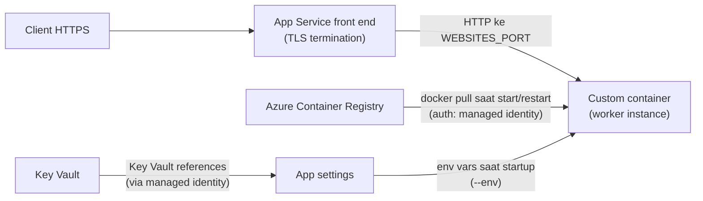

# Azure App Service — Custom Container

> Domain: 1 — Develop containerized solutions on Azure (20–25%)
> Exam: AI-200 — Developing AI Cloud Solutions on Azure
> Status: Draft
> Last reviewed: 2026-07-15
> [← Kembali ke README](README.md)

## 1. Posisi Topik dalam Exam

App Service adalah target deploy container paling sederhana di Domain 1 — PaaS penuh tanpa orchestration. Study guide memetakan topik ini pada subheading **"Implement container application hosting"** dengan satu bullet (SRC-002):

| Bullet resmi (parafrase) | Coverage matrix |
|---|---|
| Deploy container ke Azure App Service, termasuk mengonfigurasi App Service untuk menyuplai environment variables dan secrets | #3 |

Source ID utama: SRC-002 (study guide), SRC-023 (docs hub App Service), SRC-050–SRC-054 (artikel spesifik — lihat [§15](#15-sumber-resmi)).

## 2. Learning Outcomes

Setelah menyelesaikan modul ini, saya mampu:

- Membuat App Service plan (Linux) dan web app yang menjalankan custom container image dari ACR.
- Mengonfigurasi web app agar menarik image dari ACR memakai **managed identity** (bukan admin credentials), dan memilih role pull yang benar sesuai mode registry.
- Menyuplai **environment variables** ke container melalui app settings, dan menjelaskan bagaimana serta kapan nilai itu masuk ke proses aplikasi.
- Menyuplai **secrets** dengan aman: app settings (encrypted at rest) vs **Key Vault references** (`@Microsoft.KeyVault(...)`), termasuk syarat identity dan perilaku rotasinya.
- Mengonfigurasi port container (`WEBSITES_PORT`), persistent storage, dan continuous deployment via ACR webhook.
- Mengambil serta menganalisis container logs (`az webapp log config` / `log tail`) untuk troubleshooting startup.

## 3. Mental Model

**Fakta resmi (SRC-050, SRC-054):** App Service menjalankan container Anda di worker yang dikelola platform. Saat app start/restart, App Service melakukan `docker pull` dari registry — layer disimpan di disk lokal dan hanya layer yang berubah yang ditarik ulang. Selama container baru belum siap menerima request, **App Service tetap melayani trafik dari container lama**. TLS dihentikan (terminated) di front end App Service — container menerima trafik HTTP internal dan **tidak perlu (dan tidak seharusnya) mengimplementasikan TLS sendiri**.



Penjelasan teks: request HTTPS masuk lewat front end (TLS berakhir di sini) lalu diteruskan sebagai HTTP ke port container (`WEBSITES_PORT`, default asumsi 80). Image ditarik dari ACR dengan autentikasi managed identity. App settings diinjeksikan sebagai environment variables ke proses container saat startup (App Service memakai flag `--env` untuk Linux/custom container). Nilai app setting dapat berupa Key Vault reference yang diresolve platform memakai managed identity.

Batasan platform yang penting (SRC-054): container Linux harus menarget **arsitektur x86-64 — ARM64 tidak didukung**.

## 4. Konsep dan Fitur Kunci

### 4.1 Environment variables via app settings

**Fakta resmi (SRC-051, SRC-050):**

- App settings adalah variabel yang **diteruskan sebagai environment variables** ke kode aplikasi; untuk Linux/custom container disuntikkan via `--env` saat container start.
- **Menambah/mengubah/menghapus app setting memicu app restart** — inilah momen nilai baru masuk ke container.
- Nama setting: huruf, angka, titik, underscore. Untuk struktur nested JSON di Linux, ganti `:` dengan `__` (double underscore) — mis. `ApplicationInsights:InstrumentationKey` → `ApplicationInsights__InstrumentationKey`.
- App settings **selalu encrypted at rest**.
- Verifikasi env var container: buka `https://<app-name>.scm.azurewebsites.net/Env`.
- Variabel reserved kredensial registry (`DOCKER_REGISTRY_SERVER_URL`, `DOCKER_REGISTRY_SERVER_USERNAME`, `DOCKER_REGISTRY_SERVER_PASSWORD`) **tidak diekspos ke aplikasi** demi keamanan.
- Connection strings tampil sebagai env var berprefix tipe (mis. `POSTGRESQLCONNSTR_`, `CUSTOMCONNSTR_`, `SQLAZURECONNSTR_`); untuk stack non-.NET, dokumentasi menyarankan app settings biasa kecuali butuh fitur backup database.

### 4.2 Secrets: app settings vs Key Vault references

**Fakta resmi (SRC-051, SRC-052):** app settings terenkripsi at rest, tetapi dokumentasi resmi menyatakan: bila Anda butuh kapabilitas manajemen secret, gunakan **Key Vault references**:

- Format nilai app setting: `@Microsoft.KeyVault(SecretUri=https://<vault>.vault.azure.net/secrets/<name>)` atau `@Microsoft.KeyVault(VaultName=<vault>;SecretName=<name>)` (versi opsional).
- Kode aplikasi **tidak berubah** — membaca env var seperti biasa; platform yang meresolve.
- Syarat: app punya **managed identity** (default: system-assigned; bisa user-assigned via properti `keyVaultReferenceIdentity`) dengan akses baca secret — pada model RBAC vault: role **Key Vault Secrets User**; pada model access policy: permission **Get** secrets.
- **Rotasi:** tanpa versi eksplisit, app memakai versi terbaru — diperbarui otomatis **dalam 24 jam** (nilai di-cache dan di-refetch tiap 24 jam); perubahan konfigurasi apa pun memicu restart + refetch segera.
- Jika reference gagal diresolve, **string mentah `@Microsoft.KeyVault(...)` yang dipakai** sebagai nilai — sumber error aplikasi yang khas.

### 4.3 Pull image dari ACR dengan managed identity

**Fakta resmi (SRC-050, SRC-054):** langkah konfigurasinya:

1. Aktifkan identity pada web app (`az webapp identity assign` — system-assigned, atau `--identities <resource-id>` untuk user-assigned).
2. Beri identity role pull pada registry — dokumen App Service mencontohkan **`AcrPull`** dengan `az role assignment create --assignee <principal-id> --scope <registry-id> --role "AcrPull"`.
3. Set `acrUseManagedIdentityCreds=true` pada konfigurasi app (via `az webapp config set --generic-configurations` atau `az resource update`).
4. Khusus user-assigned: set juga `acrUserManagedIdentityID` = **client ID** identity.

**Catatan lintas-modul (fakta SRC-043):** contoh `AcrPull` berlaku untuk registry mode klasik ("RBAC Registry Permissions"). Jika registry Anda ABAC-enabled (seperti lab d1-01), role data plane yang tepat adalah **`Container Registry Repository Reader`**. Catatan resmi lain: service principal untuk pull **Windows** container sudah tidak didukung — managed identity direkomendasikan untuk keduanya (SRC-050).

### 4.4 Konfigurasi container penting lainnya

**Fakta resmi (SRC-050):**

- **`WEBSITES_PORT`** — App Service mengasumsikan container mendengarkan port 80; jika berbeda (mis. 8000), set app setting ini. Hanya **satu port HTTP** yang bisa diekspos.
- **Persistent storage** — direktori `/home` (Linux): default **disabled** untuk custom container; aktifkan dengan `WEBSITES_ENABLE_APP_SERVICE_STORAGE=true`; `/home/LogFiles` selalu persist bila application logging aktif. Tulisan di luar `/home` tidak persist.
- **Update image** — app menarik image saat restart; untuk memakai image baru segera, restart app; atau aktifkan **continuous deployment**: `az webapp deployment container config --enable-cd true` menghasilkan `CI_CD_URL`, lalu buat ACR webhook (`az acr webhook create --actions push`) yang menembak URL itu (SRC-054).
- **Multi-container (Docker Compose)** — preview, dan **retire 31 Maret 2027**; digantikan **sidecar containers**. Jangan pilih Compose untuk desain baru.
- **Health ping** — App Service mengecek kesehatan container dengan request dummy `/robots933456.txt`; respons 404 justru menandakan container sehat — abaikan baris log ini.
- **Logs** — aktifkan container logging: `az webapp log config --docker-container-logging filesystem`, lalu stream: `az webapp log tail`; file log juga di `https://<app-name>.scm.azurewebsites.net/api/logs/docker`.

## 5. Decision Guide

| Situasi | Pilihan | Dasar |
|---|---|---|
| Satu web app/API container, tanpa perlu orchestration, scaling event-driven, atau revisi kompleks | **App Service custom container** | Interpretasi dari positioning resmi (PaaS web app); dokumen quickstart menyarankan Container Apps untuk "containerized applications in a serverless environment" (SRC-053) |
| Butuh scale-to-zero, KEDA, revisions/traffic-splitting | **Container Apps** ([d1-03](d1-03-azure-container-apps-keda.md)) | Fakta SRC-025 (KEDA adalah mekanisme Container Apps); perbandingan menyeluruh dibahas di d1-03 |
| Butuh kontrol Kubernetes penuh (manifest, DaemonSet, CRD) | **AKS** ([d1-04](d1-04-azure-kubernetes-service.md)) | Interpretasi teknis — pemetaan kebutuhan ke kapabilitas layanan |
| Runtime bahasa standar tanpa dependensi OS khusus | Pertimbangkan **built-in images** App Service alih-alih custom container | Fakta SRC-054: built-in images tersedia (`az webapp list-runtimes --os linux`); custom image untuk stack yang belum tersedia |
| Secrets aplikasi | **Key Vault references**, bukan nilai mentah di app settings | Fakta SRC-051/SRC-052: guidance resmi bila butuh manajemen secret |
| Auth pull registry | **Managed identity**, bukan admin user | Fakta SRC-042/SRC-050: admin account tidak direkomendasikan multi-user; SP Windows pull deprecated |
| Aplikasi butuh banyak container saling terkait di satu app | **Sidecar** (bukan Docker Compose yang retire 2027) | Fakta SRC-050 |

Pembanding **out of primary exam scope**: Azure Container Instances (muncul di dokumentasi sebagai target deploy sederhana, tidak ada di skills measured AI-200).

**Inferensi teknis (bukan fakta bersumber):** untuk skenario AI backend pada kurikulum ini, App Service cocok sebagai host API inference/serving yang stateless dan selalu-hidup; beban kerja worker berbasis antrean lebih cocok di Container Apps + KEDA (d1-03) karena scale-to-zero.

## 6. Security

**Fakta resmi (SRC-050, SRC-051, SRC-052, SRC-042/SRC-043):**

- **Identity & pull:** managed identity (system-/user-assigned) untuk menarik image — tanpa password tersimpan. Role: `AcrPull` (registry klasik) / `Container Registry Repository Reader` (registry ABAC). Admin user ACR hanya untuk skenario tertentu dan bukan praktik multi-user.
- **Secrets:** jangan menaruh secret mentah bila butuh audit/rotasi — Key Vault references + managed identity + role **Key Vault Secrets User** (model RBAC). App settings tetap encrypted at rest.
- **Kredensial registry tidak bocor ke app:** `DOCKER_REGISTRY_SERVER_*` tidak diekspos ke proses aplikasi.
- **TLS:** dihentikan di front end; aktifkan **HTTPS Only** dan atur **Minimum TLS version** di General settings (SRC-051).
- **Network:** menarik image dari registry yang diproteksi network/private endpoint memerlukan virtual network integration + `vnetImagePullEnabled=true` (SRC-050); Key Vault ber-network-restriction butuh akses via VNet, bukan IP publik app (SRC-052).
- **Least privilege portal:** melihat app settings di Portal butuh Owner/Contributor/Website Contributor — Reader tidak bisa (SRC-051).
- **SSH ke container:** hanya via situs Kudu/SCM yang diautentikasi akun Azure; password root `Docker!` internal, port 2222 tidak terekspos ke internet (SRC-054/SRC-050).

## 7. Reliability, Performance, dan Cost

- **Startup & update (SRC-050):** pull pertama menarik semua layer (bisa lama — browser mungkin timeout, refresh saja per SRC-054); restart berikutnya hanya layer berubah; ganti pricing tier/scale-out memicu pull penuh lagi. Trafik tetap dilayani container lama sampai container baru siap.
- **Scaling:** App Service plan menentukan ukuran/kapasitas worker; scale up = ganti tier, scale out = tambah instance (opsi **Always On** mencegah unload saat idle — SRC-051). Autoscaling detail bukan fokus bullet ini.
- **Idempotency lab:** mengulang `az webapp config appsettings set` aman (upsert); setiap perubahan setting = restart.
- **Cost drivers:** **App Service plan menagih selama plan ada — walau app di-stop**; hapus plan/resource group saat selesai (lihat [Cost guardrails README](README.md#7-cost-and-cleanup-guardrails)). Tutorial resmi juga mengingatkan biaya registry + hosting (SRC-054). Tier lab: `az appservice plan create --is-linux` default memakai **B1** (SRC-054); portal quickstart menunjukkan opsi **F1 Free** via "Change size" (SRC-053) — cek ketersediaan/limitasi F1 untuk container saat eksekusi; angka harga selalu dari halaman pricing resmi.

## 8. Praktik Hands-on

Tujuan lab: build image sampel Python (Django) ke ACR tanpa Docker lokal → deploy sebagai custom container ke App Service → konfigurasi managed identity pull, `WEBSITES_PORT`, env vars → validasi & logs → cleanup. Secrets via Key Vault reference ditunjukkan formatnya di sini; praktik penuh (membuat vault + secret) ada di [d4-01](d4-01-azure-key-vault.md).

### 8.1 Prasyarat

- Azure subscription; izin membuat resource + role assignment pada registry.
- Azure CLI ≥ 2.0.80 (syarat tutorial resmi, SRC-054); `az login` berhasil.
- `git` untuk meng-clone sampel. Docker lokal **tidak diperlukan** (build via ACR quick task, SRC-047).

### 8.2 Environment dan dependency versions

| Komponen | Nilai | Sumber |
|---|---|---|
| Shell | bash | Rekomendasi repo |
| Azure CLI | ≥ 2.0.80 | SRC-054 |
| Sampel aplikasi | `Azure-Samples/docker-django-webapp-linux` (Python/Django, listen di port **8000**) — repo GitHub Microsoft yang ditautkan dari tutorial resmi | SRC-054 |
| Arsitektur image | x86-64 (ARM64 tidak didukung) | SRC-054 |
| Tanggal verifikasi | 2026-07-15 | — |

Tidak ada package Python tambahan: dependensi aplikasi ada di dalam image. (Lihat §8.7 tentang keputusan Python SDK.)

### 8.3 Resource yang dibuat

`<RESOURCE_GROUP>` berisi: container registry `<ACR_NAME>` (Basic), App Service plan `<PLAN_NAME>` (Linux, B1), web app `<APP_NAME>`. **App Service plan berbayar selama ada** — jangan tinggalkan aktif.

### 8.4 Placeholder dan naming convention

| Placeholder | Contoh | Catatan |
|---|---|---|
| `<RESOURCE_GROUP>` | `rg-ai200-d102` | — |
| `<LOCATION>` | `eastus` | — |
| `<ACR_NAME>` / `<LOGIN_SERVER>` | `acrai200demo02` / dari output `loginServer` | aturan nama: lihat d1-01 §8.4 |
| `<PLAN_NAME>` | `plan-ai200-d102` | — |
| `<APP_NAME>` | `app-ai200-d102-<unik>` | unik se-Azure (`a-z`, `0-9`, `-`); jadi `https://<APP_NAME>.azurewebsites.net` |

### 8.5 Langkah Azure Portal

Sesuai quickstart portal Linux (SRC-053): **Create a resource → Web App**; Basics: pilih subscription/RG, isi nama unik, **Publish = Container**, **Operating System = Linux**, pilih Region dan App Service plan (Create new; tier sesuai kebutuhan). Tab **Container**: **Image Source = Azure Container Registry**, pilih Registry/Image/Tag (dan **Identity** untuk pull via managed identity, SRC-054) → **Review + create → Create**. Setelah jadi: env vars di **Settings → Environment variables → App settings**; logs di **Monitoring → App Service logs** (Application logging = File System) lalu **Log stream** (SRC-051, SRC-054).

### 8.6 Langkah Azure CLI

```bash
# 0. Resource group + registry + image sampel (build di cloud, tanpa Docker lokal)
az group create --name <RESOURCE_GROUP> --location <LOCATION>
az acr create --resource-group <RESOURCE_GROUP> --name <ACR_NAME> --sku Basic
git clone https://github.com/Azure-Samples/docker-django-webapp-linux.git --config core.autocrlf=input
cd docker-django-webapp-linux
az acr build --image appsvc-tutorial-custom-image:latest --registry <ACR_NAME> .

# 1. App Service plan Linux (default B1) + web app dari image ACR
az appservice plan create --name <PLAN_NAME> \
  --resource-group <RESOURCE_GROUP> --is-linux
az webapp create --resource-group <RESOURCE_GROUP> --plan <PLAN_NAME> \
  --name <APP_NAME> \
  --deployment-container-image-name <LOGIN_SERVER>/appsvc-tutorial-custom-image:latest

# 2. Sampel mendengarkan di port 8000 -> beri tahu App Service
az webapp config appsettings set --resource-group <RESOURCE_GROUP> \
  --name <APP_NAME> --settings WEBSITES_PORT=8000

# 3. Pull via system-assigned managed identity (urutan resmi SRC-050)
PRINCIPAL_ID=$(az webapp identity assign --resource-group <RESOURCE_GROUP> \
  --name <APP_NAME> --query principalId --output tsv)
ACR_ID=$(az acr show --resource-group <RESOURCE_GROUP> --name <ACR_NAME> \
  --query id --output tsv)
az role assignment create --assignee $PRINCIPAL_ID --scope $ACR_ID --role "AcrPull"
#   ^ registry ABAC-enabled? pakai role "Container Registry Repository Reader" (SRC-043)
az webapp config set --resource-group <RESOURCE_GROUP> --name <APP_NAME> \
  --generic-configurations '{"acrUseManagedIdentityCreds": true}'

# 4. Environment variables aplikasi (contoh pola resmi SRC-050)
az webapp config appsettings set --resource-group <RESOURCE_GROUP> \
  --name <APP_NAME> --settings DB_HOST="<HOST_PLACEHOLDER>" APP_MODE="lab"
az webapp config appsettings list --resource-group <RESOURCE_GROUP> --name <APP_NAME>

# 5. Format secret via Key Vault reference (praktik penuh: d4-01)
#    Nilai app setting, BUKAN command khusus:
#    MY_SECRET = @Microsoft.KeyVault(SecretUri=https://<VAULT_NAME>.vault.azure.net/secrets/<SECRET_NAME>)
#    Prasyarat: identity app punya role "Key Vault Secrets User" pada vault (SRC-052)

# 6. Logs container
az webapp log config --name <APP_NAME> --resource-group <RESOURCE_GROUP> \
  --docker-container-logging filesystem
az webapp log tail --name <APP_NAME> --resource-group <RESOURCE_GROUP>
```

Opsional — continuous deployment dari ACR (SRC-054): `az webapp deployment container config --enable-cd true ... --query CI_CD_URL` lalu `az acr webhook create --name appserviceCD --registry <ACR_NAME> --uri <CI_CD_URL> --actions push --scope appsvc-tutorial-custom-image:latest`; uji dengan `az acr webhook ping`.

**Idempotency:** semua `appsettings set` bersifat upsert; `az webapp create` dengan nama yang sudah ada milik Anda memperbarui/berhasil tanpa duplikat; setiap perubahan setting memicu restart (by design, SRC-051).

### 8.7 Implementasi Python SDK

**Keputusan (sesuai guardrail README):** untuk bullet ini, jalur belajar yang bernilai adalah Portal + CLI + **kode aplikasi Python di dalam container** — dokumentasi resmi yang diverifikasi mengelola deployment/konfigurasi via Portal/CLI, dan management-plane SDK (`azure-mgmt-web`) tidak dipakai di satu pun artikel sumber modul ini, sehingga memaksakannya menjadi redundan dan tak bersumber. Yang justru diuji pemahamannya: **bagaimana container menerima konfigurasi**.

Bukti dari dalam container (pola generik `os.environ`; app settings tiba sebagai env vars — SRC-051):

```python
# snippet di dalam aplikasi container (mis. view Django/Flask)
import os

db_host = os.environ.get("DB_HOST")          # app setting biasa
app_mode = os.environ.get("APP_MODE")        # app setting biasa
secret = os.environ.get("MY_SECRET")         # hasil resolve Key Vault reference

# Jika secret masih berbentuk "@Microsoft.KeyVault(...)" -> reference GAGAL diresolve
# (identity/permission/syntax salah) — lihat §9. (SRC-052)
```

Alternatif tanpa mengubah kode: cek `https://<APP_NAME>.scm.azurewebsites.net/Env` (SRC-050).

### 8.8 Validasi hasil

1. `https://<APP_NAME>.azurewebsites.net` menampilkan halaman sampel Django (pull pertama bisa lama; refresh bila timeout — SRC-054).
2. `az webapp config appsettings list` menampilkan `WEBSITES_PORT=8000`, `DB_HOST`, `APP_MODE`.
3. `.scm.azurewebsites.net/Env` menampilkan env vars tersebut, **tanpa** `DOCKER_REGISTRY_SERVER_PASSWORD` (reserved vars tidak diekspos — SRC-050).
4. `az webapp log tail` menampilkan log startup container.
5. `az webapp config container show` menampilkan image ACR pada `DOCKER_CUSTOM_IMAGE_NAME` (atau `LinuxFxVersion`) (SRC-054).

### 8.9 Expected output

Pola log startup yang sehat pada log stream (bentuk sesuai SRC-053/SRC-054): baris `Start container succeeded` / `Container ... ready`, diikuti output console aplikasi; baris `GET /robots933456.txt ... 404` boleh muncul dan **diabaikan** (health ping — SRC-050).

### 8.10 Troubleshooting test

Uji negatif yang aman: (a) hapus sementara `WEBSITES_PORT` → app tidak merespons/timeout karena App Service mengasumsikan port 80 sedangkan container listen di 8000; kembalikan settingnya. (b) Set `MY_SECRET=@Microsoft.KeyVault(SecretUri=https://vault-tidak-ada.vault.azure.net/secrets/x)` → nilai env var tetap string mentah `@Microsoft.KeyVault(...)` (bukti perilaku gagal-resolve, SRC-052); hapus setting itu setelah diamati.

### 8.11 Cleanup

```bash
az group delete --name <RESOURCE_GROUP> --yes --no-wait
```

Menghapus resource group menghapus web app, **App Service plan** (sumber biaya terbesar), dan registry.

### 8.12 Verifikasi cleanup

```bash
az group exists --name <RESOURCE_GROUP>      # harus: false
az webapp show --name <APP_NAME> --resource-group <RESOURCE_GROUP>  # harus: not found
```

## 9. Troubleshooting Playbook

| Gejala | Kemungkinan penyebab | Cara memeriksa | Solusi |
|---|---|---|---|
| App timeout/tidak merespons setelah deploy | Container listen di port ≠ 80 dan `WEBSITES_PORT` belum diset | `az webapp config appsettings list`; log tail | Set `WEBSITES_PORT=<port>` (SRC-050) |
| Halaman lama masih tampil setelah push image baru | App belum menarik image baru (pull terjadi saat restart) | `az webapp config container show` | Restart app, atau aktifkan CD webhook ACR (SRC-050/SRC-054) |
| Startup gagal: image pull unauthorized | `acrUseManagedIdentityCreds` belum true; identity belum punya role pull; salah role untuk mode registry | Log tail (pesan pull); cek role assignments di registry | Ikuti 4 langkah §4.3; registry ABAC → `Container Registry Repository Reader` (SRC-050, SRC-043) |
| Env var berisi string `@Microsoft.KeyVault(...)` mentah | Key Vault reference gagal resolve: identity tanpa akses, secret tidak ada, atau syntax salah | Portal → Environment variables → status reference; detector "Key Vault Application Settings Diagnostics" | Beri role `Key Vault Secrets User` / permission Get; perbaiki URI; cek network vault (SRC-052) |
| Secret baru di vault belum terbaca aplikasi | Cache Key Vault reference (refetch tiap 24 jam) | Bandingkan versi secret vs nilai berjalan | Tunggu ≤24 jam, atau picu restart/perubahan konfigurasi untuk refetch segera (SRC-052) |
| Nilai app setting nested JSON tidak terbaca di Linux | Nama memakai `:` yang tidak valid sebagai env var Linux | Cek nama setting | Ganti `:` → `__` (SRC-051) |
| Log dipenuhi `GET /robots933456.txt 404` | Health ping platform | — | Abaikan — 404 justru sinyal sehat (SRC-050) |
| File yang ditulis app hilang setelah restart | Persistent storage `/home` default disabled di Linux custom container | Cek `WEBSITES_ENABLE_APP_SERVICE_STORAGE` | Set `true` dan tulis ke `/home`, atau mount Azure Storage (SRC-050) |
| Container berjalan lokal tapi gagal di App Service (image ARM) | Image bukan x86-64 (mis. build di Apple Silicon tanpa platform flag) | Periksa arsitektur image | Build untuk x86-64 — mis. `az acr build` default Linux/AMD64 (SRC-054, SRC-041) |
| App lambat merespons request pertama setelah idle | App di-unload setelah 20 menit tanpa trafik (Always On off) | General settings | Aktifkan **Always On** (butuh tier yang mendukung) (SRC-051) |

## 10. Kaitan dengan Modul Lain

- **[d1-01 ACR](d1-01-azure-container-registry.md):** sumber image; role pull per mode registry (ABAC vs klasik); `az acr build`.
- **[d1-03 Container Apps](d1-03-azure-container-apps-keda.md) / [d1-04 AKS](d1-04-azure-kubernetes-service.md):** target compute alternatif — bandingkan lewat Decision Guide masing-masing.
- **[d4-01 Key Vault](d4-01-azure-key-vault.md):** pembuatan vault/secret + rotasi — pasangan dari Key Vault references di modul ini.
- **[d4-03 Observability](d4-03-observability-opentelemetry-kql.md):** kelanjutan dari container logs ke telemetry terstruktur (Application Insights; catatan SRC-052: connection string App Insights bukan secret — boleh langsung di app settings).
- [← README](README.md) — coverage matrix baris #3.

## 11. Common Misconceptions dan Exam Decision Points

1. **"App settings hanya terbaca setelah saya redeploy."** Salah — perubahan app setting **memicu restart otomatis** dan nilai baru masuk sebagai env vars saat startup (SRC-051).
2. **"Container saya harus meng-handle HTTPS/TLS."** Salah — TLS dihentikan di front end; app menerima HTTP internal (SRC-050).
3. **"Secret di app settings tidak aman sama sekali."** Tidak tepat — app settings encrypted at rest; namun untuk rotasi/audit/akses terpusat, guidance resminya Key Vault references (SRC-051/SRC-052).
4. **"Key Vault reference langsung ter-update saat secret dirotasi."** Tidak — tanpa versi eksplisit, pembaruan otomatis terjadi **dalam 24 jam** (cache), atau segera setelah restart/perubahan config (SRC-052).
5. **"Push image baru ke ACR otomatis meng-update app."** Tidak, kecuali CD webhook diaktifkan — default-nya pull terjadi saat restart (SRC-050/SRC-054).
6. **"Pakai admin credentials ACR saja untuk pull."** Bertentangan dengan praktik resmi: managed identity + role pull; SP untuk Windows container pull malah sudah tidak didukung (SRC-050, SRC-042).
7. **"App Service plan berhenti menagih kalau app di-stop."** Plan tetap ada dan menagih; hapus plan/RG (guardrail README — *interpretasi biaya*, angka cek halaman pricing).
8. **Decision point:** butuh scale-to-zero/event-driven → bukan App Service, melainkan Container Apps + KEDA (d1-03); butuh kontrol manifest K8s → AKS (d1-04). *Inferensi pola soal:* soal pemilihan compute kemungkinan menguji pemetaan kebutuhan → layanan seperti ini.

## 12. Checklist Pemahaman

- [ ] Saya bisa menjelaskan alur pull image saat start/restart dan kenapa trafik tetap dilayani container lama.
- [ ] Saya bisa mengonfigurasi managed identity pull dari ACR (4 langkah) dan memilih role sesuai mode registry.
- [ ] Saya tahu bagaimana app settings menjadi env vars, kapan diinjeksikan, dan efek restart-nya.
- [ ] Saya bisa menulis Key Vault reference dua format dan menyebut syarat identity + role-nya.
- [ ] Saya memahami perilaku rotasi (cache 24 jam) dan gejala gagal-resolve reference.
- [ ] Saya bisa menset `WEBSITES_PORT`, mengaktifkan container logging, dan membaca log stream.
- [ ] Saya tahu batasan platform: satu port HTTP, x86-64 only, `/home` persistence default off, Compose retire 2027.

## 13. Self-Assessment

**Q1.** Container FastAPI Anda listen di port 8000. Setelah deploy ke App Service, request selalu timeout, tetapi `docker run -p 8000:8000` lokal normal. Apa perbaikan paling mungkin?
**Jawaban:** Set app setting `WEBSITES_PORT=8000` — App Service default mengasumsikan port 80. **Alasan opsi lain kurang tepat:** mengubah Dockerfile `EXPOSE` saja tidak memengaruhi routing App Service; TLS bukan masalahnya karena TLS berakhir di front end. (SRC-050)

**Q2.** Sebutkan urutan konfigurasi agar web app menarik image dari ACR tanpa credential tersimpan, memakai system-assigned identity.
**Jawaban:** (1) `az webapp identity assign` → dapat principal ID; (2) ambil resource ID registry; (3) `az role assignment create` role pull (`AcrPull`, atau `Container Registry Repository Reader` pada registry ABAC) ke principal itu dengan scope registry; (4) set `acrUseManagedIdentityCreds=true`. (SRC-050, SRC-043)

**Q3.** App setting `DB_PASSWORD` berisi `@Microsoft.KeyVault(SecretUri=...)`, tetapi aplikasi membaca string mentah itu, bukan nilai secret. Sebutkan tiga penyebab yang mungkin dan cara diagnosis tercepat.
**Jawaban:** identity app tidak punya akses baca secret (role `Key Vault Secrets User`/permission Get), secret/versi tidak ada, atau syntax reference salah. Diagnosis: buka Environment variables di Portal → edit reference → baca status resolusi; atau detector "Key Vault Application Settings Diagnostics". (SRC-052)

**Q4.** Tim merotasi secret di Key Vault pukul 09.00. Pukul 10.00 aplikasi masih memakai nilai lama. Apakah ini bug?
**Jawaban:** Bukan — reference tanpa versi di-cache dan di-refetch tiap 24 jam; nilai baru terpakai otomatis dalam ≤24 jam, atau segera bila terjadi restart/perubahan konfigurasi (bisa juga refresh via endpoint API resmi). (SRC-052)

**Q5.** Anda menyimpan `ApplicationInsights:InstrumentationKey` sebagai nama app setting di Linux container dan aplikasi tidak menemukannya. Kenapa?
**Jawaban:** `:` tidak valid untuk nama env var di Linux — gunakan `ApplicationInsights__InstrumentationKey` (double underscore). (SRC-051)

**Q6.** Setelah `docker push` versi baru ke ACR, user masih melihat versi lama meski Anda menunggu 30 menit. App tidak pernah di-restart. Jelaskan dan beri dua solusi.
**Jawaban:** App Service menarik image hanya saat start/restart. Solusi: restart app; atau aktifkan continuous deployment (`az webapp deployment container config --enable-cd true` + `az acr webhook create --actions push`). (SRC-050, SRC-054)

**Q7.** Log container penuh baris `GET /robots933456.txt ... 404`. Developer panik. Apa jawaban Anda?
**Jawaban:** Itu health-ping dummy dari App Service; 404 menandakan container mampu melayani request — aman diabaikan. (SRC-050)

**Q8.** Aplikasi menulis file upload ke `/data` dan hilang setiap restart. Sebutkan dua opsi resmi.
**Jawaban:** Tulis ke `/home` dengan `WEBSITES_ENABLE_APP_SERVICE_STORAGE=true` (default disabled di Linux custom container), atau mount Azure Storage sebagai path lokal. Menulis di luar path tersebut tidak persist. (SRC-050)

## 14. Ringkasan Cepat

| Hal | Nilai |
|---|---|
| Port default yang diasumsikan | 80 → override dengan `WEBSITES_PORT` (satu port HTTP) |
| App settings → | env vars saat startup; perubahan = restart; encrypted at rest |
| Nested key di Linux | `:` → `__` |
| Secret terkelola | `@Microsoft.KeyVault(SecretUri=...)` / `(VaultName=..;SecretName=..)` |
| Syarat KV reference | managed identity + `Key Vault Secrets User` (RBAC) / Get (access policy) |
| Rotasi KV reference | otomatis ≤24 jam (cache); restart = refetch segera |
| Pull dari ACR | managed identity + role pull + `acrUseManagedIdentityCreds=true` |
| Update image | saat restart; atau CD webhook ACR |
| Persistence Linux | `/home`, default **off** (`WEBSITES_ENABLE_APP_SERVICE_STORAGE`) |
| Arsitektur | x86-64 only; TLS berakhir di front end; Compose retire 2027-03-31 |

Command penting: `az appservice plan create --is-linux` · `az webapp create --deployment-container-image-name` · `az webapp config appsettings set/list` · `az webapp identity assign` · `az webapp config set --generic-configurations '{"acrUseManagedIdentityCreds": true}'` · `az webapp config container set/show` · `az webapp log config` / `az webapp log tail` · `az webapp deployment container config --enable-cd true` · `az acr webhook create`.

## 15. Sumber Resmi

| Source ID | Link | Bagian yang digunakan | Diakses |
|---|---|---|---|
| SRC-002 | <https://learn.microsoft.com/en-us/credentials/certifications/resources/study-guides/ai-200> | Bullet skills measured Domain 1 | 2026-07-15 |
| SRC-023 | <https://learn.microsoft.com/en-us/azure/app-service/> | Hub docs App Service | 2026-07-15 |
| SRC-050 | <https://learn.microsoft.com/en-us/azure/app-service/configure-custom-container> | Managed identity pull, `WEBSITES_PORT`, env vars, reserved vars, persistent storage, TLS di front end, logs, Compose retirement, robots933456 | 2026-07-15 |
| SRC-051 | <https://learn.microsoft.com/en-us/azure/app-service/configure-common> | App settings → env vars, restart, encrypted at rest, `__` untuk nested key, connection string prefixes, Always On, izin portal | 2026-07-15 |
| SRC-052 | <https://learn.microsoft.com/en-us/azure/app-service/app-service-key-vault-references> | Syntax reference, syarat identity/role, rotasi & cache 24 jam, `keyVaultReferenceIdentity`, troubleshooting/detector | 2026-07-15 |
| SRC-053 | <https://learn.microsoft.com/en-us/azure/app-service/quickstart-custom-container> | Alur Portal Linux (Publish=Container, Image Source=ACR), opsi tier F1, perilaku pull saat restart | 2026-07-15 |
| SRC-054 | <https://learn.microsoft.com/en-us/azure/app-service/tutorial-custom-container> | Alur CLI Linux penuh (plan `--is-linux` B1, `az webapp create --deployment-container-image-name`, user-assigned MI, CD webhook, logs, SSH), x86-64 only, sampel docker-django-webapp-linux | 2026-07-15 |
