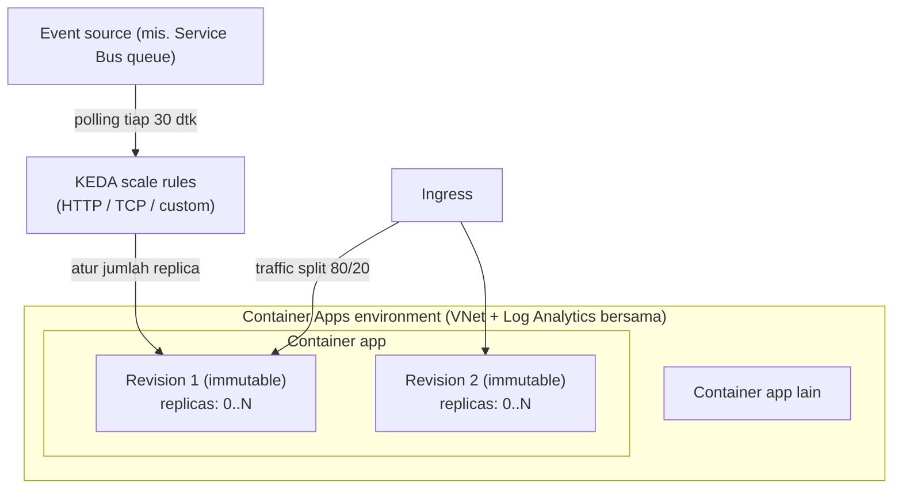

# Azure Container Apps + KEDA

> Domain: 1 — Develop containerized solutions on Azure (20–25%)
> Exam: AI-200 — Developing AI Cloud Solutions on Azure
> Status: Draft
> Last reviewed: 2026-07-15
> [← Kembali ke README](README.md)

## 1. Posisi Topik dalam Exam

Container Apps adalah platform serverless container di Domain 1 — jalur utama skenario event-driven pada kurikulum ini. Study guide memetakan topik ini pada subheading **"Implement container-orchestrated solutions"** dengan tiga bullet (SRC-002):

| Bullet resmi (parafrase) | Coverage matrix |
|---|---|
| Deploy aplikasi ke Container Apps, termasuk konfigurasi environment dan revision management | #4 |
| Terapkan event-driven scaling dengan Kubernetes Event-driven Autoscaling (KEDA) di Container Apps | #5 |
| Monitor dan troubleshoot solusi di AKS dan Container Apps: logs, events, konektivitas end-to-end | #7 (bagian Container Apps; bagian AKS di [d1-04](d1-04-azure-kubernetes-service.md)) |

Source ID utama: SRC-002, SRC-024 (hub), SRC-025 & SRC-055–SRC-059 (artikel spesifik — [§15](#15-sumber-resmi)).

## 2. Learning Outcomes

Setelah menyelesaikan modul ini, saya mampu:

- Membuat Container Apps **environment** dan menjelaskan perannya sebagai secure boundary (VNet + Log Analytics bersama), termasuk perbedaan tipe *Workload profiles* vs *Consumption only*.
- Deploy container app dengan ingress dan memahami kapan revisi baru dibuat: **revision-scope vs application-scope changes**.
- Mengelola **revisions**: single vs multiple revision mode, traffic splitting, labels, rollback, dan membaca status lifecycle revisi.
- Mengonfigurasi **scale rules KEDA**: HTTP, TCP, dan custom (contoh `azure-servicebus`), termasuk limits (min/max replicas), autentikasi via secret atau managed identity, dan perilaku scale (polling, cooldown, algoritma).
- Men-troubleshoot dengan **system logs / console logs / HTTP logs**, log streaming CLI, dan query Log Analytics.

## 3. Mental Model

**Fakta resmi (SRC-056, SRC-055, SRC-025):** satu **environment** adalah batas aman yang menampung banyak container app — semuanya berbagi virtual network dan menulis log ke Log Analytics workspace yang sama. Setiap container app terdiri dari **revisions** (snapshot immutable dari versi app). Setiap revisi berjalan sebagai sejumlah **replicas** yang dinaik-turunkan oleh **KEDA** berdasarkan scale rules.



Penjelasan teks: trafik masuk lewat ingress dan dapat dibagi antar-revisi (traffic splitting). KEDA memantau sumber event (antrean, HTTP concurrency, CPU, dll.) dan menghitung jumlah replica yang dibutuhkan per revisi — termasuk **scale-to-zero** (tidak ada tagihan usage saat replica = 0, SRC-025). Mengubah bagian `template` (image, scale rules, dll.) menciptakan revisi baru; mengubah bagian `configuration` (secrets, ingress, dll.) berlaku ke semua revisi tanpa revisi baru (SRC-055).

## 4. Konsep dan Fitur Kunci

### 4.1 Environment

**Fakta resmi (SRC-056):**

- Dua tipe: **Workload profiles** (default; mendukung plan Consumption dan Dedicated) dan **Consumption only** (legacy).
- Satu environment = satu VNet + satu tujuan log bersama. Gunakan environment terpisah bila aplikasi tidak boleh berbagi compute, atau untuk isolasi test vs production.
- **Kebijakan auto-delete:** environment **dihapus otomatis** bila >90 hari idle (tanpa app/job aktif), failed karena konfigurasi VNet/Policy, atau memblokir update infrastruktur — jaga minimal satu app aktif bila environment ingin dipertahankan.

### 4.2 Revisions dan change types

**Fakta resmi (SRC-055):**

- Revisi bersifat **immutable**, otomatis dibuat saat deploy pertama; default hingga **100 inactive revisions** tersimpan (bisa diaktifkan lagi kapan pun; inactive tidak ditagih).
- **Revision-scope change** (memicu revisi baru): perubahan pada `properties.template` — image/konfigurasi container, scale rules, revision suffix.
- **Application-scope change** (tanpa revisi baru, berlaku global): perubahan pada `properties.configuration` — nilai **secrets** (revisi harus di-restart agar terbaca), revision mode, ingress/traffic splitting/labels, kredensial registry privat, Dapr settings.
- **Revision modes:** **Single** (default — zero-downtime: revisi lama tetap menerima 100% trafik sampai revisi baru *ready*: provisioned + scaled + lolos startup/readiness probes) dan **Multiple** (kontrol penuh: beberapa revisi aktif, traffic splitting persentase, aktivasi/deaktivasi manual — untuk blue-green/A-B). Mode **Deployment labels** (preview) memberi URL unik per label (dev/staging/prod) yang bisa dipindah antar-revisi.
- Nama revisi: `<APP_NAME>-<REVISION_SUFFIX>` — suffix dapat dikustomisasi via `az containerapp create/update` (lowercase alfanumerik/dash, maks 64).

### 4.3 Scale rules KEDA

**Fakta resmi (SRC-025):**

- **Limits:** min replicas default **0**, max default **10** (keduanya bisa sampai 1.000). Tanpa rule apa pun, **default scale rule = HTTP, 0–10**.
- ⚠️ Jika **ingress dinonaktifkan** dan tidak ada min replicas ≥1 atau custom rule, app scale ke nol dan **tidak punya cara bangun kembali**.
- **Tiga kategori rule:** **HTTP** (concurrent requests; default threshold 10; dihitung tiap 15 detik), **TCP** (concurrent connections), **Custom** (semua KEDA scaler berbasis ScaledObject: CPU, memory, Azure Service Bus, Event Hubs, Kafka, Redis, dll.). Lebih dari satu rule → scaling dimulai saat kondisi rule mana pun terpenuhi.
- **Perilaku scale:** polling interval **30 dtk** (non-HTTP/TCP); cooldown **300 dtk** (hanya untuk turun dari replica terakhir ke 0); scale-down stabilization window **300 dtk**; scale-up step 1, 4, 8, 16, …; scale-down step 100%; algoritma `desiredReplicas = ceil(currentMetricValue / targetMetricValue)`.
- **Autentikasi scaler:** parameter auth memakai **Container Apps secrets** (`--secrets` + `--scale-rule-auth "connection=<secret-name>"`) atau **managed identity** (`identity: system` / `--scale-rule-identity`) untuk Azure Queue Storage, Service Bus, Event Hubs — guidance resmi: *"Where possible, use managed identity authentication to avoid storing secrets"*.
- Menambah/mengubah scale rule = revision-scope change → revisi baru; catatan resmi: gunakan mode `single` saat memakai non-HTTP event scale rules.
- Replica counts adalah *target*, bukan jaminan; vertical scaling tidak didukung.

Contoh CLI custom rule `azure-servicebus` (bentuk resmi, SRC-025):

```azurecli
az containerapp create \
  --name <CONTAINER_APP_NAME> \
  --resource-group <RESOURCE_GROUP> \
  --environment <ENVIRONMENT_NAME> \
  --image <CONTAINER_IMAGE_LOCATION> \
  --min-replicas 0 \
  --max-replicas 5 \
  --secrets "connection-string-secret=<SERVICE_BUS_CONNECTION_STRING>" \
  --scale-rule-name azure-servicebus-queue-rule \
  --scale-rule-type azure-servicebus \
  --scale-rule-metadata "queueName=my-queue" "namespace=service-bus-namespace" "messageCount=5" \
  --scale-rule-auth "connection=connection-string-secret"
```

Cara membacanya: `messageCount=5` berarti target 5 pesan per replica → antrean berisi 50 pesan menghasilkan `ceil(50/5) = 10` replica (dibatasi max), sesuai contoh perhitungan resmi (SRC-025).

### 4.4 Logs dan observability

**Fakta resmi (SRC-058, SRC-059, SRC-057):**

- **Tiga kategori:** **console logs** (`stdout`/`stderr` container), **system logs** (event layanan: "Creating a new revision", "Successfully provisioned revision", "Error provisioning revision. ErrorCode: ErrImagePull|Timeout|ContainerCrashing"), **HTTP logs** (dari ingress; opt-in via diagnostic settings — untuk 5xx, latency, retries).
- **Streaming CLI:** `az containerapp logs show --type system|console` (`--tail` 0–300, default 20; `--follow`); level environment: `az containerapp env logs show`. Untuk app multi-revisi/replica: `az containerapp revision list` dan `az containerapp replica list` lalu `--revision/--replica/--container`.
- **Log Analytics:** semua app dalam satu environment menulis ke workspace yang sama; console logs dapat di-query pada tabel `ContainerAppConsoleLogs_CL` via `az monitor log-analytics query` — pendalaman KQL di [d4-03](d4-03-observability-opentelemetry-kql.md).

## 5. Decision Guide

| Situasi | Pilihan | Dasar |
|---|---|---|
| Worker berbasis antrean yang harus scale-to-zero saat sepi | **Container Apps + custom KEDA rule** | Fakta SRC-025: scale-to-zero tanpa usage charge; scaler Service Bus/Event Hubs/Kafka/Redis |
| Web/API sederhana selalu-hidup tanpa kebutuhan event-driven | App Service ([d1-02](d1-02-azure-app-service-container.md)) juga memadai | Interpretasi — bandingkan Decision Guide d1-02 |
| Butuh API Kubernetes penuh (manifest, CRD, operator) | **AKS** ([d1-04](d1-04-azure-kubernetes-service.md)) | Fakta SRC-024: Container Apps = "without worrying about orchestration or infrastructure" — kontrol K8s-level bukan sasarannya |
| Blue-green / A-B testing antar versi | **Multiple revision mode** + traffic splitting/labels | Fakta SRC-055 |
| Rilis normal tanpa downtime | **Single revision mode** (default) | Fakta SRC-055: zero-downtime by design |
| Autentikasi scaler ke Service Bus/Storage/Event Hubs | **Managed identity** pada scale rule; secret hanya bila terpaksa | Fakta SRC-025 (guidance resmi) |
| Hardware khusus / biaya prediktif | Environment **Workload profiles** dengan Dedicated plan | Fakta SRC-056 |
| Isolasi test vs production | Environment terpisah | Fakta SRC-056 |

**Inferensi teknis (bukan fakta bersumber):** dalam skenario end-to-end kurikulum ini, Container Apps adalah host utama worker AI (konsumen antrean Service Bus di d3-01) karena kombinasi scale-to-zero + KEDA; App Service melayani API stateless; AKS dilatih untuk kontrol manifest-level.

## 6. Security

**Fakta resmi (SRC-025, SRC-055, SRC-056, SRC-043):**

- **Scale rule auth:** prioritaskan **managed identity** (system/user-assigned) — menghindari connection string tersimpan; secrets Container Apps adalah application-scope dan revisi perlu restart untuk membaca nilai baru.
- **Pull image dari registry privat:** skenario resmi "Azure Container Apps identity" ada pada daftar role assignment ACR (SRC-043) — role pull `Container Registry Repository Reader` (ABAC) / `AcrPull` (klasik); kredensial registry username/password (bila terpaksa) disimpan sebagai secret — quickstart resmi bahkan menyimpannya di **Key Vault** dan role `Key Vault Secrets Officer` untuk pengelolanya (SRC-057).
- **Boundary jaringan:** environment didukung VNet; bisa bawa VNet sendiri untuk kontrol penuh (SRC-056). Ingress internal vs external menentukan eksposur app.
- **Least privilege:** secrets discope per container app; jangan menaruh connection string di metadata scale rule (metadata bukan tempat secret — gunakan `auth`/`secretRef`).

## 7. Reliability, Performance, dan Cost

- **Zero-downtime deploy (SRC-055):** revisi lama dilayani sampai revisi baru ready (provisioned + scaled + lolos probes); gagal update → trafik tetap di revisi lama. Rollback = aktifkan kembali revisi sebelumnya.
- **Perilaku scale (SRC-025):** pahami jeda yang wajar — polling 30 dtk, scale-down menunggu 300 dtk stabilization, turun ke 0 menunggu 300 dtk cooldown; burst scale-up bertahap 1→4→8→16…; selama upgrade platform bisa muncul replica ekstra sementara (pre-warming).
- **Billing (SRC-025, SRC-056):** tidak ada usage charge saat scale ke 0; replica idle bisa ditagih tarif "idle" lebih rendah; Dedicated plan punya biaya manajemen tetap + variabel per profile. Inactive revisions tidak ditagih.
- **Guardrail biaya lab:** Log Analytics workspace dibuat bersama environment — perhatikan ingestion; hapus resource group setelah lab; ingat kebijakan auto-delete environment 90 hari idle (SRC-056).

## 8. Praktik Hands-on

Tujuan lab: buat environment → deploy app (image sampel publik) → amati revisi & buat revisi baru lewat perubahan scale rule (HTTP) → kelola traffic split di Portal → pasang custom KEDA rule `azure-servicebus` → baca logs & troubleshoot. Provisioning Service Bus namespace/queue dilakukan di lab [d3-01](d3-01-azure-service-bus.md) — di sini konfigurasinya yang dilatih (lihat catatan §8.6 langkah 6).

### 8.1 Prasyarat

- Azure subscription; Azure CLI + `az login`.
- Extension Container Apps dan registrasi provider (langkah resmi, SRC-057):

```azurecli
az extension add --name containerapp --upgrade
az provider register --namespace Microsoft.App
az provider register --namespace Microsoft.OperationalInsights
```

### 8.2 Environment dan dependency versions

| Komponen | Nilai | Sumber |
|---|---|---|
| Shell | bash | Rekomendasi repo |
| Azure CLI + extension `containerapp` | terbaru (`az extension add --name containerapp --upgrade`); fitur preview butuh `--allow-preview true` | SRC-057, SRC-055 |
| Image sampel | `mcr.microsoft.com/k8se/quickstart:latest` (publik, dari quickstart resmi) | SRC-057 |
| Tanggal verifikasi | 2026-07-15 | — |

### 8.3 Resource yang dibuat

`<RESOURCE_GROUP>` berisi: Container Apps environment `<ENV_NAME>` (+ Log Analytics workspace otomatis), container app `<APP_NAME>`. Consumption-based; scale-to-zero meminimalkan biaya, tetapi workspace tetap menampung ingestion log.

### 8.4 Placeholder dan naming convention

| Placeholder | Contoh |
|---|---|
| `<RESOURCE_GROUP>` | `rg-ai200-d103` |
| `<LOCATION>` | `eastus` |
| `<ENV_NAME>` | `env-ai200-d103` |
| `<APP_NAME>` | `app-ai200-d103` |
| `<SERVICE_BUS_CONNECTION_STRING>` / `service-bus-namespace` / `my-queue` | dari lab d3-01 |

### 8.5 Langkah Azure Portal

Deploy dan revisi juga bisa dikelola dari Portal; nilai belajar Portal terbesar ada di **Revision management** dan **Scale**: (1) halaman container app → **Scale** → **Edit and deploy** → tab **Scale** untuk range replica + **Add** rule (Type: HTTP Scaling / Custom dengan *Custom rule type* = nilai `type` KEDA scaler, metadata key/value, dan bagian *Authentication* untuk secret) (SRC-025); (2) halaman **Revision management** untuk melihat revisi aktif, mengatur alokasi trafik antar-revisi (multiple mode), dan mengelola labels (SRC-055); (3) **Monitoring → Log stream** untuk system/console logs, juga tersedia di level environment (SRC-059). Catatan resmi: managed identity untuk scale rule dan TCP rule **tidak didukung di Portal** — pakai CLI/ARM (SRC-025).

### 8.6 Langkah Azure CLI

```bash
# 1. Resource group + environment (membuat Log Analytics workspace otomatis)
az group create --name <RESOURCE_GROUP> --location <LOCATION>
az containerapp env create \
  --name <ENV_NAME> --resource-group <RESOURCE_GROUP> --location "<LOCATION>"

# 2. Deploy app dari image publik + HTTP scale rule eksplisit (revisi #1)
az containerapp create \
  --name <APP_NAME> --resource-group <RESOURCE_GROUP> \
  --environment <ENV_NAME> \
  --image mcr.microsoft.com/k8se/quickstart:latest \
  --min-replicas 0 --max-replicas 5 \
  --scale-rule-name azure-http-rule \
  --scale-rule-type http \
  --scale-rule-http-concurrency 100
# (quickstart resmi: tambahkan --query properties.configuration.ingress.fqdn
#  pada create untuk menampilkan URL publik bila ingress aktif)

# 3. Lihat revisi
az containerapp revision list --name <APP_NAME> \
  --resource-group <RESOURCE_GROUP> --query "[].name"

# 4. Revision-scope change: ubah scale rule -> revisi BARU dibuat
az containerapp update \
  --name <APP_NAME> --resource-group <RESOURCE_GROUP> \
  --min-replicas 0 --max-replicas 5 \
  --scale-rule-name azure-http-rule \
  --scale-rule-type http \
  --scale-rule-http-concurrency 50
az containerapp revision list --name <APP_NAME> \
  --resource-group <RESOURCE_GROUP> --query "[].name"   # kini 2 revisi

# 5. Logs: stream system & console; replica list
az containerapp logs show --name <APP_NAME> \
  --resource-group <RESOURCE_GROUP> --type system --tail 50
az containerapp logs show --name <APP_NAME> \
  --resource-group <RESOURCE_GROUP> --type console --follow   # Ctrl+C utk stop
az containerapp replica list --name <APP_NAME> \
  --resource-group <RESOURCE_GROUP> --revision <REVISION_NAME> \
  --query "[].{Containers:properties.containers[].name, Name:name}"

# 6. Custom KEDA rule azure-servicebus (revisi baru lagi).
#    Jalankan SETELAH lab d3-01 menyediakan namespace+queue+connection string.
az containerapp update \
  --name <APP_NAME> --resource-group <RESOURCE_GROUP> \
  --min-replicas 0 --max-replicas 5 \
  --secrets "connection-string-secret=<SERVICE_BUS_CONNECTION_STRING>" \
  --scale-rule-name azure-servicebus-queue-rule \
  --scale-rule-type azure-servicebus \
  --scale-rule-metadata "queueName=my-queue" "namespace=<SB_NAMESPACE>" "messageCount=5" \
  --scale-rule-auth "connection=connection-string-secret"

# 7. Query console logs via Log Analytics (pola resmi quickstart)
LOG_ANALYTICS_WORKSPACE_CLIENT_ID=$(az containerapp env show \
  --name <ENV_NAME> --resource-group <RESOURCE_GROUP> \
  --query properties.appLogsConfiguration.logAnalyticsConfiguration.customerId --out tsv)
az monitor log-analytics query \
  --workspace $LOG_ANALYTICS_WORKSPACE_CLIENT_ID \
  --analytics-query "ContainerAppConsoleLogs_CL | where ContainerAppName_s == '<APP_NAME>' | project ContainerAppName_s, Log_s, TimeGenerated" \
  --out table
```

**Idempotency:** `az containerapp update` yang mengubah `template` selalu membuat revisi baru (by design — SRC-025/SRC-055); mengulang command yang sama membuat revisi tambahan yang identik — tidak berbahaya, revisi lama otomatis dideprovision pada single mode. `env create`/`group create` aman diulang.

### 8.7 Implementasi Python SDK

**Keputusan (guardrail README):** seperti d1-02, dokumentasi resmi modul ini mengelola deployment/scale via CLI/Portal/ARM; management SDK Python tidak muncul di satu pun artikel sumber sehingga tidak dipaksakan. Nilai Python pada modul ini = **aplikasi worker yang perilakunya di-scale KEDA** — worker Python konsumen Service Bus (dibangun penuh di [d3-01](d3-01-azure-service-bus.md) dengan `azure-servicebus`) di-deploy ke sini dan di-scale oleh rule `azure-servicebus` di atas; validasi end-to-end-nya dilakukan pada lab gabungan d3-01 (kirim N pesan → amati replica count naik dari 0).

### 8.8 Validasi hasil

1. `az containerapp create` selesai; buka FQDN ingress → halaman quickstart tampil.
2. Setelah langkah 4, `revision list` menampilkan **2 nama revisi** (bukti revision-scope change).
3. `logs show --type system` memuat pesan seperti "Creating a new revision"/"Successfully provisioned revision" (SRC-058).
4. Portal → Revision management menampilkan revisi dan status lifecycle-nya (Provisioned/Running/Scale to 0).
5. Query `ContainerAppConsoleLogs_CL` mengembalikan baris log (mungkin butuh beberapa menit setelah deploy — SRC-057).
6. (Setelah d3-01) kirim ≥`messageCount×maxReplicas` pesan ke queue → replica naik; kosongkan queue → setelah cooldown 300 dtk replica kembali 0.

### 8.9 Expected output

`revision list` mengembalikan array nama berformat `<APP_NAME>-<suffix>`. System log stream menampilkan entri provisioning revisi; console stream menampilkan output aplikasi. Status revisi yang sehat: `Provisioned` + `Running`/`Scale to 0` (tabel status resmi — SRC-055).

### 8.10 Troubleshooting test

Uji negatif aman: deploy app **tanpa ingress** dan `--min-replicas 0` tanpa custom rule → app turun ke 0 dan tidak bisa bangun (peringatan resmi SRC-025); perbaiki dengan `--min-replicas 1` atau tambahkan scale rule. Amati juga system logs saat memberi nama image yang salah → `Error provisioning revision. ErrorCode: ErrImagePull` (SRC-058).

### 8.11 Cleanup

```bash
az group delete --name <RESOURCE_GROUP> --yes --no-wait
```

Menghapus resource group menghapus environment, app, dan Log Analytics workspace bawaannya.

### 8.12 Verifikasi cleanup

```bash
az group exists --name <RESOURCE_GROUP>          # harus: false
az containerapp env show --name <ENV_NAME> --resource-group <RESOURCE_GROUP>  # harus: not found
```

## 9. Troubleshooting Playbook

| Gejala | Kemungkinan penyebab | Cara memeriksa | Solusi |
|---|---|---|---|
| App scale ke 0 dan tidak pernah bangun | Ingress disabled tanpa min replicas ≥1 dan tanpa custom rule | `az containerapp show` (ingress, scale) | Set `--min-replicas 1` atau tambahkan scale rule (SRC-025) |
| Revisi baru gagal: status `Provisioning failed`/`Activation failed` | Image salah/registry tak terjangkau/container crash | `az containerapp logs show --type system` → cari `Error provisioning revision. ErrorCode: ErrImagePull|Timeout|ContainerCrashing` | Perbaiki nama image/kredensial registry/perintah startup; trafik masih di revisi lama (single mode) (SRC-058, SRC-055) |
| Worker tidak scale meski antrean penuh | Metadata rule salah (queueName/namespace), auth scaler gagal, atau menunggu polling | Cek definisi rule (`az containerapp show`); system logs | Perbaiki metadata; pastikan `--scale-rule-auth` menunjuk secret yang benar atau pakai managed identity; ingat polling 30 dtk (SRC-025) |
| Replica tidak turun ke 0 padahal antrean kosong | Cooldown 300 dtk + scale-down stabilization 300 dtk belum lewat | Tunggu dan amati `replica list` | Perilaku by design (SRC-025) |
| Secret baru tidak terbaca aplikasi | Secrets = application-scope; revisi berjalan tidak otomatis membaca nilai baru | Bandingkan nilai secret vs perilaku app | Restart revisi setelah mengubah secret (SRC-055) |
| Perubahan ingress/traffic split tidak membuat revisi baru — bingung kenapa | Itu application-scope change (by design) | Tabel change types | Tidak perlu revisi baru; berlaku global (SRC-055) |
| `az containerapp` error parameter tidak dikenal | Extension containerapp lama; fitur preview tidak aktif | `az extension list` | `az extension add --name containerapp --upgrade` (+ `--allow-preview true` bila perlu) (SRC-057, SRC-055) |
| Log console kosong di Log Analytics | Ingestion delay beberapa menit; app tidak menulis stdout/stderr | Coba `az containerapp logs show --type console` (real-time) | Tunggu; pastikan app menulis ke stdout/stderr (SRC-057, SRC-058) |
| Trafik masih ke versi lama setelah update (multiple mode) | Alokasi traffic split belum dipindah | Portal → Revision management | Atur persentase/label ke revisi baru (SRC-055) |
| Environment hilang setelah lama tidak dipakai | Kebijakan auto-delete 90 hari idle | Notifikasi/aktivitas environment | Buat ulang; jaga ≥1 app aktif bila ingin dipertahankan (SRC-056) |

## 10. Kaitan dengan Modul Lain

- **[d1-01 ACR](d1-01-azure-container-registry.md):** sumber image privat; role pull untuk identity Container Apps (SRC-043).
- **[d1-02 App Service](d1-02-azure-app-service-container.md) / [d1-04 AKS](d1-04-azure-kubernetes-service.md):** pembanding compute; bagian AKS dari bullet #7 ada di d1-04 (cross-link dua arah).
- **[d3-01 Service Bus](d3-01-azure-service-bus.md):** menyediakan namespace/queue + worker Python untuk validasi end-to-end KEDA `azure-servicebus`; pembahasan messaging semantics.
- **[d4-01 Key Vault](d4-01-azure-key-vault.md):** pola menyimpan kredensial registry di vault (dipakai quickstart resmi, SRC-057).
- **[d4-03 Observability](d4-03-observability-opentelemetry-kql.md):** pendalaman KQL atas tabel log Container Apps.
- [← README](README.md) — coverage matrix baris #4, #5, #7.

## 11. Common Misconceptions dan Exam Decision Points

1. **"Semua perubahan membuat revisi baru."** Salah — hanya **revision-scope** (`properties.template`: image, scale rules, suffix); secrets/ingress/traffic/registry credentials adalah **application-scope** (SRC-055). Ini decision point klasik.
2. **"Mengubah secret langsung terbaca app."** Salah — revisi perlu **restart** untuk membaca nilai secret baru (SRC-055).
3. **"Scale-to-zero berisiko app mati permanen."** Hanya bila ingress off tanpa min-replicas/custom rule; dengan ingress atau event rule, KEDA membangunkan app (SRC-025).
4. **"KEDA memeriksa antrean real-time."** Tidak — polling interval 30 dtk; turun ke 0 menunggu cooldown 300 dtk; jeda ini normal, bukan bug (SRC-025).
5. **"Taruh connection string di metadata scale rule."** Salah tempat — metadata bukan untuk secret; gunakan `auth` (`secretRef`/`triggerParameter`) atau managed identity (SRC-025).
6. **"Traffic splitting butuh deploy ulang."** Tidak — application-scope, diatur di Revision management tanpa revisi baru (SRC-055).
7. **"Container Apps = AKS mini."** Positioning resminya justru "run containerized applications without worrying about orchestration or infrastructure" (SRC-024); butuh kontrol K8s → AKS. *Inferensi pola soal:* pemetaan kebutuhan → layanan (scale-to-zero/event-driven vs manifest-level control) kemungkinan besar bentuk soalnya.
8. **Decision point angka default:** min 0 / max 10; HTTP concurrency default 10; polling 30 dtk; cooldown 300 dtk (SRC-025).

## 12. Checklist Pemahaman

- [ ] Saya bisa menjelaskan environment sebagai boundary (VNet + log bersama) dan dua tipenya.
- [ ] Saya bisa membedakan revision-scope vs application-scope changes dengan contoh masing-masing.
- [ ] Saya bisa menjelaskan single vs multiple revision mode, traffic splitting, dan labels.
- [ ] Saya bisa menulis scale rule HTTP dan custom `azure-servicebus` via CLI lengkap dengan auth.
- [ ] Saya hafal perilaku scale: polling 30 dtk, cooldown 300 dtk, algoritma ceil, step 1→4→8→16.
- [ ] Saya tahu jebakan ingress-off + min 0 tanpa rule.
- [ ] Saya bisa memakai `az containerapp logs show` (system/console) dan query `ContainerAppConsoleLogs_CL`.
- [ ] Saya bisa membaca status lifecycle revisi (Provisioned, Scale to 0, Degraded, Failed).

## 13. Self-Assessment

**Q1.** Worker Anda mengonsumsi Service Bus queue. Target: 0 replica saat sepi, +1 replica per 10 pesan, maksimum 8. Tulis parameter CLI kuncinya.
**Jawaban:** `--min-replicas 0 --max-replicas 8 --scale-rule-name <nama> --scale-rule-type azure-servicebus --scale-rule-metadata "queueName=<q>" "namespace=<ns>" "messageCount=10" --scale-rule-auth "connection=<secret-name>"` (+ `--secrets` untuk connection string, atau lebih baik managed identity). Antrean 45 pesan → `ceil(45/10)=5` replica. (SRC-025)

**Q2.** Anda mengubah nilai secret dan ingress setting sekaligus, lalu heran tidak ada revisi baru. Jelaskan.
**Jawaban:** Keduanya **application-scope changes** (`properties.configuration`) — berlaku global tanpa revisi baru; revisi baru hanya dari perubahan `properties.template` (image, scale rules, suffix). Secret baru terbaca setelah revisi di-restart. (SRC-055)

**Q3.** Deploy versi baru gagal start di single revision mode. Apa dampak ke user, dan bagaimana Anda mendiagnosisnya?
**Jawaban:** Tidak ada downtime — trafik tetap 100% ke revisi lama karena revisi baru tidak pernah *ready*. Diagnosis: `az containerapp logs show --type system` → cari "Error provisioning revision" + ErrorCode (ErrImagePull/Timeout/ContainerCrashing). (SRC-055, SRC-058)

**Q4.** Tim ingin 10% user mencoba versi baru dan sisanya tetap di versi stabil, dengan opsi rollback instan. Fitur apa yang dipakai?
**Jawaban:** **Multiple revision mode** + traffic splitting (90/10) via Revision management; rollback = geser alokasi kembali. Alternatif pengujian tertarget: **label** dengan URL unik untuk penguji. (SRC-055)

**Q5.** Antrean sudah kosong 2 menit tetapi masih ada 1 replica berjalan. Bug?
**Jawaban:** Bukan — scale-in ke 0 menunggu **cooldown 300 detik** setelah event terakhir (dan scale-down stabilization 300 dtk untuk penurunan lain). (SRC-025)

**Q6.** App internal tanpa ingress di-set min-replicas 0 tanpa scale rule custom. Apa risikonya?
**Jawaban:** App scale ke nol dan **tidak punya jalan untuk bangun** — tidak ada trigger HTTP (ingress off) ataupun event rule. Solusi: min-replicas ≥1 atau custom rule. (SRC-025)

**Q7.** Sebutkan tiga kategori log Container Apps dan satu contoh kasus pemakaian masing-masing.
**Jawaban:** **Console logs** (stdout/stderr — debug logika aplikasi), **system logs** (event platform — diagnosis provisioning revisi/ErrImagePull), **HTTP logs** (ingress, opt-in — analisis 5xx/latency/retries). (SRC-058)

**Q8.** Mengapa guidance resmi menyarankan managed identity untuk autentikasi scale rule, dan pada sumber event apa saja itu didukung?
**Jawaban:** Menghindari penyimpanan secret di app ("avoid storing secrets within the app"); didukung untuk Azure Queue Storage, Service Bus, dan Event Hubs. (SRC-025)

## 14. Ringkasan Cepat

| Hal | Nilai |
|---|---|
| Environment | boundary VNet + Log Analytics bersama; Workload profiles (default) vs Consumption only; auto-delete 90 hari idle |
| Revisi | immutable; ≤100 inactive; nama `<app>-<suffix>` |
| Revision-scope (revisi baru) | `properties.template`: image, container config, scale rules, suffix |
| Application-scope (global) | secrets (restart untuk terbaca), ingress, traffic split, labels, registry creds, Dapr |
| Mode | Single (default, zero-downtime) / Multiple (traffic split, blue-green) / Labels (preview) |
| Scale limits default | min 0 / max 10 (maks 1.000); default rule HTTP 0–10 |
| HTTP rule | `--scale-rule-http-concurrency` (default 10) |
| Custom rule | semua KEDA ScaledObject scaler; auth via secret atau managed identity |
| Perilaku | polling 30 dtk; cooldown 300 dtk; `ceil(metric/target)`; step naik 1,4,8,16… |
| Logs | console / system / HTTP (opt-in); `az containerapp logs show`; tabel `ContainerAppConsoleLogs_CL` |

Command penting: `az containerapp env create` · `az containerapp create/update` (+ `--min/max-replicas`, `--scale-rule-*`, `--secrets`) · `az containerapp revision list` · `az containerapp replica list` · `az containerapp logs show --type system|console` · `az containerapp env logs show` · `az monitor log-analytics query`.

## 15. Sumber Resmi

| Source ID | Link | Bagian yang digunakan | Diakses |
|---|---|---|---|
| SRC-002 | <https://learn.microsoft.com/en-us/credentials/certifications/resources/study-guides/ai-200> | Bullet skills measured Domain 1 | 2026-07-15 |
| SRC-024 | <https://learn.microsoft.com/en-us/azure/container-apps/> | Hub docs; positioning "without worrying about orchestration" | 2026-07-15 |
| SRC-025 | <https://learn.microsoft.com/en-us/azure/container-apps/scale-app> | KEDA; limits & defaults; rule HTTP/TCP/custom; auth secret & managed identity; scale behavior (polling/cooldown/algoritma); peringatan ingress-off; considerations | 2026-07-15 |
| SRC-055 | <https://learn.microsoft.com/en-us/azure/container-apps/revisions> | Revisi immutable; lifecycle status; single/multiple/labels; traffic splitting; zero-downtime; revision- vs application-scope changes; suffix | 2026-07-15 |
| SRC-056 | <https://learn.microsoft.com/en-us/azure/container-apps/environment> | Environment sebagai boundary; tipe Workload profiles vs Consumption only; log bersama; kebijakan auto-delete 90 hari | 2026-07-15 |
| SRC-057 | <https://learn.microsoft.com/en-us/azure/container-apps/get-started-existing-container-image> | Setup extension/provider; `az containerapp env create`; `az containerapp create` (publik & registry privat + Key Vault); query `ContainerAppConsoleLogs_CL`; cleanup | 2026-07-15 |
| SRC-058 | <https://learn.microsoft.com/en-us/azure/container-apps/logging> | Tiga kategori log; pesan system logs (ErrImagePull/Timeout/ContainerCrashing); HTTP logs opt-in | 2026-07-15 |
| SRC-059 | <https://learn.microsoft.com/en-us/azure/container-apps/log-streaming> | `az containerapp logs show` (`--type`, `--tail` 0–300 default 20, `--follow`, `--revision/--replica/--container`); `az containerapp env logs show`; `revision list`/`replica list` | 2026-07-15 |
