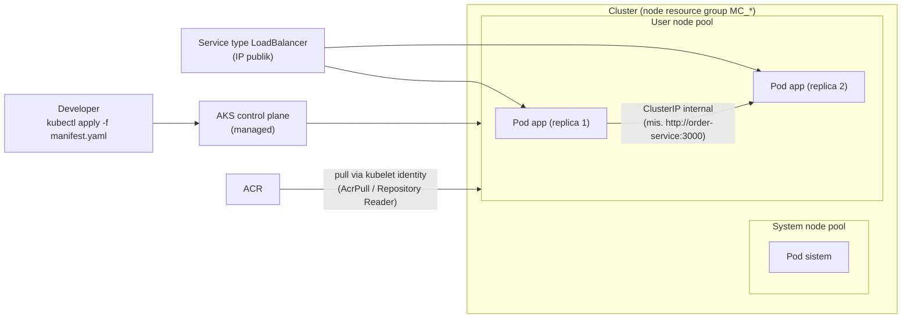

# Azure Kubernetes Service (AKS)

> Domain: 1 — Develop containerized solutions on Azure (20–25%)
> Exam: AI-200 — Developing AI Cloud Solutions on Azure
> Status: Draft
> Last reviewed: 2026-07-15
> [← Kembali ke README](README.md)

## 1. Posisi Topik dalam Exam

AKS adalah opsi orkestrasi penuh di Domain 1 — dipakai saat butuh kontrol Kubernetes-level. Study guide memetakan topik ini pada subheading **"Implement container-orchestrated solutions"** (SRC-002):

| Bullet resmi (parafrase) | Coverage matrix |
|---|---|
| Deploy dan kelola aplikasi di AKS menggunakan manifest files | #6 |
| Monitor dan troubleshoot solusi di AKS dan Container Apps: logs, events, konektivitas end-to-end | #7 (bagian AKS; bagian Container Apps di [d1-03](d1-03-azure-container-apps-keda.md)) |

Source ID utama: SRC-002, SRC-026 (hub), SRC-060–SRC-063 (artikel spesifik — [§15](#15-sumber-resmi)).

## 2. Learning Outcomes

Setelah menyelesaikan modul ini, saya mampu:

- Membuat AKS cluster via CLI (system + user node pool), mengambil kredensial `kubectl`, dan menjelaskan kenapa AKS membuat resource group kedua (`MC_*`).
- Menulis dan menerapkan **manifest file** (Deployment, Service, StatefulSet, ConfigMap) dengan `kubectl apply -f`, termasuk `nodeSelector`, resource requests/limits, dan **startup/readiness/liveness probes**.
- Mengintegrasikan AKS dengan ACR (`--attach-acr` → role `AcrPull` ke kubelet identity) dan tahu kapan integrasi itu **tidak berlaku** (registry ABAC-enabled).
- Men-troubleshoot dengan `kubectl get events` / `describe pod` / logs, memahami retensi event 1 jam, dan peran **Container insights** untuk retensi lebih lama.
- Menguji konektivitas end-to-end: service `LoadBalancer` eksternal via IP publik + konektivitas internal antar-service (`ClusterIP`).
- Menjelaskan lapisan monitoring AKS: Container insights (stdout/stderr + events), control plane resource logs (diagnostic settings), dan implikasi biaya `kube-audit`.

## 3. Mental Model

**Fakta resmi (SRC-060):** manifest file mendefinisikan **desired state** cluster — "such as which container images to run". Anda mendeklarasikan objek (Deployment, Service, dll.); Kubernetes menyelaraskan kondisi nyata ke deklarasi itu. AKS mengelola control plane; node berjalan pada **node pools** — aplikasi sebaiknya di **user node pool**, bukan system node pool ("User node pools provide better isolation and flexibility for application workloads").



Penjelasan teks: developer menerapkan manifest ke control plane; scheduler menempatkan pod di node pool sesuai `nodeSelector`. Image ditarik dari ACR dengan identity kubelet. Trafik eksternal masuk lewat Service `LoadBalancer` (IP publik); komunikasi antar-service internal memakai `ClusterIP` dan DNS nama service. Saat cluster dibuat, AKS otomatis membuat **resource group kedua** untuk resource node (SRC-060; awalan `MC_`, SRC-061).

## 4. Konsep dan Fitur Kunci

### 4.1 Cluster dan node pools

**Fakta resmi (SRC-060):**

- `az aks create --node-count 1 --generate-ssh-keys` membuat cluster dengan **system-assigned managed identity** (default); tanpa `--node-count`, default **3 node** — rekomendasi produksi ≥3.
- Tambah user node pool: `az aks nodepool add --mode User`; verifikasi `az aks nodepool list`.
- Akses cluster: `az aks get-credentials` (mengunduh kredensial untuk `kubectl`; `kubectl` sudah ada di Cloud Shell, atau `az aks install-cli`); uji dengan `kubectl get nodes`.
- Provider `Microsoft.ContainerService` harus terdaftar; subscription mungkin butuh kenaikan kuota vCPU.

### 4.2 Manifest files

**Fakta resmi (SRC-060, SRC-061):** manifest quickstart resmi (aplikasi AKS Store) memuat pola-pola yang persis diuji bullet ini:

- **Jenis objek:** `Deployment` (stateless: order-service, product-service, store-front), `StatefulSet` (RabbitMQ), `ConfigMap` (plugin), `Service` (`ClusterIP` internal; `LoadBalancer` untuk store-front).
- **Penempatan:** `nodeSelector` dengan `kubernetes.io/os: linux` dan `kubernetes.azure.com/mode: user` (paksa ke user pool).
- **Resource management:** `resources.requests` dan `resources.limits` (CPU/memory) per container.
- **Probes** (bagian dari bullet #7): `startupProbe` (beri waktu start; mis. `failureThreshold: 5`, `initialDelaySeconds: 20`), `readinessProbe` (siap menerima trafik), `livenessProbe` (restart bila tidak sehat) — ketiganya `httpGet` ke `/health` pada port container.
- **initContainers:** pola tunggu dependensi — `busybox` dengan `until nc -zv rabbitmq 5672; do ... sleep 2; done` (sekaligus pola cek konektivitas internal).
- **Deploy:** `kubectl apply -f <file>.yaml`; verifikasi `kubectl get pods -o wide` (kolom node menunjukkan pool).
- Catatan resmi: jangan jalankan container stateful (RabbitMQ) tanpa persistent storage di produksi — gunakan managed services seperti Azure Service Bus/Cosmos DB (relevan ke [d3-01](d3-01-azure-service-bus.md)/[d2-01](d2-01-cosmos-db-nosql.md)).

### 4.3 Integrasi ACR

**Fakta resmi (SRC-061):**

- `az aks create/update --attach-acr <acr-name|acr-resource-id>` memberikan role **`AcrPull`** ke **kubelet managed identity** agent pool; perintah memakai izin user yang menjalankannya (butuh Owner/admin subscription, atau pakai managed identity yang sudah ada).
- ⚠️ **Caveat ABAC (penting):** `--attach-acr` **tidak didukung** untuk registry dengan mode "RBAC Registry + ABAC Repository Permissions" — registry ABAC memerlukan role **`Container Registry Repository Reader`** yang di-assign manual (Portal/`az role assignment`/ARM). Sinkron dengan d1-01 §6.
- Registry eksternal non-Azure: gunakan Kubernetes **image pull secret**.
- `az acr import` menyalin image (mis. dari Docker Hub) ke ACR — lengkap dengan role `Container Registry Data Importer and Data Reader` (SRC-043).
- Verifikasi konektivitas AKS→ACR: **`az aks check-acr`**.
- `--detach-acr` mencabut integrasi.

### 4.4 Events, logs, dan monitoring

**Fakta resmi (SRC-062, SRC-063):**

- **Kubernetes events**: sumber utama troubleshooting lifecycle objek. Tipe **Warning** (mis. `FailedScheduling`, `CrashLoopBackoff`) vs **Normal** (Scheduled/Pulled/Created/Started). ⚠️ Event **hanya tersedia 1 jam** — tanpa mekanisme retensi; aktifkan **Container insights** untuk penyimpanan lebih lama.
- Perintah: `kubectl get events` (filter `--namespace <ns>`), `kubectl describe pod <pod>`; di Portal: cluster → **Kubernetes resources → Events** (filter type/reason/object/namespace).
- **Container insights**: agen Azure Monitor terkontainer mengumpulkan `stdout`/`stderr` dan Kubernetes events dari tiap node → Log Analytics workspace; fitur **live data** memberi akses real-time setara `kubectl logs -c`, `kubectl get events`, `kubectl top pods` (Portal: Workloads → pilih pod → **Live Logs**). Log container berada di `/var/log/containers` pada node.
- **Control plane resource logs**: tidak dikumpulkan sampai Anda membuat **diagnostic setting**; mode resource-specific mengirim ke tabel `AKSAudit`, `AKSAuditAdmin`, `AKSControlPlane`. ⚠️ Peringatan biaya resmi: `kube-audit` bisa sangat mahal — nonaktifkan bila tak perlu, pakai `kube-audit-admin` (tanpa event get/list), dan set tabel audit ke Basic logs.
- AKS Automatic menyertakan baseline monitoring default (managed Prometheus + Container insights + dashboards); AKS Standard opt-in.

## 5. Decision Guide

| Situasi | Pilihan | Dasar |
|---|---|---|
| Butuh objek K8s penuh (StatefulSet, initContainers, nodeSelector, CRD) & kontrol manifest | **AKS** | Fakta SRC-060 (manifest = desired state penuh) |
| Cukup container serverless + scale-to-zero event-driven | **Container Apps** ([d1-03](d1-03-azure-container-apps-keda.md)) | Fakta SRC-024/SRC-025 |
| Satu web app sederhana | **App Service** ([d1-02](d1-02-azure-app-service-container.md)) | Interpretasi — lihat decision guide d1-02 |
| Pull image dari ACR mode klasik | `--attach-acr` (AcrPull otomatis ke kubelet identity) | Fakta SRC-061 |
| Pull image dari ACR **ABAC-enabled** | **Manual** `Container Registry Repository Reader` ke kubelet identity — `--attach-acr` tidak didukung | Fakta SRC-061 |
| Registry eksternal (Docker Hub privat dsb.) | Image pull secret, atau `az acr import` ke ACR lalu attach | Fakta SRC-061 |
| Workload aplikasi | **User node pool** (`--mode User`), bukan system pool | Fakta SRC-060 |
| Butuh baseline monitoring tanpa konfigurasi | **AKS Automatic** | Fakta SRC-063 |
| Message broker untuk produksi | Managed service (Service Bus) alih-alih RabbitMQ self-hosted tanpa persistence | Fakta SRC-060 (catatan resmi quickstart) |

**Inferensi teknis (bukan fakta bersumber):** untuk skenario kurikulum ini, AKS dilatih sebagai target "kontrol penuh" — worker/API yang sama dengan d1-02/d1-03 tetapi dikelola manifest-level; di exam, sinyal kata "manifest files", "kubectl", "StatefulSet/DaemonSet" mengarah ke AKS, sedangkan "revisions/KEDA tanpa kelola infra" mengarah ke Container Apps.

## 6. Security

**Fakta resmi (SRC-060, SRC-061, SRC-063, SRC-043):**

- **Identity cluster:** system-assigned managed identity (default quickstart) — platform yang mengelola; tak perlu dihapus manual.
- **Pull image:** role pull diberikan ke **kubelet identity** (bukan identity cluster utama): `AcrPull` via `--attach-acr`, atau `Container Registry Repository Reader` manual untuk ABAC. Ada isu latensi Entra group saat AcrPull diberikan lewat group — workaround resmi: *bring your own kubelet identity* (pre-created user-assigned identity).
- **Izin melakukan attach:** `--attach-acr` butuh Owner/account admin pada subscription karena membuat role assignment.
- **Secrets di manifest:** contoh quickstart menaruh password RabbitMQ sebagai env var — pola lab; untuk produksi ambil secret dari layanan terkelola ([d4-01 Key Vault](d4-01-azure-key-vault.md)); jangan commit manifest berisi secret nyata.
- **Audit:** `kube-audit`/`kube-audit-admin` + tabel `AKSAudit*` untuk jejak operasi; `guard` untuk audit Entra ID/RBAC (di kategori resource logs).
- **Akses kubectl:** `az aks get-credentials` mengunduh kredensial — kelola siapa yang berhak; live data mengikuti Kubernetes RBAC.

## 7. Reliability, Performance, dan Cost

- **Probes (SRC-060):** startupProbe memberi waktu boot; readinessProbe mengatur kapan pod menerima trafik; livenessProbe me-restart pod yang macet — fondasi zero-bad-traffic saat rolling update.
- **Kapasitas:** requests/limits per container mencegah node kehabisan resource; `FailedScheduling` muncul bila tidak ada node yang muat (event Warning — SRC-062).
- **Node pools:** produksi ≥3 node (SRC-060); system vs user pool memisahkan beban platform dari aplikasi.
- **Cost drivers:** **node VM menagih selama cluster hidup** — sumber biaya terbesar lab Domain 1 (guardrail README: "Sangat tinggi"); resource group `MC_*` berisi VM/disk/IP; kuota vCPU bisa membatasi. Log ingestion: peringatan resmi biaya `kube-audit` (SRC-063). Lab: 1 node system + 1 node user, hapus segera setelah selesai.
- **Idempotency:** `kubectl apply` deklaratif — aman diulang (menyelaraskan state); `az aks create` dengan nama sama yang sudah ada akan gagal/berperilaku update tergantung parameter — gunakan nama baru per lab; `--attach-acr` aman diulang (role assignment idempotent).

## 8. Praktik Hands-on

Tujuan lab: buat cluster + user node pool → attach ACR → import image → deploy manifest (Deployment+Service dengan probes) → verifikasi pods/events/logs → uji konektivitas end-to-end → cleanup. Mengikuti alur dua quickstart resmi (SRC-060, SRC-061).

### 8.1 Prasyarat

- Azure subscription dengan izin membuat resource + role assignment (`--attach-acr` butuh Owner-level pada scope terkait — SRC-061).
- Azure CLI ≥ 2.7.0 (syarat halaman integrasi ACR, SRC-061); `kubectl` (Cloud Shell sudah ada, atau `az aks install-cli`).
- Provider terdaftar: `az provider register --namespace Microsoft.ContainerService` (SRC-060).

### 8.2 Environment dan dependency versions

| Komponen | Nilai | Sumber |
|---|---|---|
| Shell | bash | Rekomendasi repo |
| Azure CLI | ≥ 2.7.0 | SRC-061 |
| kubectl | bawaan Cloud Shell / `az aks install-cli` | SRC-060 |
| Image lab | `docker.io/library/nginx:latest` → di-import sebagai `<ACR_NAME>/nginx:v1` | SRC-061 |
| Tanggal verifikasi | 2026-07-15 | — |

### 8.3 Resource yang dibuat

`<RESOURCE_GROUP>` berisi AKS cluster `<CLUSTER_NAME>` (+ resource group node `MC_*` otomatis) dan registry `<ACR_NAME>` (Basic). **Node VM menagih terus — jangan biarkan cluster hidup.**

### 8.4 Placeholder dan naming convention

| Placeholder | Contoh |
|---|---|
| `<RESOURCE_GROUP>` | `rg-ai200-d104` |
| `<LOCATION>` | `westus2` |
| `<CLUSTER_NAME>` | `aks-ai200-d104` |
| `<ACR_NAME>` | `acrai200d104` (aturan nama: d1-01 §8.4) |

### 8.5 Langkah Azure Portal

Portal berguna terutama untuk **observasi**: cluster → **Kubernetes resources → Events** (filter type/reason/namespace — SRC-062); **Workloads** → pilih Deployment/Pod → **Live Logs** untuk stream stdout/stderr (butuh Container insights untuk fitur penuh — SRC-063); **Nodes/Node pools** untuk kapasitas. Pembuatan cluster via Portal mengikuti wizard Create Kubernetes cluster; nilai belajar terbesar tetap di CLI+kubectl, jadi langkah pembuatan tidak diduplikasi di sini.

### 8.6 Langkah Azure CLI + kubectl

```bash
# 1. Resource group + ACR + import image nginx (tanpa Docker lokal)
az group create --name <RESOURCE_GROUP> --location <LOCATION>
az acr create --name <ACR_NAME> --resource-group <RESOURCE_GROUP> --sku Basic
az acr import --name <ACR_NAME> \
  --source docker.io/library/nginx:latest --image nginx:v1

# 2. Cluster (1 node system) + attach ACR (AcrPull ke kubelet identity)
#    Catatan: registry ABAC-enabled TIDAK didukung --attach-acr ->
#    assign manual "Container Registry Repository Reader" ke kubelet identity.
az aks create \
  --resource-group <RESOURCE_GROUP> --name <CLUSTER_NAME> \
  --node-count 1 --generate-ssh-keys \
  --attach-acr <ACR_NAME>
az aks show --resource-group <RESOURCE_GROUP> --name <CLUSTER_NAME> \
  --query provisioningState --output tsv        # harus: Succeeded

# 3. User node pool untuk workload aplikasi
az aks nodepool add \
  --resource-group <RESOURCE_GROUP> --cluster-name <CLUSTER_NAME> \
  --name userpool1 --node-count 1 --mode User

# 4. Kredensial kubectl + verifikasi node
az aks get-credentials --resource-group <RESOURCE_GROUP> \
  --name <CLUSTER_NAME> --overwrite-existing
kubectl get nodes

# 5. Manifest: Deployment (2 replika, image dari ACR, probes) + Service LoadBalancer
cat > acr-nginx.yaml <<'YAML'
apiVersion: apps/v1
kind: Deployment
metadata:
  name: nginx0-deployment
  labels:
    app: nginx0-deployment
spec:
  replicas: 2
  selector:
    matchLabels:
      app: nginx0
  template:
    metadata:
      labels:
        app: nginx0
    spec:
      nodeSelector:
        kubernetes.io/os: linux
        kubernetes.azure.com/mode: user
      containers:
      - name: nginx
        image: <ACR_LOGIN_SERVER>/nginx:v1
        ports:
        - containerPort: 80
        resources:
          requests:
            cpu: 10m
            memory: 32Mi
          limits:
            cpu: 100m
            memory: 128Mi
        readinessProbe:
          httpGet:
            path: /
            port: 80
          initialDelaySeconds: 3
          periodSeconds: 5
          failureThreshold: 3
        livenessProbe:
          httpGet:
            path: /
            port: 80
          initialDelaySeconds: 3
          periodSeconds: 3
          failureThreshold: 5
---
apiVersion: v1
kind: Service
metadata:
  name: nginx0-service
spec:
  type: LoadBalancer
  ports:
  - port: 80
    targetPort: 80
  selector:
    app: nginx0
YAML
# (Kerangka Deployment+image ACR dari SRC-061; pola nodeSelector, resources,
#  serta bentuk readiness/livenessProbe httpGet dari manifest resmi SRC-060.)

kubectl apply -f acr-nginx.yaml

# 6. Verifikasi pods (kolom NODE menunjukkan user pool), events, logs
kubectl get pods -o wide
kubectl get events --namespace default
POD_NAME=$(kubectl get pods -o jsonpath="{.items[0].metadata.name}")
kubectl describe pod $POD_NAME

# 7. Konektivitas end-to-end: tunggu IP publik LoadBalancer lalu curl
kubectl get service nginx0-service --watch     # tunggu EXTERNAL-IP terisi; Ctrl+C
IP_ADDRESS=$(kubectl get service nginx0-service \
  --output 'jsonpath={..status.loadBalancer.ingress[0].ip}')
curl $IP_ADDRESS                               # harus mengembalikan HTML nginx

# 8. Diagnosa konektivitas AKS -> ACR bila pull bermasalah
az aks check-acr --resource-group <RESOURCE_GROUP> \
  --name <CLUSTER_NAME> --acr <ACR_NAME>.azurecr.io
```

### 8.7 Implementasi Python SDK

**Keputusan (guardrail README):** alat kerja bullet ini adalah **manifest + kubectl** — dokumentasi resmi yang diverifikasi tidak memakai SDK Python untuk deploy/kelola AKS, sehingga tidak dipaksakan. Nilai Python = aplikasi di dalam container (probes `/health` yang dites platform adalah endpoint yang Anda tulis di app — pola endpoint health Flask/FastAPI dibangun pada modul-modul Domain 2/3). Verifikasi konektivitas internal antar-service memakai pola resmi initContainer (`nc -zv <service> <port>`) atau `curl http://<service>:<port>` dari pod lain.

### 8.8 Validasi hasil

1. `kubectl get nodes` menampilkan ≥2 node (`nodepool1` System, `userpool1` User) — pola output resmi SRC-060.
2. `kubectl get pods -o wide` → 2 pod `nginx0-deployment-...` status `Running`, `READY 1/1`, berjalan di node `userpool1` (bukti `nodeSelector`).
3. `kubectl get events` memuat rangkaian Normal: `Scheduled → Pulled → Created → Started` (SRC-062).
4. `curl $IP_ADDRESS` mengembalikan HTML — konektivitas end-to-end eksternal OK.
5. `az aks check-acr` melaporkan cluster dapat menjangkau registry (SRC-061).

### 8.9 Expected output

`kubectl get pods` pola resmi (SRC-061):

```text
NAME                                 READY   STATUS    RESTARTS   AGE
nginx0-deployment-669dfc4d4b-x74kr   1/1     Running   0          20s
nginx0-deployment-669dfc4d4b-xdpd6   1/1     Running   0          20s
```

### 8.10 Troubleshooting test

Uji negatif aman: ubah image di manifest menjadi tag yang tidak ada (mis. `nginx:v999`) lalu `kubectl apply` → pod baru macet `ImagePullBackOff`; `kubectl describe pod` + `kubectl get events` menunjukkan reason Warning terkait pull. Kembalikan ke `nginx:v1` dan apply ulang — Deployment menyelaraskan diri (sifat deklaratif). Catat: kejadian >1 jam lalu hilang dari `kubectl get events` (retensi 1 jam — SRC-062).

### 8.11 Cleanup

```bash
az group delete --name <RESOURCE_GROUP> --yes --no-wait
```

Menghapus resource group menghapus cluster, ACR, **dan resource group node `MC_*`** (perilaku resmi — SRC-061). Identity system-assigned dikelola platform, tak perlu dihapus manual (SRC-060).

### 8.12 Verifikasi cleanup

```bash
az group exists --name <RESOURCE_GROUP>                   # harus: false
az group list --query "[?starts_with(name, 'MC_<RESOURCE_GROUP>')].name"  # harus: []
kubectl config get-contexts                               # hapus context lama bila perlu
```

## 9. Troubleshooting Playbook

| Gejala | Kemungkinan penyebab | Cara memeriksa | Solusi |
|---|---|---|---|
| Pod `ImagePullBackOff` dari ACR | Cluster tidak ter-attach; registry ABAC (AcrPull tidak berlaku); nama image/tag salah | `kubectl describe pod`; `kubectl get events`; `az aks check-acr` | `az aks update --attach-acr`; untuk ABAC assign manual `Container Registry Repository Reader` ke kubelet identity; perbaiki image ref (SRC-061) |
| Pod `CrashLoopBackoff` | Aplikasi crash saat start; liveness probe membunuh berulang | `kubectl describe pod` (restart count, last state); logs container (Live Logs/`kubectl logs` via live data) | Perbaiki app/command; longgarkan probe (initialDelay/failureThreshold) (SRC-060, SRC-062, SRC-063) |
| Event Warning `FailedScheduling` | Tidak ada node cocok: resource requests terlalu besar, nodeSelector tak terpenuhi, kuota vCPU | `kubectl get events`; `kubectl describe pod` (alasan scheduling) | Turunkan requests; cocokkan label pool; tambah node/kuota (SRC-062, SRC-060) |
| `READY 0/1` padahal `Running` | readinessProbe gagal → pod tidak menerima trafik | `kubectl describe pod` (kondisi Ready, probe failures) | Perbaiki endpoint health/port probe (SRC-060) |
| EXTERNAL-IP Service `<pending>` lama | LoadBalancer masih diprovision | `kubectl get service --watch` | Tunggu; pola resmi menunggu hingga IP terisi (SRC-060) |
| Service internal tak terjangkau dari pod lain | Nama service/port salah; selector tidak match pod | Uji `nc -zv <service> <port>` dari pod (pola initContainer resmi); cek `kubectl get endpoints` melalui describe | Selaraskan selector/label dan port (SRC-060) |
| `kubectl get events` kosong padahal insiden tadi pagi | Retensi event hanya **1 jam** | — | Aktifkan Container insights untuk retensi di Log Analytics (SRC-062) |
| Butuh log stdout/stderr historis | Live stream saja tidak cukup | Container insights → Log Analytics | Aktifkan Container insights; query di workspace ([d4-03](d4-03-observability-opentelemetry-kql.md)) (SRC-063) |
| `kubectl` error kredensial/context | Kredensial lama/kadaluarsa di kubeconfig | `kubectl config get-contexts` | `az aks get-credentials --overwrite-existing` (SRC-062) |
| Biaya Log Analytics melonjak setelah aktifkan audit | `kube-audit` sangat verbose | Diagnostic setting kategori | Nonaktifkan `kube-audit`; pakai `kube-audit-admin`; tabel audit → Basic logs (SRC-063) |
| Pull dari registry ABAC gagal walau sudah `--attach-acr` | `--attach-acr` tidak didukung mode ABAC | Cek `roleAssignmentMode` registry (`az acr show`) | Assign manual `Container Registry Repository Reader` (SRC-061) |

## 10. Kaitan dengan Modul Lain

- **[d1-01 ACR](d1-01-azure-container-registry.md):** mode ABAC vs klasik menentukan mekanisme pull AKS (`--attach-acr` vs role manual); `az acr import`.
- **[d1-03 Container Apps](d1-03-azure-container-apps-keda.md):** separuh lain bullet #7; bandingkan: events K8s + kubectl vs system logs Container Apps; probes manifest vs readiness revisi.
- **[d3-01 Service Bus](d3-01-azure-service-bus.md):** pengganti terkelola untuk RabbitMQ pada manifest quickstart (catatan resmi).
- **[d4-01 Key Vault](d4-01-azure-key-vault.md):** membenahi anti-pattern password-di-manifest.
- **[d4-03 Observability](d4-03-observability-opentelemetry-kql.md):** Container insights, tabel `AKSAudit`/`AKSControlPlane`, dan KQL untuk log AKS.
- [← README](README.md) — coverage matrix baris #6–#7.

## 11. Common Misconceptions dan Exam Decision Points

1. **"`kubectl get events` adalah sumber sejarah insiden."** Salah — event hanya bertahan **1 jam**; sejarah butuh Container insights → Log Analytics (SRC-062). Jebakan waktu klasik.
2. **"`--attach-acr` selalu jalan untuk ACR."** Tidak untuk registry **ABAC-enabled** — wajib manual `Container Registry Repository Reader`; AcrPull adalah role mode klasik (SRC-061). Pasangan langsung dengan misconception #4 di d1-01.
3. **"liveness dan readiness sama saja."** Beda akibat: liveness gagal → container di-restart; readiness gagal → pod tetap hidup tetapi dikeluarkan dari trafik (`READY 0/1`); startupProbe melindungi app yang lama boot (pola resmi manifest — SRC-060; pembedaan akibat = interpretasi teknis atas semantik Kubernetes).
4. **"Role pull diberikan ke identity cluster."** Ke **kubelet identity** agent pool (SRC-061).
5. **"Resource group `MC_*` boleh dihapus manual untuk hemat."** Itu resource group node yang dikelola AKS — dihapus bersama cluster; menghapus paksa merusak cluster. Cleanup benar: hapus RG utama/cluster (SRC-061 menunjukkan keduanya terhapus bersama).
6. **"Aplikasi jalan di node pool mana pun sama saja."** Guidance resmi: aplikasi di **user node pool**; system pool untuk komponen platform (SRC-060).
7. **"kubectl apply dua kali = deploy dobel."** Deklaratif — apply ulang menyelaraskan state, bukan menduplikasi (SRC-060; sifat `apply`).
8. **Decision point:** kata kunci "manifest/kubectl/StatefulSet" → AKS; "revisions/KEDA/serverless" → Container Apps; "app settings/Key Vault reference" → App Service. *Inferensi pola soal.*

## 12. Checklist Pemahaman

- [ ] Saya bisa membuat cluster + user node pool dan menjelaskan system vs user pool.
- [ ] Saya bisa menulis manifest Deployment+Service dengan nodeSelector, requests/limits, dan tiga jenis probe.
- [ ] Saya tahu mekanisme pull ACR (kubelet identity + AcrPull) dan pengecualian ABAC.
- [ ] Saya bisa memakai `kubectl get events`/`describe pod` dan tahu retensi event 1 jam.
- [ ] Saya tahu peran Container insights (stdout/stderr + events → Log Analytics; live data).
- [ ] Saya bisa menguji konektivitas: LoadBalancer IP eksternal + `nc -zv`/DNS service internal.
- [ ] Saya tahu diagnostic settings untuk control plane logs dan jebakan biaya `kube-audit`.
- [ ] Saya paham dua resource group (utama + `MC_*`) dan cara cleanup yang benar.

## 13. Self-Assessment

**Q1.** Pod Anda `Running` tetapi `READY 0/1` dan tidak menerima trafik. Probe mana yang gagal, dan apa bedanya bila liveness yang gagal?
**Jawaban:** **readinessProbe** gagal — pod dikeluarkan dari endpoint trafik tetapi tidak di-restart. Bila **livenessProbe** gagal berulang, container justru di-restart (gejala `CrashLoopBackoff`/restart count naik). (SRC-060; pembedaan akibat = semantik probe)

**Q2.** Cluster baru tidak bisa menarik image dari registry ABAC-enabled meskipun sudah `az aks update --attach-acr`. Kenapa dan apa perbaikannya?
**Jawaban:** `--attach-acr` tidak didukung untuk registry mode "RBAC Registry + ABAC Repository Permissions" (memberi AcrPull yang tidak berlaku di ABAC). Perbaikan: assign manual role **`Container Registry Repository Reader`** ke **kubelet identity** cluster pada scope registry. (SRC-061)

**Q3.** Insiden pod gagal terjadi 3 jam lalu; `kubectl get events` kosong. Jelaskan dan sebutkan mitigasi ke depan.
**Jawaban:** Event Kubernetes hanya tersedia **1 jam** (tanpa retensi). Mitigasi: aktifkan **Container insights** agar event & log tersimpan di Log Analytics dan bisa di-query kapan pun. (SRC-062)

**Q4.** Manifest men-deploy 5 replika dengan `requests: cpu: 2` per pod di cluster 1 node kecil. Event apa yang muncul dan bagaimana diagnosisnya?
**Jawaban:** Warning **`FailedScheduling`** — tidak ada node dengan kapasitas cukup. Diagnosis: `kubectl get events` / `kubectl describe pod` (alasan scheduling). Solusi: turunkan requests, tambah node, atau perbesar pool. (SRC-062, SRC-060)

**Q5.** Bagaimana cara resmi memverifikasi bahwa cluster dapat menjangkau registry, dan kapan Anda memakainya?
**Jawaban:** **`az aks check-acr --name <cluster> --acr <registry>.azurecr.io`** — saat pull gagal dan Anda perlu memisahkan masalah jaringan/otorisasi AKS→ACR dari masalah manifest. (SRC-061)

**Q6.** Order-service butuh RabbitMQ siap sebelum start. Pola manifest resmi apa yang dipakai, dan apa fungsi gandanya?
**Jawaban:** **initContainer** busybox dengan loop `until nc -zv rabbitmq 5672; do sleep 2; done` — menunda start sampai dependensi siap, sekaligus menjadi pola uji **konektivitas internal** antar-service (ClusterIP + DNS nama service). (SRC-060)

**Q7.** Tim mengaktifkan semua kategori resource logs termasuk `kube-audit` dan tagihan Log Analytics melonjak. Apa rekomendasi resminya?
**Jawaban:** Nonaktifkan `kube-audit` bila tak diperlukan; gunakan **`kube-audit-admin`** (mengecualikan event get/list); aktifkan resource-specific mode dan set tabel **AKSAudit** ke Basic logs. (SRC-063)

**Q8.** Setelah lab, Anda menghapus resource group utama. Apa yang terjadi pada resource group `MC_*`, dan identity cluster?
**Jawaban:** Resource group node `MC_*` ikut terhapus bersama cluster; identity system-assigned dikelola platform sehingga tidak perlu dihapus manual. (SRC-061, SRC-060)

## 14. Ringkasan Cepat

| Hal | Nilai |
|---|---|
| Buat cluster | `az aks create --node-count 1 --generate-ssh-keys` (default 3 node; identity system-assigned) |
| Node pools | System (platform) vs User (`--mode User`, tempat aplikasi) |
| Akses | `az aks get-credentials` (+ `--overwrite-existing`) → `kubectl` |
| Deploy | `kubectl apply -f manifest.yaml` (deklaratif, aman diulang) |
| ACR pull | `--attach-acr` → AcrPull ke kubelet identity; **ABAC → manual Repository Reader** |
| Probes | startup (waktu boot) / readiness (trafik) / liveness (restart) |
| Events | `kubectl get events`, `describe pod`; Warning vs Normal; **retensi 1 jam** |
| Logs | Container insights: stdout/stderr + events → Log Analytics; live data (`kubectl logs -c`, `top pods`) |
| Control plane logs | diagnostic settings → `AKSAudit`/`AKSAuditAdmin`/`AKSControlPlane`; hemat: kube-audit-admin + Basic logs |
| Konektivitas | LoadBalancer IP publik + curl; internal: DNS service + `nc -zv` |
| Cleanup | hapus RG utama → cluster + `MC_*` ikut terhapus |

Command penting: `az aks create/show/update --attach-acr/--detach-acr` · `az aks nodepool add/list` · `az aks get-credentials` · `az aks check-acr` · `az acr import` · `kubectl get nodes/pods/events/service` · `kubectl apply -f` · `kubectl describe pod`.

## 15. Sumber Resmi

| Source ID | Link | Bagian yang digunakan | Diakses |
|---|---|---|---|
| SRC-002 | <https://learn.microsoft.com/en-us/credentials/certifications/resources/study-guides/ai-200> | Bullet skills measured Domain 1 | 2026-07-15 |
| SRC-026 | <https://learn.microsoft.com/en-us/azure/aks/> | Hub docs AKS | 2026-07-15 |
| SRC-060 | <https://learn.microsoft.com/en-us/azure/aks/learn/quick-kubernetes-deploy-cli> | Cluster + node pools; get-credentials; manifest lengkap (Deployment/StatefulSet/Service/ConfigMap, probes, initContainer nc -zv, nodeSelector, requests/limits); uji LoadBalancer IP + curl; dua resource group; cleanup | 2026-07-15 |
| SRC-061 | <https://learn.microsoft.com/en-us/azure/aks/cluster-container-registry-integration> | `--attach-acr`/`--detach-acr` (AcrPull → kubelet identity); caveat ABAC → Container Registry Repository Reader; image pull secret; `az acr import`; `az aks check-acr`; contoh Deployment nginx + `kubectl get pods`; cleanup MC_* | 2026-07-15 |
| SRC-062 | <https://learn.microsoft.com/en-us/azure/aks/events> | Kubernetes events: retensi 1 jam; Warning vs Normal (FailedScheduling/CrashLoopBackoff); `kubectl get events`/`describe pod`; filter namespace; Portal Events; Container insights untuk retensi | 2026-07-15 |
| SRC-063 | <https://learn.microsoft.com/en-us/azure/aks/monitor-aks> | Container insights (stdout/stderr + events → Log Analytics); live data (`kubectl logs -c`, `kubectl top pods`, `/var/log/containers`); control plane resource logs via diagnostic settings; tabel AKSAudit/AKSAuditAdmin/AKSControlPlane; peringatan biaya kube-audit; baseline AKS Automatic | 2026-07-15 |
