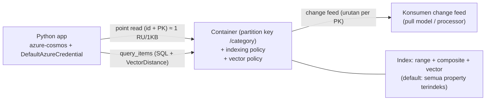

# Azure Cosmos DB for NoSQL

> Domain: 2 — Develop AI solutions by using Azure data management services (25–30%)
> Exam: AI-200 — Developing AI Cloud Solutions on Azure
> Status: Draft
> Last reviewed: 2026-07-15
> [← Kembali ke README](README.md)

## 1. Posisi Topik dalam Exam

Cosmos DB for NoSQL membuka Domain 2 — domain berbobot terbesar. Study guide memetakan topik ini pada subheading **"Develop AI solutions by using Azure Cosmos DB for NoSQL"** dengan empat bullet (SRC-002):

| Bullet resmi (parafrase) | Coverage matrix |
|---|---|
| Connect ke Cosmos DB for NoSQL via SDK dan jalankan query | #8 |
| Optimasi performa query dan konsumsi RU via indexing policies dan consistency levels | #9 |
| Simpan/ambil embeddings dan jalankan vector similarity search untuk semantic retrieval | #10 |
| Implement change feed processor untuk mendeteksi item baru/berubah | #11 |

Fokus sesuai catatan produk README: **API NoSQL saja**, bukan seluruh API Cosmos DB. Source ID utama: SRC-002, SRC-027 (hub), SRC-064–SRC-070 ([§15](#15-sumber-resmi)).

## 2. Learning Outcomes

Setelah menyelesaikan modul ini, saya mampu:

- Menghubungkan aplikasi Python (`azure-cosmos` + `DefaultAzureCredential`) ke account, database, dan container, lalu menjalankan point read dan query berparameter.
- Menjelaskan **Request Units (RU)** — faktor yang memengaruhi biaya operasi dan tiga mode akun (provisioned, serverless, autoscale) — serta mengukur RU charge per operasi.
- Merancang **indexing policy**: include/exclude paths, composite indexes untuk `ORDER BY`/multi-filter, dan dampaknya ke biaya write & query.
- Memilih **consistency level** (5 level) berdasar trade-off konsistensi vs latency vs throughput vs RU.
- Menyimpan embeddings dengan **container vector policy**, memilih **vector index** (flat/quantizedFlat/diskANN), dan menjalankan **`VectorDistance`** untuk semantic retrieval.
- Mengonsumsi **change feed** dari Python (pull model: `query_items_change_feed`) — termasuk continuation token, filter partition key, dan paralelisasi via feed range — serta menjelaskan posisinya terhadap change feed processor.

## 3. Mental Model

**Fakta resmi (SRC-064, SRC-069):** hierarki: **account → database → container → items** (JSON schemaless). Container dipartisi berdasarkan **partition key** (mis. `/category`); point read = ambil item via `id` + partition key (operasi termurah: item 1 KB ≈ **1 RU**). Semua operasi diukur dalam **RU** — mata uang performa yang menormalkan CPU/IOPS/memori; "the same query on the same data always costs the same number of RUs".



Penjelasan teks: aplikasi membaca/menulis item ke container; setiap operasi menarik RU dari throughput akun. Indexing policy menentukan property mana yang terindeks (default: semuanya) — memengaruhi RU write dan kecepatan query. Setiap insert/update tercatat di **change feed** yang bisa dikonsumsi terpisah untuk memproses item baru/berubah. Vector embeddings disimpan sebagai property item biasa dan di-query dengan `VectorDistance` — "colocation of data and vectors" tanpa database vector terpisah (SRC-067).

## 4. Konsep dan Fitur Kunci

### 4.1 SDK Python dan query (bullet #8)

**Fakta resmi (SRC-064):** package **`azure-cosmos`** (+ `azure-identity`). Object model: `CosmosClient` → `DatabaseProxy` → `ContainerProxy`; `PartitionKey` untuk operasi umum.

```python
from azure.identity import DefaultAzureCredential
from azure.cosmos import CosmosClient

client = CosmosClient(url="<COSMOS_ENDPOINT>", credential=DefaultAzureCredential())
database = client.get_database_client("cosmicworks")
container = database.get_container_client("products")

# Tulis (upsert = create-or-replace)
container.upsert_item({"id": "<GUID>", "category": "gear-surf-surfboards",
                       "name": "Yamba Surfboard", "quantity": 12, "sale": False})

# Point read — cara baca paling murah (id + partition key)
item = container.read_item(item="<GUID>", partition_key="gear-surf-surfboards")

# Query berparameter (single-partition bila filter = partition key)
results = container.query_items(
    query="SELECT * FROM products p WHERE p.category = @category",
    parameters=[dict(name="@category", value="gear-surf-surfboards")],
    enable_cross_partition_query=False,
)
```

Catatan: `enable_cross_partition_query=True` diperlukan bila query tidak dibatasi satu nilai partition key (pola resmi pada query vector — SRC-070).

### 4.2 Request Units (bullet #9a)

**Fakta resmi (SRC-069):**

- Faktor RU: ukuran & jumlah property item, **indexed properties** ("limit the number of indexed properties" untuk menekan RU write), **konsistensi** (strong/bounded staleness ≈ **2× RU read**), tipe baca (**point read < query**), kompleksitas query (jumlah hasil, predikat, UDF, proyeksi).
- Tiga mode akun: **Provisioned** (RU/s per 100, billing per jam; granularity container atau database), **Serverless** (bayar RU terpakai), **Autoscale** (skala RU/s otomatis — untuk trafik tak terduga).
- Multi-region: R RU × N region; RU tidak bisa dialokasikan per region.
- Lacak konsumsi: "examine the response header to track the number of RUs consumed" — di Python, header respons terakhir tersedia via `container.client_connection.last_response_headers` (mekanisme yang sama dipakai resmi untuk continuation token, SRC-068); cetak header tersebut dan baca nilai *request charge*-nya.

### 4.3 Indexing policy (bullet #9b)

**Fakta resmi (SRC-065):**

- Default: **semua property terindeks** (range index untuk string/number) — bagus untuk mulai, mahal untuk write berat.
- **Indexing mode:** `consistent` (index update sinkron) atau `none` (pure key-value / bulk load, lalu kembalikan ke consistent). Lazy: jangan dipakai (hasil query bisa tidak konsisten; container baru tidak bisa memilihnya).
- **Include/exclude paths:** root `/*` wajib ada di salah satu sisi. Strategi disarankan: include root + exclude selektif. Notasi: `/path/?` (scalar), `/path/*` (subtree), `/[]/` (elemen array). Path lebih presisi menang saat konflik. **Partition key sebaiknya diikutkan di index** — jika tidak, filter pada partition key memicu full scan (RU tinggi).
- **Composite indexes:** wajib untuk `ORDER BY` multi-property (urutan & arah harus cocok, atau kebalikan keduanya); mempercepat filter equality+range (equality dulu, range terakhir; satu range per composite); default tidak ada — tambahkan sesuai query.
- **Mengubah policy:** transformasi index berjalan online/in-place, **mengonsumsi RU**, asinkron; saat mengganti index, **tambah dulu yang baru, tunggu selesai, baru hapus yang lama**; menghapus indexed path berlaku seketika (query langsung full scan).
- Index size ikut menambah storage; TTL memerlukan indexing (mode `none` tidak bisa TTL).

### 4.4 Consistency levels (bullet #9c)

**Fakta resmi (SRC-066):** lima level, dari terkuat ke terlemah:

| Level | Jaminan inti | Catatan performa/RU |
|---|---|---|
| **Strong** | Linearizability — selalu baca committed write terbaru | Read = 2 replika (local minority) → **RU read 2×**; write multi-region menunggu komit global; latency write naik dengan jarak antar-region; tidak tersedia untuk multi-write-region |
| **Bounded staleness** | Lag maksimum K versi atau T waktu | RU read 2×; cocok single-write-region multi-region yang butuh "near strong"; anti-pattern di multi-write |
| **Session** (paling banyak dipakai) | Read-your-writes & write-follows-reads dalam satu session (via session token, partition-bound) | Read 1 replika — throughput ≈ eventual; default pilihan aplikasi berkonteks user |
| **Consistent prefix** | Tidak pernah melihat urutan write transaksional terbalik | Read 1 replika |
| **Eventual** | Tanpa jaminan urutan — bisa baca lebih lama dari sebelumnya | Read 1 replika; untuk data tanpa kebutuhan urutan (like/retweet count) |

Level default diatur per **account** (berlaku semua database/container); dapat **dioverride per request/klien hanya ke arah lebih lemah untuk read** (override berlaku pada read SDK; write tetap mengikuti akun). RPO saat outage regional: strong = 0; session/prefix/eventual < 15 menit; bounded = K & T.

### 4.5 Vector search (bullet #10)

**Fakta resmi (SRC-067, SRC-065, SRC-070):**

- **Aktifkan fitur** per account: Portal → Settings → Features → *Vector Search for NoSQL API*, atau `az cosmosdb update --capabilities EnableNoSQLVectorSearch` (autoapproved, efektif ≤15 menit). Setelah aktif pada container, tidak bisa dinonaktifkan; tidak didukung pada shared throughput.
- **Container vector policy** (wajib, hanya container **baru**, immutable): `path`, `dataType` (`float32` default; `float16` hemat storage 50% dengan sedikit penurunan akurasi; `int8`/`uint8`), `dimensions` (default 1536), `distanceFunction` (`cosine` default / `dotproduct` / `euclidean`).
- **Vector indexes** (di indexing policy): **`flat`** (brute-force, recall 100%, maks **505 dimensi**), **`quantizedFlat`** (kompresi; latency/RU lebih rendah; disarankan bila cakupan pencarian ≤ ~50.000 vektor), **`diskANN`** (ANN Microsoft Research; terbaik untuk > ~50.000 vektor). ⚠️ `quantizedFlat`/`diskANN` butuh ≥ **1.000 vektor** terindeks — di bawah itu full scan (RU lebih tinggi). Maks 4.096 dimensi.
- ⚠️ **Exclude path vector dari index biasa** (`"/embedding/*"` di excludedPaths) — jika tidak, RU dan latency insert naik (peringatan resmi SRC-070).
- **Query:** `VectorDistance(c.embedding, @embedding)` dalam `SELECT` + `ORDER BY`; **selalu pakai `TOP N`** — tanpa itu RU dan latency membengkak (peringatan resmi SRC-067).

### 4.6 Change feed (bullet #11)

**Fakta resmi (SRC-068):** dua cara konsumsi:

| Aspek | Change feed processor | Pull model |
|---|---|---|
| Penanda posisi | **Lease container** (di Cosmos DB) | **Continuation token** (di memori/persist manual) |
| Polling | Otomatis (poll interval) | Manual |
| Paralelisasi | Otomatis lintas mesin | Manual via **FeedRange** (1 per physical partition) |
| Filter satu partition key | Tidak didukung | **Didukung** |

- Catatan resmi: "In most cases... the simplest option is to use the change feed processor" — processor tersedia di **.NET/Java**; untuk **Python**, jalur resmi adalah **pull model**: `container.query_items_change_feed(...)`. Bullet exam berbicara "change feed processor" — pahami konsep processor (lease, parallel otomatis) DAN implementasi Python pull model; perbedaannya sendiri adalah bahan decision point.
- Python: `start_time="Beginning"` (LatestVersion; default mode), `mode="AllVersionsAndDeletes"` (butuh SDK ≥ **4.9.1b1**; mulai dari Now/continuation saja), `partition_key=...` untuk satu PK, `feed_range=...` untuk paralel, continuation token dari `container.client_connection.last_response_headers['etag']`.
- Perilaku penting: respons **0 dokumen dengan HTTP 200 belum tentu akhir feed** — terus poll sampai **HTTP 304 NotModified**; change feed = daftar tak berhingga (semua write/update masa depan).

## 5. Decision Guide

| Situasi | Pilihan | Dasar |
|---|---|---|
| Baca satu item yang id + partition key-nya diketahui | **Point read** (`read_item`), bukan query | Fakta SRC-069: point read < query; 1 KB ≈ 1 RU |
| Write-heavy, banyak property tak pernah difilter | Exclude path yang tak dipakai dari index | Fakta SRC-065/SRC-069 |
| `ORDER BY` dua property / filter equality+range panas | **Composite index** (equality dulu, range terakhir) | Fakta SRC-065 |
| Aplikasi user-centric umum | **Session** consistency (default terpopuler) | Fakta SRC-066 |
| Wajib baca commit terbaru lintas region, single-write | **Strong** (ingat RU read 2×, latency write antar-region) | Fakta SRC-066 |
| "Near-strong" multi-region single-write | **Bounded staleness** (K/T) | Fakta SRC-066 |
| Vector search ≤ ~50k vektor tercakup filter, akurasi penting | **quantizedFlat** | Fakta SRC-067 |
| Vector search skala besar (>50k) | **diskANN** | Fakta SRC-067 |
| Dataset vektor kecil (<1.000) atau butuh recall 100% dan dimensi ≤505 | **flat** | Fakta SRC-067 |
| Proses perubahan per partition key / kontrol pace / one-time migration | **Pull model** | Fakta SRC-068 |
| Konsumsi perubahan kontinu, paralel otomatis (di .NET/Java) | **Change feed processor** | Fakta SRC-068 |
| Beban tak terduga / lab hemat | **Serverless** atau **Autoscale** account | Fakta SRC-069 |

Pembanding **out of primary exam scope**: perbandingan dengan PostgreSQL+pgvector dan Azure Managed Redis untuk vector workloads dibahas di [d2-02](d2-02-azure-database-postgresql.md)/[d2-03](d2-03-azure-managed-redis.md) — ketiganya bullet resmi Domain 2, jadi in-scope; API Cosmos DB selain NoSQL out of scope.

**Inferensi teknis (bukan fakta bersumber):** untuk pola RAG di kurikulum ini, Cosmos DB NoSQL unggul saat data operasional dan vektor ingin satu tempat (colocation) dengan skala horizontal otomatis; PostgreSQL unggul saat butuh SQL relasional + join kompleks; Redis untuk latensi cache-level.

## 6. Security

**Fakta resmi (SRC-064, SRC-067):**

- **Autentikasi:** pola resmi quickstart memakai **`DefaultAzureCredential`** (Microsoft Entra ID) — tanpa key di kode; kredensial dari `az login`/managed identity. Akses data-plane Entra memerlukan role data-plane Cosmos DB pada account (template quickstart mengonfigurasinya otomatis via Bicep).
- **Least privilege:** batasi siapa yang bisa mengubah indexing/vector policy (control plane) vs baca-tulis item (data plane).
- **Jangan tanam key/connection string** di kode atau notebook lab — bila terpaksa memakai key (contoh sample tertentu), simpan via Key Vault ([d4-01](d4-01-azure-key-vault.md)).
- Kaitan konsistensi-keamanan-data: pilih level yang sesuai kebutuhan integritas baca aplikasi Anda (mis. saldo/inventori vs feed sosial) — lihat §4.4.

## 7. Reliability, Performance, dan Cost

- **Throughput & biaya (SRC-069):** provisioned dibilling per jam atas RU/s yang disediakan (terpakai atau tidak); serverless per RU terpakai — cocok lab; autoscale untuk produksi fluktuatif. RU tersedia di **setiap** region (R×N) — region menambah biaya.
- **Query cost (SRC-065/SRC-069):** cross-partition query > single-partition; proyeksi & jumlah hasil memengaruhi RU; komposit index menurunkan RU query panas dengan menambah biaya write index.
- **Vector (SRC-067):** `TOP N` wajib; ingestion vektor sangat besar (>5M) butuh waktu build index; batasi laju insert.
- **Index transformation (SRC-065):** memakai RU berprioritas lebih rendah dari CRUD — aman untuk availability, tetapi rencanakan saat trafik rendah; gabungkan beberapa perubahan policy jadi satu.
- **Change feed (SRC-068):** simpan continuation token agar konsumen dapat resume tanpa mengulang; token LatestVersion tidak kedaluwarsa selama container ada.
- **Idempotency lab:** `create_database_if_not_exists`/`create_container_if_not_exists` aman diulang; `upsert_item` idempotent per `id`+PK.

## 8. Praktik Hands-on

Tujuan lab: sediakan account (jalur resmi `azd`) → buat container vector-enabled via Python → CRUD + query + ukur RU → uji efek indexing policy & consistency → vector similarity search → konsumsi change feed. Semua kode dari pola resmi (SRC-064, SRC-067, SRC-068, SRC-070).

### 8.1 Prasyarat

- Azure subscription; **Azure Developer CLI (`azd`)** + Azure CLI; Python (quickstart resmi menyebut 3.12); Docker Desktop (prasyarat template azd, SRC-064).
- Aktifkan kapabilitas vector search pada account (langkah 2 di §8.6).

### 8.2 Environment dan dependency versions

| Komponen | Nilai | Sumber |
|---|---|---|
| Python | 3.12 (prasyarat quickstart) — selaras manifest repo ≥3.10 | SRC-064 |
| `azure-cosmos` | terbaru; `AllVersionsAndDeletes` change feed butuh ≥ 4.9.1b1 | SRC-064, SRC-068 |
| `azure-identity` | terbaru (DefaultAzureCredential) | SRC-064 |
| Provisioning | `azd init --template cosmos-db-nosql-python-quickstart` + `azd up` (~5 menit) | SRC-064 |
| Tanggal verifikasi | 2026-07-15 | — |

`requirements.txt`:

```text
azure-cosmos
azure-identity
```

### 8.3 Resource yang dibuat

Template azd membuat: Cosmos DB for NoSQL account + sample web app (Container Apps) + konfigurasi RBAC data-plane, dalam satu environment azd. Potensi biaya: account Cosmos DB (mode sesuai template) + container app sampel — **jalankan `azd down` segera setelah selesai**.

### 8.4 Placeholder dan naming convention

| Placeholder | Keterangan |
|---|---|
| `<COSMOS_ENDPOINT>` | URL account, mis. `https://<account>.documents.azure.com:443/` (dari output azd/Portal) |
| `<RESOURCE_GROUP>` / `<ACCOUNT_NAME>` | dipilih saat `azd up` |
| `<AZD_ENV_NAME>` | nama environment azd unik |

### 8.5 Langkah Azure Portal

Portal dipakai untuk: (1) **Settings → Features → Vector Search for NoSQL API → Enable** (SRC-067); (2) **Data Explorer** untuk memeriksa item, menjalankan query coba-coba, dan melihat **request charge** per query; (3) mengubah **indexing policy** container (Scale & Settings) dan memantau transformasi index (SRC-065); (4) mengubah **default consistency** account (SRC-066). Pembuatan account dilakukan via azd (§8.6) — tidak diduplikasi.

### 8.6 Langkah provisioning (azd + CLI)

```bash
# 1. Provision account + sample (jalur resmi quickstart)
azd auth login
azd init --template cosmos-db-nosql-python-quickstart   # di direktori kosong
azd up          # pilih subscription/location/RG; ~5 menit; catat endpoint

# 2. Aktifkan vector search pada account (efektif <= 15 menit)
az cosmosdb update \
  --resource-group <RESOURCE_GROUP> \
  --name <ACCOUNT_NAME> \
  --capabilities EnableNoSQLVectorSearch
```

### 8.7 Implementasi Python SDK

Satu skrip lab `lab_cosmos.py` (jalankan bagian per bagian):

```python
import json
from azure.identity import DefaultAzureCredential
from azure.cosmos import CosmosClient, PartitionKey, exceptions

ENDPOINT = "<COSMOS_ENDPOINT>"
client = CosmosClient(url=ENDPOINT, credential=DefaultAzureCredential())
db = client.create_database_if_not_exists(id="ai200lab")

# --- (A) Container vector-enabled: policy WAJIB saat pembuatan (immutable) ---
vector_embedding_policy = {
    "vectorEmbeddings": [{
        "path": "/contentVector",
        "dataType": "float32",
        "distanceFunction": "cosine",
        "dimensions": 10,          # kecil agar lab mudah; produksi: sesuai model embedding
    }]
}
indexing_policy = {
    "includedPaths": [{"path": "/*"}],
    "excludedPaths": [
        {"path": "/\"_etag\"/?"},
        {"path": "/contentVector/*"},   # WAJIB: exclude path vector dari index biasa
    ],
    "vectorIndexes": [{"path": "/contentVector", "type": "quantizedFlat"}],
}
container = db.create_container_if_not_exists(
    id="books",
    partition_key=PartitionKey(path="/id"),
    indexing_policy=indexing_policy,
    vector_embedding_policy=vector_embedding_policy,
)

# --- (B) CRUD + point read + ukur RU (bullet #8, #9) ---
container.upsert_item({"id": "b1", "title": "Cloud Cooking",
                       "description": "food recipe collection",
                       "contentVector": [1,2,3,4,5,6,7,8,9,10]})
item = container.read_item(item="b1", partition_key="b1")   # point read
print(container.client_connection.last_response_headers)     # cari nilai request charge
# (nama header pastikan dari output — SRC-069: "examine the response header")

# --- (C) Query berparameter (bullet #8) ---
for it in container.query_items(
        query="SELECT c.title FROM c WHERE c.title = @t",
        parameters=[{"name": "@t", "value": "Cloud Cooking"}],
        enable_cross_partition_query=True):
    print(it)

# --- (D) Vector similarity search (bullet #10; pola resmi SRC-070) ---
query_embedding = [1,2,3,4,5,6,7,8,9,10]
for it in container.query_items(
        query=("SELECT TOP 3 c.title, "
               "VectorDistance(c.contentVector,@embedding) AS SimilarityScore "
               "FROM c ORDER BY VectorDistance(c.contentVector,@embedding)"),
        parameters=[{"name": "@embedding", "value": query_embedding}],
        enable_cross_partition_query=True):
    print(json.dumps(it, indent=True))

# --- (E) Change feed pull model (bullet #11; pola resmi SRC-068) ---
for doc in container.query_items_change_feed(start_time="Beginning"):
    print("changed:", doc["id"])
continuation_token = container.client_connection.last_response_headers['etag']

# ... lakukan upsert baru, lalu resume dari token:
container.upsert_item({"id": "b2", "title": "More Recipes",
                       "description": "second book",
                       "contentVector": [2,3,4,5,6,7,8,9,10,11]})
for doc in container.query_items_change_feed(continuation=continuation_token):
    print("new change:", doc["id"])
```

Eksperimen tambahan yang disarankan: (1) bandingkan header request charge point read vs query; (2) di Data Explorer, tambah composite index lalu bandingkan RU query `ORDER BY` dua property sebelum/sesudah transformasi (SRC-065); (3) ubah default consistency account ke Strong lalu amati RU read naik ±2× (SRC-066 — **buat ulang instance SDK setelah mengubah default**, catatan resmi).

### 8.8 Validasi hasil

1. Container `books` terbuat dengan vector policy (cek Data Explorer → Settings).
2. Point read `b1` sukses; header respons memuat nilai request charge kecil (~1 RU untuk item kecil).
3. Query vector mengembalikan `title` + `SimilarityScore` terurut naik (cosine: makin kecil skor pada euclidean/makin besar pada cosine similarity — baca nilai sesuai `distanceFunction`).
4. Change feed dari `Beginning` mencetak `b1`; setelah resume dengan continuation token, hanya `b2` yang tercetak (bukti token bekerja).

### 8.9 Expected output

Query vector (pola resmi): objek JSON `{"title": ..., "SimilarityScore": ...}` maksimal `TOP N` baris. Change feed: id dokumen berurutan sesuai urutan perubahan per partition key.

### 8.10 Troubleshooting test

Uji negatif aman: (1) coba `db.create_container_if_not_exists` dengan **policy vector berbeda pada container yang sudah ada** → policy tidak berubah (immutable; harus container baru — SRC-067); (2) jalankan query vector **tanpa `TOP N`** pada dataset lebih besar dan bandingkan request charge (peringatan resmi SRC-067); (3) query `ORDER BY c.a, c.b` tanpa composite index → error/RU tinggi; tambahkan composite index dan ulangi (SRC-065).

### 8.11 Cleanup

```bash
azd down          # menghapus seluruh resource yang diprovision template
```

### 8.12 Verifikasi cleanup

```bash
az group exists --name <RESOURCE_GROUP>     # harus: false setelah azd down selesai
az cosmosdb show --name <ACCOUNT_NAME> --resource-group <RESOURCE_GROUP>  # harus: not found
```

## 9. Troubleshooting Playbook

| Gejala | Kemungkinan penyebab | Cara memeriksa | Solusi |
|---|---|---|---|
| RU write tinggi padahal item kecil | Semua property terindeks (default), termasuk path vector | Lihat indexing policy container | Exclude path yang tak difilter; **selalu exclude path vector** (SRC-065, SRC-070) |
| Query `ORDER BY` multi-property gagal/mahal | Tidak ada composite index yang cocok (urutan/arah) | Bandingkan klausa vs definisi composite | Tambah composite index sesuai aturan urutan & arah (SRC-065) |
| Filter partition key tetap full scan | Partition key tidak diikutkan di index (strategi exclude-root) | Periksa includedPaths | Include path partition key (SRC-065) |
| RU read tiba-tiba 2× | Consistency diubah ke Strong/Bounded staleness | Cek default consistency account | Sesuaikan level; ingat read = 2 replika pada dua level itu (SRC-066) |
| Setelah ganti default consistency, perilaku tidak berubah | Instance SDK lama masih dipakai | — | Buat ulang instance SDK/restart aplikasi (catatan resmi SRC-066) |
| Vector query lambat/mahal padahal ada index | < 1.000 vektor pada quantizedFlat/diskANN → full scan; atau tanpa `TOP N` | Hitung jumlah vektor; cek query | Isi ≥1.000 vektor atau pakai flat; selalu `TOP N` (SRC-067) |
| Gagal membuat vector policy di container lama | Vector search hanya untuk container **baru**; policy immutable | — | Buat container baru dengan policy + index (SRC-067/SRC-070) |
| Error kapabilitas saat membuat container vector | Fitur belum aktif di account / belum efektif | Portal → Features | `az cosmosdb update --capabilities EnableNoSQLVectorSearch`; tunggu ≤15 menit (SRC-067) |
| Change feed "kosong" padahal yakin ada perubahan | Menganggap respons 0 dokumen + HTTP 200 = selesai | Periksa status respons | Terus poll sampai HTTP 304 NotModified (SRC-068) |
| Konsumen change feed mengulang dari awal setiap restart | Continuation token tidak dipersist | — | Simpan token (`last_response_headers['etag']`) dan resume dengan `continuation=` (SRC-068) |
| Butuh menangkap delete di change feed | Mode LatestVersion tidak memuat delete | — | Mode `AllVersionsAndDeletes` (SDK ≥4.9.1b1; mulai dari Now/continuation) (SRC-068) |
| Query lintas partisi error di SDK | `enable_cross_partition_query` tidak diset | Baca exception | Set `enable_cross_partition_query=True` atau tambahkan filter partition key (SRC-064/SRC-070) |

## 10. Kaitan dengan Modul Lain

- **[d2-02 PostgreSQL + pgvector](d2-02-azure-database-postgresql.md) & [d2-03 Azure Managed Redis](d2-03-azure-managed-redis.md):** dataset embedding yang sama dipakai ulang untuk membandingkan model vector search tiga layanan (roadmap README §6).
- **[d3-01 Service Bus](d3-01-azure-service-bus.md)/[d3-03 Functions](d3-03-azure-functions.md):** konsumen change feed dapat menjadi worker yang dipicu antrean; pola event-driven.
- **[d4-01 Key Vault](d4-01-azure-key-vault.md):** bila terpaksa memakai key/connection string.
- **[d4-03 Observability](d4-03-observability-opentelemetry-kql.md):** telemetri RU/latency aplikasi.
- [← README](README.md) — coverage matrix baris #8–#11.

## 11. Common Misconceptions dan Exam Decision Points

1. **"Query sederhana sama murahnya dengan point read."** Salah — point read (id+PK) adalah operasi termurah (1 KB ≈ 1 RU); query selalu lebih mahal (SRC-069).
2. **"Index default sudah optimal."** Default mengindeks **semua** property — optimal untuk mulai, boros untuk write-heavy; exclude selektif adalah tuning nyata (SRC-065).
3. **"Strong consistency selalu pilihan teraman."** Ada harga: RU read 2×, latency write antar-region, tak tersedia multi-write-region (SRC-066). Session adalah default paling banyak dipakai.
4. **"Vector index bisa ditambahkan ke container lama."** Salah — vector policy & index hanya saat **pembuatan container** dan immutable (SRC-067/SRC-070).
5. **"quantizedFlat/diskANN langsung efisien."** Butuh ≥1.000 vektor; di bawah itu full scan (SRC-067).
6. **"Vector path ikut index biasa tidak masalah."** Peringatan resmi: tidak meng-exclude path vector → RU insert & latency naik (SRC-070).
7. **"HTTP 200 dengan 0 dokumen = akhir change feed."** Salah — hanya HTTP 304 NotModified yang menandakan tidak ada perubahan baru (SRC-068).
8. **"Change feed processor tersedia di semua SDK."** Processor = .NET/Java (lease container); Python memakai **pull model** — dan pull model justru satu-satunya yang bisa filter per partition key (SRC-068). *Decision point:* soal "proses perubahan hanya untuk satu partition key" → pull model.
9. **Angka yang layak diingat:** 5 level konsistensi; flat 505 dim; quantizedFlat/diskANN 4.096 dim & ≥1.000 vektor; strong/bounded RU read 2×; point read 1 KB ≈ 1 RU. *(Semua fakta bersumber; pemilihan "layak diingat" = rekomendasi belajar.)*

## 12. Checklist Pemahaman

- [ ] Saya bisa menulis koneksi + point read + query berparameter dengan `azure-cosmos`.
- [ ] Saya bisa menjelaskan RU dan 5+ faktor yang memengaruhinya, serta 3 mode akun.
- [ ] Saya bisa merancang include/exclude paths dan composite index untuk query tertentu.
- [ ] Saya bisa mengurutkan 5 consistency level dan menyebut trade-off RU/latency masing-masing.
- [ ] Saya bisa menulis vector policy + vector index dan query `VectorDistance` dengan `TOP N`.
- [ ] Saya bisa memilih flat vs quantizedFlat vs diskANN berdasarkan ukuran dataset dan dimensi.
- [ ] Saya bisa mengonsumsi change feed di Python dengan continuation token dan menjelaskan pull model vs processor.

## 13. Self-Assessment

**Q1.** Aplikasi menampilkan detail produk berdasarkan `id` dan `category` (partition key). Tim memakai `query_items` dengan `WHERE c.id = @id`. Apa perbaikan paling berdampak dan mengapa?
**Jawaban:** Ganti ke **point read** `read_item(item=id, partition_key=category)` — operasi termurah (±1 RU utk 1 KB); query selalu lebih mahal dari point read. (SRC-069, SRC-064)

**Q2.** Write RU container telemetri sangat tinggi; hanya `deviceId` dan `ts` yang pernah difilter. Desain indexing policy yang tepat?
**Jawaban:** Strategi include-root + exclude selektif terbalik: karena hanya 2 path dipakai — exclude root `/*` dan include `/deviceId/?` + `/ts/?` **plus partition key** (wajib diikutkan agar filter PK tidak full scan); atau include root dan exclude subtree besar yang tak difilter. Keduanya menurunkan RU write. (SRC-065)

**Q3.** Query `SELECT * FROM c WHERE c.name = "John" AND c.age > 18 ORDER BY c.timestamp` mahal. Composite index apa yang menolong dan aturan apa yang berlaku?
**Jawaban:** Tambahkan properti filter ke ORDER BY dan buat composite `(name, age, timestamp)` — equality dulu (`name`), range/order terakhir; satu composite hanya mengoptimalkan satu range filter; urutan+arah ORDER BY harus cocok dengan definisi (atau kebalikan penuh). (SRC-065)

**Q4.** Dashboard membaca data yang baru saja ditulis oleh user yang sama, dari region yang sama. Level konsistensi paling hemat yang tetap menjamin "read your writes"?
**Jawaban:** **Session** — jaminan read-your-writes dalam session (via session token), dengan read 1 replika (throughput ≈ eventual, RU normal). Strong/bounded berlebihan (RU read 2×). (SRC-066)

**Q5.** Anda menyimpan embedding 1536 dimensi, ±30.000 vektor per tenant, query selalu difilter per tenant. Pilih index vector dan alasannya.
**Jawaban:** **quantizedFlat** — dimensi >505 menggugurkan flat; cakupan pencarian per query (~30k, ≤50k) adalah zona rekomendasi quantizedFlat; brute-force atas subset terfilter dengan akurasi nyaris 100%. Pastikan total vektor terindeks ≥1.000 dan path vector di-exclude dari index biasa. (SRC-067, SRC-070)

**Q6.** Query vector Anda: `SELECT c.title, VectorDistance(c.v,@e) FROM c ORDER BY VectorDistance(c.v,@e)`. Apa yang hilang dan akibatnya?
**Jawaban:** **`TOP N`** — tanpa itu vector search mencoba mengembalikan jauh lebih banyak hasil: RU lebih besar dan latency lebih tinggi (peringatan resmi). (SRC-067)

**Q7.** Worker Python harus memproses hanya perubahan untuk partition key `tenant-42`, dan melanjutkan dari posisi terakhir setelah restart. Tulis kerangkanya.
**Jawaban:** Pull model: `container.query_items_change_feed(start_time="Beginning", partition_key="tenant-42")`; setelah memproses, simpan `container.client_connection.last_response_headers['etag']`; saat restart, panggil dengan `continuation=<token>`. Change feed processor tidak mendukung filter satu partition key. (SRC-068)

**Q8.** Konsumen change feed Anda berhenti karena menerima 0 dokumen dengan HTTP 200. Apa kesalahannya?
**Jawaban:** 0 dokumen + 200 OK **bukan** tanda akhir feed — bisa jadi masih ada perubahan; teruskan polling sampai **HTTP 304 NotModified**. (SRC-068)

**Q9.** Tim mengganti default consistency account dari Session ke Strong tetapi metrik RU read tak berubah. Sebab paling mungkin?
**Jawaban:** Aplikasi belum membuat ulang instance SDK — catatan resmi: "Recreate any SDK instance after changing the default consistency level by restarting the application." (SRC-066)

## 14. Ringkasan Cepat

| Hal | Nilai |
|---|---|
| Package Python | `azure-cosmos` + `azure-identity` (DefaultAzureCredential) |
| Termurah | Point read id+PK: 1 KB ≈ 1 RU |
| Mode akun | Provisioned (per 100 RU/s) / Serverless / Autoscale |
| Indexing default | Semua property; mode consistent/none; exclude selektif utk write-heavy |
| Composite index | ORDER BY multi-prop (urutan+arah); equality dulu, satu range terakhir |
| 5 konsistensi | Strong → Bounded (K/T) → Session (default terpopuler) → Consistent prefix → Eventual |
| RU read 2× | Strong & Bounded staleness |
| Vector policy | path/dataType/dimensions(1536)/distanceFunction(cosine) — container baru, immutable |
| Vector index | flat ≤505 dim; quantizedFlat & diskANN ≤4096 dim, butuh ≥1.000 vektor; exclude path dari index biasa |
| Query vector | `SELECT TOP N ... ORDER BY VectorDistance(...)` |
| Change feed Python | `query_items_change_feed` (pull); token = `last_response_headers['etag']`; 304 = tidak ada perubahan |
| Enable vector | `az cosmosdb update --capabilities EnableNoSQLVectorSearch` |

## 15. Sumber Resmi

| Source ID | Link | Bagian yang digunakan | Diakses |
|---|---|---|---|
| SRC-002 | <https://learn.microsoft.com/en-us/credentials/certifications/resources/study-guides/ai-200> | Bullet skills measured Domain 2 | 2026-07-15 |
| SRC-027 | <https://learn.microsoft.com/en-us/azure/cosmos-db/> | Hub docs Cosmos DB | 2026-07-15 |
| SRC-064 | <https://learn.microsoft.com/en-us/azure/cosmos-db/nosql/quickstart-python> | `azure-cosmos`/`azure-identity`; object model; DefaultAzureCredential; upsert/read_item/query_items; provisioning `azd` template; Python 3.12 | 2026-07-15 |
| SRC-065 | <https://learn.microsoft.com/en-us/azure/cosmos-db/index-policy> | Mode consistent/none (lazy: hindari); include/exclude paths & presedensi; partition key harus diindeks; composite indexes (aturan lengkap); transformasi index online & RU; vector indexes (tipe & parameter) | 2026-07-15 |
| SRC-066 | <https://learn.microsoft.com/en-us/azure/cosmos-db/consistency-levels> | 5 level & semantiknya; session token; RU read 2× utk strong/bounded; latency write strong; RPO; override default (read-only, recreate SDK) | 2026-07-15 |
| SRC-067 | <https://learn.microsoft.com/en-us/azure/cosmos-db/nosql/vector-search> | Enable fitur (Portal/CLI `EnableNoSQLVectorSearch`); container vector policy (path/datatype/dimensions/distanceFunction); tipe index & batas (505/4096; ≥1.000 vektor); `VectorDistance` + kewajiban `TOP N`; limitasi (container baru, immutable, no shared throughput) | 2026-07-15 |
| SRC-068 | <https://learn.microsoft.com/en-us/azure/cosmos-db/nosql/change-feed-pull-model> | Perbandingan processor vs pull; Python `query_items_change_feed` (start_time/mode/partition_key/feed_range/continuation via `last_response_headers['etag']`); HTTP 304 vs 200-kosong; AllVersionsAndDeletes ≥4.9.1b1 | 2026-07-15 |
| SRC-069 | <https://learn.microsoft.com/en-us/azure/cosmos-db/request-units> | Definisi RU; point read 1 KB ≈ 1 RU; faktor biaya (indexing, konsistensi 2×, tipe baca, pola query); mode provisioned/serverless/autoscale; RU × region | 2026-07-15 |
| SRC-070 | <https://learn.microsoft.com/en-us/azure/cosmos-db/how-to-python-vector-index-query> | Python: `vector_embedding_policy` + `indexing_policy` (exclude path vector — peringatan RU); `create_container_if_not_exists(..., vector_embedding_policy=...)`; query `VectorDistance` berparameter dengan `enable_cross_partition_query=True` | 2026-07-15 |
