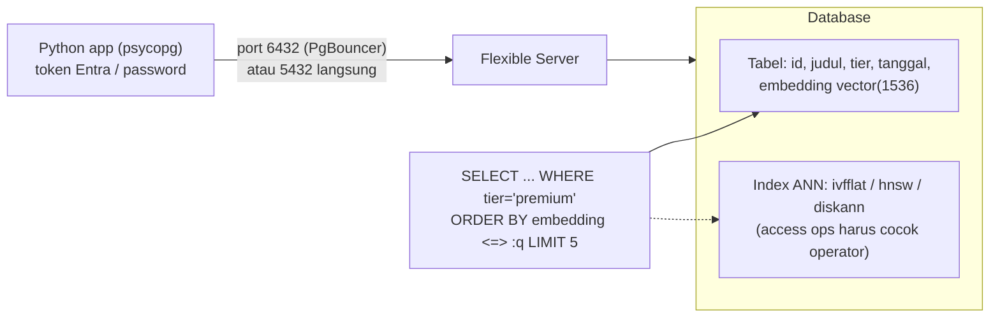

# Azure Database for PostgreSQL + pgvector

> Domain: 2 — Develop AI solutions by using Azure data management services (25–30%)
> Exam: AI-200 — Developing AI Cloud Solutions on Azure
> Status: Draft
> Last reviewed: 2026-07-15
> [← Kembali ke README](README.md)

## 1. Posisi Topik dalam Exam

Subheading **"Develop AI solutions by using Azure Database for PostgreSQL"** memiliki enam bullet — terbanyak di seluruh study guide (SRC-002):

| Bullet resmi (parafrase) | Coverage matrix |
|---|---|
| Connect dan query Azure Database for PostgreSQL via SDK | #12 |
| Modelkan schema dan strategi indexing: desain tabel dan pemilihan data type | #13 |
| Strategi indexing: optimasi latency query dan pengurangan overhead compute pgvector | #14 |
| Konfigurasi compute, memory, dan storage untuk vector workloads | #15 |
| Vector similarity search: simpan embedding, semantic retrieval, pola RAG dengan metadata filter | #16 |
| Optimasi koneksi untuk throughput dan latency | #17 |

Fokus sesuai catatan produk README: **Azure Database for PostgreSQL (Flexible Server)** + `pgvector`. Source ID utama: SRC-002, SRC-028 (hub), SRC-071–SRC-075 ([§15](#15-sumber-resmi)).

## 2. Learning Outcomes

Setelah menyelesaikan modul ini, saya mampu:

- Menghubungkan Python (`psycopg`) ke Flexible Server dengan **Microsoft Entra passwordless** (token scope `https://ossrdbms-aad.database.windows.net/.default`) dan menjalankan CRUD berparameter.
- Mengaktifkan extension `pgvector` (allowlist → `CREATE EXTENSION vector`) dan mendesain tabel dengan kolom `vector(n)` + kolom metadata.
- Memilih dan menala **index vector**: IVFFlat (`lists`/`probes`), HNSW (`m`/`ef_construction`/`ef_search`), DiskANN — termasuk batas **2000 dimensi untuk index** dan keharusan mencocokkan access function dengan operator query.
- Menguji rencana eksekusi dengan `EXPLAIN (ANALYZE, VERBOSE, BUFFERS)` dan menurunkan overhead compute pgvector.
- Menjalankan **similarity search + RAG dengan metadata filter** (WHERE, partial index, partitioning).
- Memilih tier compute (Burstable/General Purpose/Memory Optimized) untuk beban vector, dan **mengoptimalkan koneksi** dengan PgBouncer built-in (port 6432).

## 3. Mental Model

**Fakta resmi (SRC-071, SRC-073):** pgvector menambahkan tipe kolom `vector(n)` dan operator jarak ke PostgreSQL biasa — embedding hidup berdampingan dengan kolom relasional di tabel yang sama. Tanpa index, pencarian bersifat **exact** (recall sempurna, lambat); dengan index (IVFFlat/HNSW/DiskANN) menjadi **approximate nearest neighbor** — menukar sedikit recall demi kecepatan.



Penjelasan teks: aplikasi terhubung (idealnya lewat PgBouncer di port 6432 untuk pooling) lalu menjalankan SQL biasa; pencarian semantik = `ORDER BY embedding <operator> :query_vector LIMIT k`, dapat digabung filter WHERE metadata (inti pola RAG). Index ANN hanya dipakai bila operator query cocok dengan access function index — misal `<=>` (cosine) hanya memakai index `vector_cosine_ops` (SRC-073).

## 4. Konsep dan Fitur Kunci

### 4.1 Koneksi SDK Python (bullet #12)

**Fakta resmi (SRC-072):**

- Driver: **`psycopg`** (`pip install "psycopg[binary]"`); Python ≥ 3.8. Dua metode autentikasi: **Microsoft Entra (passwordless — direkomendasikan)** dan password PostgreSQL.
- Passwordless: `DefaultAzureCredential().get_token("https://ossrdbms-aad.database.windows.net/.default").token` menjadi "password" pada URI koneksi; server harus dikonfigurasi Entra admin. Catatan resmi: token berumur terbatas (±24 jam default) — produksi butuh refresh policy dan credential yang dipersist (token caching).
- `sslmode=require`; host `*.postgres.database.azure.com`; akses publik butuh firewall rule IP klien, akses privat butuh resource dalam VNet yang sama.
- Query selalu **berparameter** (`cursor.execute("... VALUES (%s, %s)", (a, b))`) — pola resmi semua contoh.

### 4.2 Schema, data types, dan pgvector (bullet #13)

**Fakta resmi (SRC-071):**

- Aktifkan extension dua langkah: (1) **allowlist** di server (`SHOW azure.extensions;` untuk cek — lihat how-to-allow-extensions), (2) per database: `CREATE EXTENSION vector;` — nama binary/extension adalah **`vector`**, bukan "pgvector".
- Desain tabel: kolom `embedding vector(3)` menetapkan dimensi. ⚠️ **Dimensi wajib dideklarasikan** bila kolom akan diindeks — `col vector` tanpa dimensi → `ERROR: column does not have dimensions` (SRC-073).
- Upsert idempotent: `INSERT ... ON CONFLICT (id) DO UPDATE SET embedding = EXCLUDED.embedding`.
- Operator jarak: **`<->`** Euclidean (L2), **`<#>`** negative inner product, **`<=>`** cosine distance (+ fungsi `l2_distance`, `inner_product`, `cosine_distance`, `l1_distance`; agregat `AVG`/`SUM`).
- *Interpretasi teknis:* kolom metadata (tier, tanggal, tenant) memakai tipe SQL biasa (text/date/uuid) di tabel yang sama — inilah keunggulan relasional untuk filter RAG (§4.5).

### 4.3 Indexing ANN dan pengurangan overhead (bullet #14)

**Fakta resmi (SRC-073):**

- **Mulai dari query plan:** `EXPLAIN (ANALYZE, VERBOSE, BUFFERS) SELECT ... ORDER BY embedding <-> '[..]' LIMIT 5;` — pertanyaan kunci: apakah paralel? apakah index dipakai? apakah WHERE cocok definisi partial index? apakah partisi ter-prune?
- **Tanpa index = exact search**; paralelisme (`max_parallel_workers_per_gather`) bisa mempercepat exact search tanpa index.
- **Muat data dulu, baru buat index** — build lebih cepat dan layout lebih optimal.
- Tiga tipe index:

| Index | Karakteristik | Parameter build | Parameter query |
|---|---|---|---|
| **IVFFlat** | Build tercepat, memori terkecil; speed-recall lebih rendah; perlu data saat build (k-means) | `lists` — mulai `rows/1000` (≤1 jt baris) atau `sqrt(rows)` | `ivfflat.probes` — mulai `lists/10` atau `sqrt(lists)`; `probes = lists` ⇒ exact (index tak dipakai) |
| **HNSW** | Build lebih lama/memori lebih besar; speed-recall lebih baik; bisa dibuat di tabel kosong | `m` (default 16), `ef_construction` (default 64) | `hnsw.ef_search` (default 40) |
| **DiskANN** | Keseimbangan terbaik build & akurasi; skala besar | `max_neighbors` (default 32), `l_value_ib` (default 50) | `diskann.l_value_is` |

- ⚠️ **Batas index 2000 dimensi** (`ivfflat`/`hnsw`): vektor >2000 dim bisa disimpan tetapi tidak diindeks — kurangi dimensi atau andalkan partitioning/sharding.
- **Access function harus cocok operator**: `vector_cosine_ops` ↔ `<=>`; `vector_l2_ops` ↔ `<->`; `vector_ip_ops` ↔ `<#>` — salah pasang = index tidak dipakai.
- **Mengurangi overhead compute:** vektor ternormalisasi (mis. OpenAI embeddings) → gunakan **inner product `<#>`** untuk performa terbaik; setel `probes`/`ef_search` per koneksi atau per transaksi (`SET LOCAL`) sesuai kebutuhan akurasi; pantau progres build via `pg_stat_progress_create_index`.

### 4.4 Sizing compute/memory/storage (bullet #15)

**Fakta resmi (SRC-075):**

- Tiga tier: **Burstable** (B-series, model CPU credit — "Not recommended for production workloads"; kredit habis = degradasi berat), **General Purpose** (4 GiB/vCore, produksi umum), **Memory Optimized** (6,75–9,5 GiB/vCore — "high-performance database workloads that require in-memory performance").
- Storage 32 GiB–64 TiB; **vCores bisa naik/turun, storage hanya naik**, perubahan dalam hitungan detik; storage tier menentukan IOPS min/maks.
- *Interpretasi teknis (label eksplisit):* beban vector diuntungkan memori besar — index ANN dan buffer cache yang muat di RAM menurunkan latency; HNSW/DiskANN membutuhkan lebih banyak memori saat build daripada IVFFlat (SRC-073). Maka: lab → Burstable kecil; produksi vector serius → General Purpose/Memory Optimized dengan RAM cukup untuk index. Dokumentasi yang diverifikasi tidak memberi rumus sizing eksplisit per jumlah vektor — jangan mengklaim angka pasti.

### 4.5 Vector search + RAG dengan metadata filter (bullet #16)

**Fakta resmi (SRC-071, SRC-073):**

- Similarity search dasar: `SELECT * FROM t ORDER BY embedding <-> '[3,1,2]' LIMIT 5;` — pembatas jarak: `WHERE embedding <-> '[3,1,2]' < 6`.
- **Metadata filter (pola RAG):** gabungkan WHERE biasa dengan ORDER BY vector. Dua strategi percepatan resmi:
  - **Partial index** — index hanya subset data: `CREATE INDEX t_premium ON t USING ivfflat (vec vector_ip_ops) WITH (lists = 100) WHERE tier = 'premium';` → query dengan `WHERE tier = 'premium'` memakai index; ⚠️ bentuk klausa harus **persis sama** — `tier LIKE 'premium'` tidak memakai index tersebut.
  - **Partitioning** — partisi by range (mis. tanggal), pastikan query menyaring subset partisi (partition pruning); tabel terpartisi tetap bisa diindeks vector.
- *Interpretasi teknis:* pipeline RAG = (1) embed pertanyaan di aplikasi, (2) `SELECT konten FROM dokumen WHERE <metadata filter> ORDER BY embedding <=> :qvec LIMIT k`, (3) masukkan hasil sebagai konteks LLM. Pembuatan embedding di luar cakupan modul (layanan embedding API).

### 4.6 Connection optimization (bullet #17)

**Fakta resmi (SRC-074):**

- Postgres memakai **model proses per koneksi** — banyak koneksi idle itu mahal; ribuan koneksi = resource constraint. Solusi built-in: **PgBouncer** (opsional per server, versi 1.25.1) — aktifkan `pgbouncer.enabled=true` (tanpa restart), lalu koneksikan aplikasi ke **port 6432** (host sama). Skala hingga ~10.000 koneksi.
- Parameter kunci: `pool_mode` default **transaction** (direkomendasikan untuk mayoritas), `default_pool_size` 50, `max_client_conn` 5000, `max_prepared_statements` (0 = off; perlu diaktifkan bila pakai protocol-level prepared statements di transaction mode).
- **Batasan penting:** tidak tersedia di tier **Burstable**; PgBouncer ikut restart saat scale/failover; single-threaded — beban koneksi pendek yang sangat besar bisa perlu beberapa instance/PgCat di VM; mendukung Microsoft Entra authentication; pada HA zone-redundant, connection string tetap sama setelah failover.
- Monitoring: metrics (aktifkan `metrics.pgbouncer_diagnostics`), logs (tabel `PGSQLPgBouncer`/`AzureDiagnostics`), admin console (`SHOW POOLS/STATS` via database `pgbouncer`, user di `pgbouncer.stats_users`).
- *Interpretasi teknis:* untuk throughput aplikasi — selain pooling: pertahankan credential/koneksi (jangan buat `DefaultAzureCredential` per panggilan — catatan resmi SRC-072), dan gunakan batch/parameterized statements.

## 5. Decision Guide

| Situasi | Pilihan | Dasar |
|---|---|---|
| Recall 100% wajib, dataset kecil / query jarang | Tanpa index (exact) + naikkan `max_parallel_workers_per_gather` | Fakta SRC-073 |
| Build cepat & memori kecil, recall boleh sedikit turun | **IVFFlat** (ingat: butuh data dulu — k-means) | Fakta SRC-073 |
| Speed-recall terbaik, tabel bisa kosong saat build | **HNSW** | Fakta SRC-073 |
| Skala besar, keseimbangan build & akurasi | **DiskANN** | Fakta SRC-073 |
| Embedding ternormalisasi (OpenAI) | Operator **`<#>`** (inner product) + `vector_ip_ops` | Fakta SRC-073 |
| RAG per-tenant/per-kategori dengan filter tetap | **Partial index** dengan WHERE persis sama | Fakta SRC-073 |
| Data time-series vector besar | **Partitioning** by range + pruning | Fakta SRC-073 |
| Vektor > 2000 dimensi | Reduksi dimensi, atau simpan tanpa index + partisi | Fakta SRC-073 |
| Banyak koneksi pendek/idle (web app, serverless) | **PgBouncer** port 6432, transaction mode | Fakta SRC-074 |
| Lab/dev hemat | **Burstable** (ingat: tanpa PgBouncer, bukan produksi) | Fakta SRC-075, SRC-074 |
| Produksi vector butuh RAM besar | **Memory Optimized** (6,75–9,5 GiB/vCore) | Fakta SRC-075 (+ interpretasi §4.4) |
| Pilih Cosmos DB NoSQL vs PostgreSQL untuk vector | Cosmos: colocation dokumen+vector, skala horizontal otomatis, RU model ([d2-01](d2-01-cosmos-db-nosql.md)); PostgreSQL: SQL relasional penuh, join, partial index/partitioning | **Inferensi teknis** — perbandingan lintas-layanan tidak dinyatakan eksplisit di dokumen yang diverifikasi |

## 6. Security

**Fakta resmi (SRC-072, SRC-074):**

- **Autentikasi:** Microsoft Entra passwordless direkomendasikan (label resmi "Recommended") — token via `DefaultAzureCredential`, scope `https://ossrdbms-aad.database.windows.net/.default`; kelola user identity terpusat. Password PostgreSQL = rotasi manual tanggung jawab Anda.
- **TLS:** `sslmode=require`; `require_secure_transport=ON` (default server baru) otomatis memberlakukan TLS juga untuk PgBouncer.
- **Network:** public access + firewall IP, atau private access (VNet) — klien harus berada dalam jaringan yang benar.
- **Least privilege:** buat role database terpisah untuk aplikasi (bukan admin server); user `pgbouncer.stats_users` hanya untuk konsol statistik read-only.
- Jangan menaruh password di kode — env var untuk lab, [d4-01 Key Vault](d4-01-azure-key-vault.md) untuk produksi.

## 7. Reliability, Performance, dan Cost

- **Performance (SRC-073):** alur baku — `EXPLAIN (ANALYZE, VERBOSE, BUFFERS)` → cek index terpakai/paralel/pruning; tuning `probes`/`ef_search` = tukar akurasi vs latency per koneksi/transaksi; load data sebelum build index.
- **Scaling (SRC-075):** vCore naik/turun & storage naik dalam detik — eksperimen sizing murah; storage tidak bisa turun (hati-hati overprovision).
- **Availability (SRC-074):** HA zone-redundant — PgBouncer restart otomatis di primary baru, connection string tetap.
- **Cost drivers:** compute tier + storage + backup retention (7–35 hari); **server menagih saat idle** — guardrail README: stop/hapus setelah lab; Burstable menghemat lab tetapi kredit CPU bisa habis saat build index besar (SRC-075). Harga: cek kalkulator/halaman pricing resmi saat eksekusi.
- **Idempotency lab:** `CREATE EXTENSION`/`CREATE TABLE` gagal bila sudah ada — gunakan `DROP ... IF EXISTS` (pola resmi quickstart) atau `IF NOT EXISTS`; `INSERT ... ON CONFLICT DO UPDATE` untuk upsert (SRC-071, SRC-072).

## 8. Praktik Hands-on

Tujuan lab: buat Flexible Server → aktifkan pgvector → desain tabel embedding+metadata → koneksi Python passwordless → similarity search + RAG filter → bandingkan exact vs IVFFlat vs HNSW via EXPLAIN → aktifkan PgBouncer dan pindah port. Dataset embedding kecil yang sama dengan [d2-01](d2-01-cosmos-db-nosql.md) (perbandingan apple-to-apple, roadmap README).

### 8.1 Prasyarat

- Azure subscription; Azure CLI + `az login`; server Flexible Server (buat via Portal — rujukan resmi quickstart-create-server, SRC-072) dengan **Microsoft Entra admin** dikonfigurasi dan firewall mengizinkan IP klien.
- Allowlist extension `vector` pada parameter server (`azure.extensions`) — cek dengan `SHOW azure.extensions;` (SRC-071).

### 8.2 Environment dan dependency versions

| Komponen | Nilai | Sumber |
|---|---|---|
| Python | ≥ 3.8 (quickstart) — selaras manifest repo ≥3.10 | SRC-072 |
| `psycopg` | `psycopg[binary]` terbaru | SRC-072 |
| `azure-identity` | terbaru (passwordless) | SRC-072 |
| PgBouncer built-in | 1.25.1 (port 6432; bukan Burstable) | SRC-074 |
| Tanggal verifikasi | 2026-07-15 | — |

`requirements.txt`:

```text
psycopg[binary]
azure-identity
```

### 8.3 Resource yang dibuat

`<RESOURCE_GROUP>` berisi satu Flexible Server `<PG_SERVER>`. Lab dasar: tier Burstable (hemat); langkah PgBouncer (§8.6 langkah 6) membutuhkan **General Purpose** — opsional, aktifkan hanya bila ingin menguji, lalu segera cleanup. **Server menagih saat idle.**

### 8.4 Placeholder dan naming convention

| Placeholder | Contoh |
|---|---|
| `<RESOURCE_GROUP>` | `rg-ai200-d202` |
| `<PG_SERVER>` | `pg-ai200-d202` → host `pg-ai200-d202.postgres.database.azure.com` |
| `<DBNAME>` | `postgres` (default) atau `ai200lab` |
| `<ENTRA_USER>` | mis. `nama@domain.com` |

### 8.5 Langkah Azure Portal

(1) Buat server: ikuti quickstart resmi *Create an Azure Database for PostgreSQL* (pilih tier, versi, region) — SRC-072 prasyarat; (2) **Security → Authentication**: pastikan akun Anda terdaftar sebagai Microsoft Entra Admin (SRC-072); (3) **Networking**: tambah firewall rule IP klien; (4) **Server parameters**: `azure.extensions` → centang `VECTOR` (allowlist — SRC-071); untuk PgBouncer: cari `pgbouncer.enabled` → `true` (tanpa restart; parameter lain baru tampak setelah pane dibuka ulang — SRC-074); (5) **Compute + storage**: amati estimasi biaya dan ubah vCore/storage (SRC-075).

### 8.6 Langkah SQL + CLI

```sql
-- 1. Per database: aktifkan extension (nama: vector)
CREATE EXTENSION vector;

-- 2. Tabel embedding + metadata (dimensi WAJIB utk index)
CREATE TABLE docs(
    id bigserial PRIMARY KEY,
    title text NOT NULL,
    tier text NOT NULL DEFAULT 'free',
    doc_date date NOT NULL DEFAULT now(),
    embedding vector(10)
);

-- 3. Data contoh (upsert idempotent)
INSERT INTO docs (id, title, tier, embedding) VALUES
  (1, 'Cloud Cooking', 'premium', '[1,2,3,4,5,6,7,8,9,10]'),
  (2, 'More Recipes',  'free',    '[2,3,4,5,6,7,8,9,10,11]'),
  (3, 'Vector Soup',   'premium', '[3,1,2,4,6,5,8,7,9,10]')
ON CONFLICT (id) DO UPDATE SET embedding = EXCLUDED.embedding;

-- 4. Baseline exact search + rencana eksekusi
EXPLAIN (ANALYZE, VERBOSE, BUFFERS)
SELECT title FROM docs ORDER BY embedding <=> '[1,2,3,4,5,6,7,8,9,10]' LIMIT 2;

-- 5. Index ANN (cosine) + partial index utk filter RAG
CREATE INDEX docs_emb_cos_idx ON docs
  USING ivfflat (embedding vector_cosine_ops) WITH (lists = 100);
CREATE INDEX docs_premium_idx ON docs
  USING ivfflat (embedding vector_cosine_ops) WITH (lists = 100)
  WHERE tier = 'premium';

-- 6. RAG query: metadata filter + similarity (operator <=> cocok vector_cosine_ops)
SET ivfflat.probes = 10;
SELECT title, embedding <=> '[1,2,3,4,5,6,7,8,9,10]' AS distance
FROM docs
WHERE tier = 'premium'
ORDER BY embedding <=> '[1,2,3,4,5,6,7,8,9,10]'
LIMIT 2;

-- 7. Verifikasi index dipakai (bandingkan dgn LIKE 'premium' yang TIDAK memakai partial index)
EXPLAIN SELECT * FROM docs WHERE tier = 'premium'
ORDER BY embedding <=> '[1,2,3,4,5,6,7,8,9,10]' LIMIT 2;
```

PgBouncer (opsional; server General Purpose): set `pgbouncer.enabled=true` di Server parameters, lalu uji `psql "host=<PG_SERVER>.postgres.database.azure.com port=6432 dbname=<DBNAME> user=<USER> sslmode=require"` — hanya port yang berubah (SRC-074).

### 8.7 Implementasi Python SDK

Pola resmi passwordless (SRC-072) + query vector:

```python
# get_conn.py — pola resmi (demo; produksi: persist credential + refresh token)
import os, urllib.parse
from azure.identity import DefaultAzureCredential

def get_connection_uri():
    dbhost = os.environ['DBHOST']          # <PG_SERVER>.postgres.database.azure.com
    dbname = os.environ['DBNAME']
    dbuser = urllib.parse.quote(os.environ['DBUSER'])
    sslmode = os.environ['SSLMODE']        # require
    credential = DefaultAzureCredential()
    password = credential.get_token(
        "https://ossrdbms-aad.database.windows.net/.default").token
    return f"postgresql://{dbuser}:{password}@{dbhost}/{dbname}?sslmode={sslmode}"
```

```python
# rag_query.py — similarity + metadata filter dari Python
import psycopg
from get_conn import get_connection_uri

conn = psycopg.connect(get_connection_uri())
cursor = conn.cursor()

query_vec = "[1,2,3,4,5,6,7,8,9,10]"
cursor.execute(
    """SELECT title, embedding <=> %s AS distance
       FROM docs
       WHERE tier = %s
       ORDER BY embedding <=> %s
       LIMIT %s;""",
    (query_vec, "premium", query_vec, 2),
)
for title, distance in cursor.fetchall():
    print(f"{title}: {distance:.4f}")

conn.commit(); cursor.close(); conn.close()
```

Untuk PgBouncer: cukup arahkan `DBHOST` yang sama dengan port 6432 pada URI (`...@{dbhost}:6432/...`).

### 8.8 Validasi hasil

1. `CREATE EXTENSION vector;` sukses (jika error, cek allowlist — §8.5).
2. Query langkah 6 mengembalikan hanya dokumen `premium` terurut jarak cosine naik.
3. `EXPLAIN` langkah 7 menampilkan `Index Scan using docs_premium_idx` untuk `tier = 'premium'`, dan **Seq Scan/Sort** untuk `tier LIKE 'premium'` (bukti kecocokan klausa partial index — SRC-073).
4. `rag_query.py` mencetak judul + jarak; koneksi passwordless tanpa password tersimpan.
5. (Opsional) koneksi port 6432 berhasil; `SHOW POOLS` di database `pgbouncer` menampilkan pool aktif.

### 8.9 Expected output

Pola `EXPLAIN` saat index dipakai (bentuk resmi SRC-073):

```text
Limit  (cost=...)
  ->  Index Scan using docs_emb_cos_idx on docs (...)
        Order By: (embedding <=> '[...]'::vector)
```

### 8.10 Troubleshooting test

Uji negatif aman: (1) jalankan query dengan operator `<->` (L2) padahal index `vector_cosine_ops` → `EXPLAIN` menunjukkan index tidak dipakai (mismatch access function — SRC-073); (2) buat kolom `vector` tanpa dimensi lalu coba index → `ERROR: column does not have dimensions`; (3) set `ivfflat.probes` = jumlah `lists` → planner meninggalkan index (exact search).

### 8.11 Cleanup

```bash
az group delete --name <RESOURCE_GROUP> --yes --no-wait
```

Menghapus resource group menghapus server beserta database dan backup terkait.

### 8.12 Verifikasi cleanup

```bash
az group exists --name <RESOURCE_GROUP>    # harus: false
az postgres flexible-server show --name <PG_SERVER> --resource-group <RESOURCE_GROUP>  # harus: not found
```

## 9. Troubleshooting Playbook

| Gejala | Kemungkinan penyebab | Cara memeriksa | Solusi |
|---|---|---|---|
| `CREATE EXTENSION vector` gagal | Extension belum di-allowlist di server | `SHOW azure.extensions;` | Tambah `VECTOR` ke `azure.extensions` (Server parameters), ulangi per database (SRC-071) |
| Index tidak dipakai (Seq Scan) | Operator query ≠ access function index; klausa WHERE ≠ definisi partial index; probes = lists | `EXPLAIN (ANALYZE, VERBOSE, BUFFERS)` | Cocokkan `<=>`↔cosine_ops / `<->`↔l2_ops / `<#>`↔ip_ops; samakan bentuk WHERE persis; turunkan probes (SRC-073) |
| `ERROR: column does not have dimensions` | Kolom `vector` tanpa dimensi diindeks | Definisi kolom | Deklarasikan `vector(n)` (SRC-073) |
| `ERROR: column cannot have more than 2000 dimensions` | Melebihi batas index ivfflat/hnsw | Dimensi embedding | Reduksi dimensi; atau simpan tanpa index + partisi/sharding (SRC-073) |
| Recall hasil ANN rendah | `probes`/`ef_search` terlalu kecil; IVFFlat dibuat sebelum data dimuat | Uji dengan nilai lebih besar (`SET LOCAL`) | Naikkan probes/ef_search; rebuild index setelah load data (SRC-073) |
| Koneksi gagal: timeout/refused | Firewall belum memuat IP klien; salah jaringan (private access) | Portal → Networking | Tambah firewall rule / akses dari VNet yang sama (SRC-072) |
| Auth Entra gagal | Bukan Entra admin; scope token salah | Security → Authentication; kode | Daftarkan Entra admin; scope `https://ossrdbms-aad.database.windows.net/.default` (SRC-072) |
| Koneksi putus tiap ±24 jam (passwordless) | Token Entra kedaluwarsa | — | Implement refresh policy; persist credential (catatan resmi SRC-072) |
| Server kehabisan koneksi / latensi koneksi tinggi | Model proses per koneksi + banyak koneksi pendek/idle | Metrics koneksi | Aktifkan PgBouncer, pindah port 6432, pool_mode transaction (SRC-074) |
| PgBouncer tidak tersedia | Tier Burstable | Cek tier server | Naik ke General Purpose/Memory Optimized (SRC-074) |
| Prepared statements error via PgBouncer | `max_prepared_statements` = 0 pada transaction mode | Parameter PgBouncer | Set > 0 (dukungan protocol-level) (SRC-074) |
| Performa anjlok parah di Burstable saat build index | CPU credits habis | Metric **CPU Credits Remaining** | Tunggu kredit pulih / naikkan size / pindah tier (SRC-075) |
| Query lambat meski ada index & filter partisi | Partisi tidak ter-prune | `EXPLAIN ANALYZE` (cek partisi yang discan) | Pastikan WHERE memfilter kolom partisi dengan rentang benar (SRC-073) |

## 10. Kaitan dengan Modul Lain

- **[d2-01 Cosmos DB](d2-01-cosmos-db-nosql.md) / [d2-03 Azure Managed Redis](d2-03-azure-managed-redis.md):** dataset embedding sama — bandingkan: policy immutable + `VectorDistance` (Cosmos) vs index ANN + SQL (PostgreSQL) vs vector index in-memory (Redis).
- **[d1-02](d1-02-azure-app-service-container.md)/[d1-03](d1-03-azure-container-apps-keda.md):** aplikasi RAG Python dari modul ini menjadi container yang dihosting di Domain 1; connection string/host via app settings.
- **[d4-01 Key Vault](d4-01-azure-key-vault.md):** simpan kredensial DB bila jalur password terpaksa dipakai.
- **[d4-03 Observability](d4-03-observability-opentelemetry-kql.md):** query KQL atas log PgBouncer (`PGSQLPgBouncer`) dan metrics server.
- [← README](README.md) — coverage matrix baris #12–#17.

## 11. Common Misconceptions dan Exam Decision Points

1. **"CREATE EXTENSION pgvector."** Salah — nama extension/binary adalah **`vector`**; dan di Azure harus **allowlist dulu** di parameter server (SRC-071).
2. **"Index vector otomatis dipakai."** Tidak — hanya bila operator query cocok dengan access function (`<=>`↔`vector_cosine_ops`, dll.); salah operator = Seq Scan (SRC-073).
3. **"Lebih banyak probes selalu lebih baik."** `probes = lists` menjadikan pencarian exact dan planner meninggalkan index — probes adalah kenop akurasi↔kecepatan (SRC-073).
4. **"IVFFlat bisa dibuat sebelum data dimuat."** Build IVFFlat memakai k-means atas data; buat index **setelah** load (HNSW/DiskANN boleh di tabel kosong) (SRC-073).
5. **"pgvector bisa mengindeks dimensi berapa pun."** Batas **2000 dimensi** untuk index (simpan boleh lebih); >2000 → reduksi dimensi/partisi (SRC-073).
6. **"Partial index bekerja untuk semua bentuk filter."** Klausa WHERE query harus cocok bentuk definisi index — `= 'premium'` ya, `LIKE 'premium'` tidak (SRC-073).
7. **"PgBouncer harus diinstal sendiri."** Built-in di Flexible Server (port 6432, enable via parameter, tanpa restart) — tetapi **tidak di Burstable** (SRC-074).
8. **"Burstable cukup untuk produksi kecil."** Peringatan resmi: model kredit CPU; "Not recommended for production workloads" (SRC-075).
9. **Decision point operator:** embedding ternormalisasi → `<#>` inner product untuk performa terbaik (SRC-073).
10. **Decision point lintas-layanan:** filter relasional kompleks + SQL → PostgreSQL; colocation dokumen JSON + skala RU → Cosmos ([d2-01](d2-01-cosmos-db-nosql.md)). *Inferensi pola soal.*

## 12. Checklist Pemahaman

- [ ] Saya bisa mengaktifkan `vector` (allowlist + CREATE EXTENSION) dan menjelaskan kenapa dua langkah.
- [ ] Saya bisa mendesain tabel embedding + metadata dan menjelaskan kenapa dimensi wajib untuk index.
- [ ] Saya hafal 3 operator jarak dan pasangan access function-nya.
- [ ] Saya bisa memilih IVFFlat vs HNSW vs DiskANN + parameter tuning masing-masing.
- [ ] Saya bisa membaca `EXPLAIN (ANALYZE, VERBOSE, BUFFERS)` untuk memverifikasi index/paralel/pruning.
- [ ] Saya bisa menulis query RAG (WHERE metadata + ORDER BY vector) dan mempercepatnya dengan partial index/partitioning.
- [ ] Saya bisa menjelaskan koneksi passwordless Entra (scope token, umur token) dari Python.
- [ ] Saya bisa mengaktifkan PgBouncer, tahu port 6432, pool mode transaction, dan batasannya.
- [ ] Saya bisa memilih tier compute untuk beban vector dan tahu arah scaling (vCore ↕, storage ↑).

## 13. Self-Assessment

**Q1.** `CREATE EXTENSION vector;` gagal di server baru Anda. Dua hal apa yang harus diperiksa, berurutan?
**Jawaban:** (1) Extension sudah di-allowlist? — `SHOW azure.extensions;`, tambahkan `VECTOR` di server parameters; (2) perintah dijalankan di database target? — extension dibuat **per database**. (SRC-071)

**Q2.** Embedding OpenAI (ternormalisasi) 1536 dimensi, 500k baris, query harus <50 ms dengan recall tinggi; tabel sudah terisi penuh. Rancang index + operator.
**Jawaban:** Operator **`<#>`** (inner product — rekomendasi resmi untuk vektor ternormalisasi) dengan access function **`vector_ip_ops`**; index **HNSW** (speed-recall terbaik) atau DiskANN; jika IVFFlat: `lists = 500000/1000 = 500`, `probes` mulai `lists/10 = 50`. 1536 < 2000 → aman diindeks. (SRC-073)

**Q3.** Query RAG Anda `WHERE tenant_id = 'a1' ORDER BY embedding <=> :q LIMIT 5` lambat; ada partial index `WHERE tenant_id = 'a1'` tetapi EXPLAIN menunjukkan Seq Scan. Tiga penyebab yang mungkin?
**Jawaban:** (1) Operator query tidak cocok access function index (mis. index `vector_ip_ops` tapi query `<=>`); (2) bentuk klausa berbeda dari definisi partial index (mis. `LIKE`/fungsi); (3) `probes` disetel = `lists` sehingga planner memilih exact. Verifikasi dengan `EXPLAIN (ANALYZE, VERBOSE, BUFFERS)`. (SRC-073)

**Q4.** Kenapa IVFFlat sebaiknya dibuat setelah data dimuat, sementara HNSW tidak masalah di tabel kosong?
**Jawaban:** IVFFlat mempartisi dataset dengan **k-means** — butuh data representatif saat build; HNSW membangun graf tanpa langkah training. Umum untuk keduanya: load-then-index lebih cepat dan layout lebih optimal. (SRC-073)

**Q5.** Aplikasi serverless membuka ratusan koneksi pendek per menit; latensi naik dan server mendekati batas koneksi. Solusi resmi bawaan dan tiga konfigurasinya?
**Jawaban:** **PgBouncer built-in**: `pgbouncer.enabled=true` (tanpa restart), aplikasi pindah ke **port 6432**, `pool_mode=transaction` (default, direkomendasikan); perhatikan `default_pool_size`/`max_client_conn`; tidak tersedia di Burstable. (SRC-074)

**Q6.** Token connection passwordless Anda gagal setelah sehari berjalan. Jelaskan dan solusinya.
**Jawaban:** Token Microsoft Entra berumur terbatas (±24 jam default) — kode demo mengambil token sekali; produksi wajib **token refresh policy** dan mempersist credential (token caching). (SRC-072)

**Q7.** Tim memilih Burstable B2s untuk produksi RAG dan mengeluh performa anjlok setiap build index. Analisis Anda?
**Jawaban:** Burstable memakai model CPU credit — build index menghabiskan kredit; setelah habis, server dibatasi ke baseline (degradasi berat). Resmi: tidak direkomendasikan untuk produksi. Pindah ke General Purpose/Memory Optimized (vector diuntungkan RAM besar — interpretasi berlabel §4.4); pantau metric CPU Credits Remaining. (SRC-075)

**Q8.** Sebutkan dua strategi resmi mempercepat vector search yang selalu difilter subset data, dan jebakan masing-masing.
**Jawaban:** (1) **Partial index** — jebakan: klausa WHERE harus persis sama bentuknya dengan definisi; (2) **Partitioning** by range — jebakan: query harus menyaring kolom partisi agar pruning terjadi (cek EXPLAIN). (SRC-073)

## 14. Ringkasan Cepat

| Hal | Nilai |
|---|---|
| Aktivasi | allowlist `VECTOR` (server param) → `CREATE EXTENSION vector;` per database |
| Tipe kolom | `vector(n)` — dimensi wajib untuk index; batas index 2000 dim |
| Operator ↔ ops | `<->`↔`vector_l2_ops` · `<#>`↔`vector_ip_ops` · `<=>`↔`vector_cosine_ops` |
| IVFFlat | `lists` = rows/1000 atau √rows; `probes` = lists/10 atau √lists; butuh data saat build |
| HNSW | `m`=16, `ef_construction`=64; query `hnsw.ef_search` (40) |
| DiskANN | `max_neighbors`=32, `l_value_ib`=50; query `diskann.l_value_is` |
| Diagnostik | `EXPLAIN (ANALYZE, VERBOSE, BUFFERS)`; `pg_stat_progress_create_index` |
| RAG filter | WHERE metadata + partial index (klausa persis) / partitioning (pruning) |
| Ternormalisasi | pakai `<#>` inner product |
| Python | `psycopg[binary]`; passwordless: token scope `https://ossrdbms-aad.database.windows.net/.default`; sslmode=require |
| Pooling | PgBouncer built-in 1.25.1, port **6432**, transaction mode; bukan di Burstable |
| Tier | Burstable (lab; kredit CPU) / General Purpose (4 GiB/vCore) / Memory Optimized (6,75–9,5 GiB/vCore); vCore ↕, storage ↑ |

## 15. Sumber Resmi

| Source ID | Link | Bagian yang digunakan | Diakses |
|---|---|---|---|
| SRC-002 | <https://learn.microsoft.com/en-us/credentials/certifications/resources/study-guides/ai-200> | Bullet skills measured Domain 2 | 2026-07-15 |
| SRC-028 | <https://learn.microsoft.com/en-us/azure/postgresql/> | Hub docs Azure Database for PostgreSQL | 2026-07-15 |
| SRC-071 | <https://learn.microsoft.com/en-us/azure/postgresql/flexible-server/how-to-use-pgvector> | Allowlist + `CREATE EXTENSION vector`; tipe `vector(n)`; INSERT/ON CONFLICT; operator `<->`/`<#>`/`<=>`; fungsi & agregat vector | 2026-07-15 |
| SRC-072 | <https://learn.microsoft.com/en-us/azure/postgresql/flexible-server/connect-python> | `psycopg`; Entra passwordless (scope `ossrdbms-aad`, umur token ±24 jam); sslmode=require; firewall; CRUD berparameter; Python ≥3.8 | 2026-07-15 |
| SRC-073 | <https://learn.microsoft.com/en-us/azure/postgresql/flexible-server/how-to-optimize-performance-pgvector> | EXPLAIN (ANALYZE,VERBOSE,BUFFERS); paralelisme; IVFFlat/HNSW/DiskANN + parameter & heuristik; batas 2000 dim; access ops ↔ operator; `<#>` utk vektor ternormalisasi; partial index (jebakan LIKE); partitioning/pruning; `pg_stat_progress_create_index` | 2026-07-15 |
| SRC-074 | <https://learn.microsoft.com/en-us/azure/postgresql/flexible-server/concepts-pgbouncer> | PgBouncer built-in 1.25.1; port 6432; pool_mode transaction; parameter; **tidak di Burstable**; Entra support; metrics/logs/admin console; batasan single-threaded & failover | 2026-07-15 |
| SRC-075 | <https://learn.microsoft.com/en-us/azure/postgresql/flexible-server/concepts-compute> | Tier Burstable (credit model, bukan produksi)/General Purpose (4 GiB/vCore)/Memory Optimized (6,75–9,5 GiB/vCore); storage 32 GiB–64 TiB; vCore ↕ storage ↑ dalam detik; tabel SKU IOPS | 2026-07-15 |
