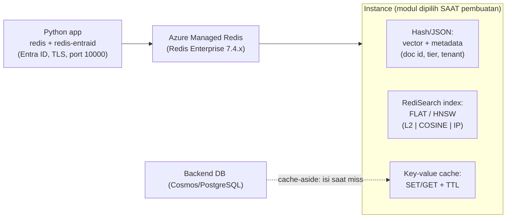

# Azure Managed Redis

> Domain: 2 — Develop AI solutions by using Azure data management services (25–30%)
> Exam: AI-200 — Developing AI Cloud Solutions on Azure
> Status: Draft
> Last reviewed: 2026-07-15
> [← Kembali ke README](README.md)

## 1. Posisi Topik dalam Exam

Subheading **"Integrate Azure Managed Redis in AI solutions"** memiliki dua bullet (SRC-002):

| Bullet resmi (parafrase) | Coverage matrix |
|---|---|
| Operasi data Azure Managed Redis: caching, expiration, invalidation | #18 |
| Vector indexing untuk mengaktifkan similarity search | #19 |

⚠️ **Penjagaan produk (catatan README):** ini **Azure Managed Redis** (hub `/azure/redis/`, berbasis **Redis Enterprise**) — BUKAN produk lama **Azure Cache for Redis** (hub `/azure/azure-cache-for-redis/`). Keduanya punya port, tier, dan kapabilitas berbeda. Source ID utama: SRC-002, SRC-029 (hub), SRC-076–SRC-078 ([§15](#15-sumber-resmi)).

## 2. Learning Outcomes

Setelah menyelesaikan modul ini, saya mampu:

- Menjelaskan posisi Azure Managed Redis (Redis Enterprise, versi 7.4.x) dan **empat tier** (Memory Optimized 8:1, Balanced 4:1, Compute Optimized 2:1, Flash Optimized) beserta kapan memilihnya.
- Menghubungkan Python (`redis` + `redis-entraid` + `azure-identity`) via **Microsoft Entra ID** ke **port 10000**.
- Mengimplementasikan pola **cache-aside** dengan expiration (TTL) dan invalidation (update/delete + eviction policy).
- Merencanakan instance untuk **vector search**: modul **RediSearch** wajib diaktifkan **saat pembuatan**, clustering policy **Enterprise**, eviction **NoEviction**, tier non-Flash.
- Membedakan index **FLAT** vs **HNSW**, metrik **L2/COSINE/IP**, penyimpanan vector di **hash/JSON**, dan **hybrid search** (filter metadata + KNN).
- Memilih antara AMR, Cosmos DB, PostgreSQL+pgvector, dan AI Search untuk beban vector (tabel resmi).

## 3. Mental Model

**Fakta resmi (SRC-076, SRC-077):** AMR adalah **in-memory data store** berbasis Redis Enterprise — dioperasikan Microsoft, kompatibel dengan Redis community. Perannya dalam solusi AI dua sisi: (1) **cache/data ops** klasik (cache-aside, session store, antrean kerja); (2) **vector database latensi-rendah** via modul RediSearch (RAG, semantic caching, LLM conversation memory).



Penjelasan teks: aplikasi terhubung dengan autentikasi Entra ID lewat TLS ke port 10000. Data cache biasa disimpan key-value dengan TTL (pola cache-aside: isi cache hanya saat dibutuhkan, perbarui saat data berubah). Untuk vector search, embedding + metadata disimpan pada **hash atau JSON**, diindeks RediSearch (FLAT exact / HNSW approximate), dan di-query KNN top-K — bisa digabung filter metadata (hybrid search).

## 4. Konsep dan Fitur Kunci

### 4.1 Produk dan tier

**Fakta resmi (SRC-076):**

- Berbasis **Redis Enterprise**; mendukung Redis **7.4.x**; dipakai juga untuk non-caching (ingestion, dedup, messaging, leaderboards).
- **Empat tier:** **Memory Optimized** (rasio memori:vCPU **8:1** — memory-intensive, dev/test), **Balanced** (**4:1** — beban standar), **Compute Optimized** (**2:1** — throughput maksimum), **Flash Optimized** (RAM + NVMe — dataset besar hemat biaya, dengan penurunan performa; ⚠️ **tanpa dukungan search/vector**).
- **High availability** default (primary+replica lintas ≥2 node; bisa dimatikan untuk dev/test = lebih murah tapi ada risiko data loss), data persistence opsional, active geo-replication (kecuali Flash; B0/B1 tidak mendukung), private endpoint, **Microsoft Entra ID authentication** di semua tier.
- Skala koneksi per SKU (15.000 hingga 200.000); bandwidth naik dengan tier/size.

### 4.2 Data operations: caching, expiration, invalidation (bullet #18)

**Fakta resmi (SRC-076):** pola **cache-aside** — "load data into the cache only as needed. When the system makes changes to the data, it can also update the cache… Additionally, the system can set an **expiration** on data, or use an **eviction policy** to trigger data updates into the cache."

Tiga mekanisme menjaga cache tetap benar:

1. **Expiration (TTL)** — nilai kedaluwarsa otomatis setelah T detik; cocok untuk data yang boleh basi sebentar.
2. **Invalidation eksplisit** — saat sumber berubah: perbarui nilai cache (write-through ke cache) atau hapus key agar dibaca ulang dari sumber.
3. **Eviction policy** — instance penuh → kebijakan menentukan key mana yang tersingkir. ⚠️ Interaksi penting: dengan RediSearch aktif, kebijakan wajib **NoEviction** (SRC-077) — kontrol memori bergeser sepenuhnya ke TTL + sizing.

Perintah inti (perilaku Redis standar — AMR "maintaining compatibility" dengan Redis, SRC-076): `SET key value EX <detik>` / `GET` / `EXPIRE` / `TTL` / `DEL`; di klien Python `redis`: `r.set(k, v, ex=60)`, `r.get(k)`, `r.expire(k, 60)`, `r.ttl(k)`, `r.delete(k)` (metode standar package `redis` yang dipakai quickstart resmi — SRC-078).

### 4.3 Koneksi Python + Entra ID

**Fakta resmi (SRC-078):**

- Package: **`redis`**, **`redis-entraid`**, **`azure-identity`**; Python ≥ 3.7.
- ⚠️ **Port AMR/Enterprise = 10000**; port Azure Cache for Redis = 6380 — pembeda produk yang paling sering keliru.
- Entra ID **aktif default** saat pembuatan; credential provider: `create_from_default_azure_credential(("https://redis.azure.com/.default",))` → `redis.Redis(host=..., port=10000, ssl=True, credential_provider=...)`.
- Prasyarat akses: **tambahkan user/service principal sebagai Redis user pada cache** (halaman entra-for-authentication) dan login `az`/`azd` di klien.

### 4.4 Vector indexing & similarity search (bullet #19)

**Fakta resmi (SRC-077):**

- Kapabilitas vector membutuhkan modul **RediSearch** — di AMR tersedia sebagai managed module yang **hanya bisa diaktifkan saat pembuatan instance** ("You can't add modules… after it's created"); versi modul dikelola layanan.
- **Syarat provisioning untuk vector search:** RediSearch enabled + clustering policy **Enterprise** + eviction **NoEviction** + tier in-memory (Memory Optimized/Balanced/Compute Optimized — **bukan Flash**); ukur kapasitas untuk data vector **plus overhead index**.
- **Penyimpanan:** vector di **hash atau JSON**, bersama **metadata** (doc ID, title, source URL, category, timestamp, tenant, access-control) — metadata memungkinkan filter dan sitasi RAG.
- **Index:** **FLAT** (exact brute-force — dataset kecil/recall penuh) dan **HNSW** (approximate — dataset besar, latensi rendah); metrik jarak **L2, COSINE, IP**; query **KNN top-K**, **vector range queries**, dan **hybrid search** (filter geospasial/numerik/teks, prefix/fuzzy/phonetic, boolean).
- **Konsistensi model embedding:** satu model embedding per index — schema, dimensi, dan metrik harus cocok dengan model yang dipakai.
- Skenario resmi: semantic Q&A/RAG, document retrieval, rekomendasi, visual search, **semantic caching** (cache jawaban LLM untuk prompt yang mirip), **LLM conversation memory**.

Sintaks perintah RediSearch (FT.CREATE/FT.SEARCH) tidak dimuat pada halaman Microsoft yang diverifikasi — rujuk dokumentasi RediSearch/tutorial yang **ditautkan dari halaman resmi** (SRC-077 menaut tutorial LangChain dan dokumentasi Redis) saat implementasi; perlakukan sebagai *operational destination*, bukan otoritas kebijakan Microsoft.

## 5. Decision Guide

| Situasi | Pilihan | Dasar |
|---|---|---|
| Cache + session + vector + LLM memory dalam satu layanan latensi-rendah | **Azure Managed Redis** | Fakta SRC-077 (tabel "Consider when") |
| Vector search bersanding data NoSQL operasional | Cosmos DB ([d2-01](d2-01-cosmos-db-nosql.md)) | Fakta SRC-077 |
| Vector + relasional SQL (pgvector) | PostgreSQL ([d2-02](d2-02-azure-database-postgresql.md)) | Fakta SRC-077 |
| Search-first: indexing dokumen, relevance tuning enterprise | Azure AI Search — **out of primary exam scope** (tidak ada di skills measured) | Fakta SRC-077 (pembanding) |
| Dataset vector kecil, recall 100% | Index **FLAT** | Fakta SRC-077 |
| Dataset besar, prioritas latensi | Index **HNSW** | Fakta SRC-077 |
| Butuh vector search → pilih tier | Memory/Balanced/Compute Optimized — **jangan Flash** | Fakta SRC-076/SRC-077 |
| Dev/test hemat | Balanced kecil (B0/B1); HA bisa dimatikan utk dev/test | Fakta SRC-076 (ingat: B0/B1 tanpa geo-replication) |
| Dataset sangat besar, toleran performa lebih rendah, tanpa vector | **Flash Optimized** | Fakta SRC-076 |
| Data boleh basi T detik vs harus selalu segar | TTL (expiration) vs invalidation eksplisit saat write | Fakta SRC-076 (pola cache-aside); pemilihan = **interpretasi teknis** |
| Cache jawaban LLM untuk prompt serupa | **Semantic caching** di AMR | Fakta SRC-077 |

## 6. Security

**Fakta resmi (SRC-076, SRC-078, SRC-077):**

- **Autentikasi:** Microsoft Entra ID (default saat pembuatan; semua tier) — package `redis-entraid`, scope token `https://redis.azure.com/.default`; kelola akses dengan menambahkan user/principal sebagai **Redis user** pada cache; ini menggantikan access key statis (least privilege + rotasi otomatis token).
- **Transport:** TLS (`ssl=True` pada klien); data encryption in transit di semua tier.
- **Network:** private endpoint/Private Link tersedia semua tier; produksi vector: pertimbangkan Private Link + HA + diagnostics (guidance resmi SRC-077).
- **Metadata access-control:** simpan field access-control bersama vector agar query RAG bisa memfilter dokumen sesuai izin user (SRC-077).

## 7. Reliability, Performance, dan Cost

- **HA (SRC-076):** default aktif (primary+replica ≥2 node, zona tersebar bila didukung); menonaktifkan HA menurunkan harga tetapi berisiko data loss/downtime — hanya dev/test.
- **Persistence vs Flash (SRC-076):** data persistence = backup on-disk untuk pemulihan (bukan penambah kapasitas); Flash Optimized = data tiering RAM→NVMe untuk kapasitas (bukan penambah resiliensi).
- **Sizing vector (SRC-077):** kapasitas = data vector + overhead index; satu model embedding per index.
- **Koneksi & bandwidth (SRC-076):** batas koneksi naik dengan tier/size (15k–200k); bandwidth mengikuti ukuran VM — saturasi jaringan menimbulkan timeout.
- **Cost drivers:** ukuran + tier + HA; IP & bandwidth geo-replication saat ini diserap Microsoft (bisa berubah — catatan resmi); **instance menagih selama hidup** → guardrail README: hapus setelah lab; SKU >350 GB masih preview.
- **Idempotency lab:** `SET` bersifat overwrite (aman diulang); pembuatan instance dengan nama sama tidak dapat mengubah modul (immutable saat pembuatan — rencanakan modul sejak awal).

## 8. Praktik Hands-on

Tujuan lab: buat instance **dengan RediSearch aktif** (agar bagian vector bisa dilanjutkan tanpa membuat ulang) → koneksi Python Entra ID → cache-aside + TTL + invalidation → rencana index vector + verifikasi kapabilitas. Dataset embedding sama dengan [d2-01](d2-01-cosmos-db-nosql.md)/[d2-02](d2-02-azure-database-postgresql.md).

### 8.1 Prasyarat

- Azure subscription; Azure CLI (`az login`).
- Instance dibuat via Portal quickstart resmi (`quickstart-create-managed-redis`, dirujuk SRC-077/SRC-078) — **saat pembuatan**: pilih tier non-Flash, aktifkan modul **RediSearch**, clustering policy **Enterprise**, eviction **NoEviction** (SRC-077).
- Tambahkan akun Anda sebagai **Redis user** pada cache (halaman entra-for-authentication — SRC-078).

### 8.2 Environment dan dependency versions

| Komponen | Nilai | Sumber |
|---|---|---|
| Python | ≥ 3.7 (quickstart) — selaras manifest repo ≥3.10 | SRC-078 |
| `redis`, `redis-entraid`, `azure-identity` | terbaru | SRC-078 |
| Port | **10000** (AMR) | SRC-078 |
| Redis version | 7.4.x | SRC-076 |
| Tanggal verifikasi | 2026-07-15 | — |

`requirements.txt`:

```text
redis
redis-entraid
azure-identity
```

### 8.3 Resource yang dibuat

`<RESOURCE_GROUP>` berisi satu instance AMR `<REDIS_NAME>` (tier Balanced kecil, RediSearch enabled, HA sesuai kebutuhan — nonaktif untuk lab menghemat biaya, dengan catatan risiko resmi). **Instance menagih selama hidup.**

### 8.4 Placeholder dan naming convention

| Placeholder | Contoh |
|---|---|
| `<RESOURCE_GROUP>` | `rg-ai200-d203` |
| `<REDIS_NAME>` / `<HOST_URL>` | `redis-ai200-d203` / host dari Portal (Overview) |

### 8.5 Langkah Azure Portal

(1) Buat instance: ikuti quickstart *Create an Azure Managed Redis instance* — pilih SKU/tier; pada langkah **modul**: centang **RediSearch** (ingat: tidak bisa ditambah belakangan), clustering policy **Enterprise**, eviction **NoEviction** (SRC-077); (2) **Authentication**: pastikan Entra ID aktif dan tambahkan diri Anda sebagai Redis user (SRC-078); (3) catat **host URL** dari Overview; (4) amati batas koneksi/tier di blade Scale (SRC-076).

### 8.6 Langkah CLI

Interaksi data dilakukan via Python (§8.7); CLI dipakai untuk verifikasi resource dan cleanup:

```bash
az group create --name <RESOURCE_GROUP> --location <LOCATION>   # bila belum ada
# (pembuatan instance via Portal — §8.5; parameter modul/cluster policy dipilih di wizard)
az group delete --name <RESOURCE_GROUP> --yes --no-wait          # cleanup (§8.11)
```

### 8.7 Implementasi Python SDK

Bagian A — koneksi + cache-aside + TTL + invalidation (pola koneksi resmi SRC-078; perintah data = metode standar package `redis`):

```python
import time
import redis
from redis_entraid.cred_provider import create_from_default_azure_credential

REDIS_HOST = "<HOST_URL>"
REDIS_PORT = 10000   # port default Azure Managed Redis (SRC-078)

credential_provider = create_from_default_azure_credential(
    ("https://redis.azure.com/.default",),
)
r = redis.Redis(host=REDIS_HOST, port=REDIS_PORT, ssl=True,
                decode_responses=True, credential_provider=credential_provider)
print("PING:", r.ping())

# --- Cache-aside (SRC-076): baca cache dulu; miss -> ambil dari "DB" -> isi cache + TTL
def get_product(pid: str) -> str:
    key = f"product:{pid}"
    cached = r.get(key)
    if cached is not None:
        return f"(cache) {cached}"
    value = f"data-produk-{pid}-dari-database"     # simulasi baca backend
    r.set(key, value, ex=60)                       # expiration 60 dtk
    return f"(db) {value}"

print(get_product("42"))   # (db) ...   -> mengisi cache
print(get_product("42"))   # (cache) ...
print("TTL:", r.ttl("product:42"))                 # sisa umur key

# --- Invalidation eksplisit saat sumber berubah (SRC-076: update cache / hapus key)
r.set("product:42", "data-produk-42-versi-baru", ex=60)   # opsi 1: overwrite
r.delete("product:42")                                     # opsi 2: hapus -> reload saat akses
print("Setelah delete:", r.get("product:42"))              # None

r.close()
```

Bagian B — vector (kapabilitas terverifikasi; sintaks FT dari dokumentasi yang ditautkan halaman resmi): simpan tiap dokumen sebagai **hash** berisi field metadata (`title`, `tier`) + field vector (bytes float32), buat index **HNSW/FLAT** dengan metrik **COSINE** berdimensi sesuai model embedding, lalu query **KNN top-K** dengan filter metadata (hybrid). Implementasi perintah `FT.CREATE`/`FT.SEARCH` mengikuti dokumentasi RediSearch dan tutorial LangChain yang ditautkan dari SRC-077 — **verifikasi sintaks saat eksekusi** (bagian ini `Needs Review` sampai dijalankan; kapabilitas dan syarat provisioning-nya sendiri adalah fakta terverifikasi).

### 8.8 Validasi hasil

1. `PING: True` — koneksi Entra ID + TLS port 10000 berhasil (pola output resmi SRC-078).
2. Panggilan pertama `get_product` mencetak `(db)`, kedua `(cache)` — bukti cache-aside.
3. `TTL` mengembalikan angka ≤60 dan menurun; setelah 60 dtk key hilang (expiration).
4. Setelah `delete`, `get` mengembalikan `None` (invalidation).
5. Portal menunjukkan modul RediSearch aktif pada instance (bukti provisioning benar untuk bullet #19).

### 8.9 Expected output

```text
PING: True
(db) data-produk-42-dari-database
(cache) data-produk-42-dari-database
TTL: 59
Setelah delete: None
```

### 8.10 Troubleshooting test

Uji negatif aman: (1) jalankan skrip **sebelum** menambahkan diri sebagai Redis user → error autentikasi (bukti syarat SRC-078); (2) coba koneksi ke port 6380 → gagal (port itu milik Azure Cache for Redis, bukan AMR); (3) di Portal, coba menambah modul pada instance yang sudah ada → tidak tersedia (immutable — SRC-077).

### 8.11 Cleanup

```bash
az group delete --name <RESOURCE_GROUP> --yes --no-wait
```

### 8.12 Verifikasi cleanup

```bash
az group exists --name <RESOURCE_GROUP>    # harus: false
```

Portal: pastikan instance tidak lagi terdaftar di Resource groups.

## 9. Troubleshooting Playbook

| Gejala | Kemungkinan penyebab | Cara memeriksa | Solusi |
|---|---|---|---|
| Koneksi gagal/timeout | Salah port (6380 vs **10000**); TLS off; network/private endpoint | Cek kode koneksi | Port 10000 + `ssl=True` untuk AMR (SRC-078) |
| Error autentikasi Entra | Belum ditambahkan sebagai Redis user; belum `az login`; scope salah | Cek daftar Redis user di Portal | Tambah user/principal ke cache; scope `https://redis.azure.com/.default` (SRC-078) |
| Butuh vector search tetapi modul tidak ada | RediSearch tidak diaktifkan saat pembuatan | Portal → modul instance | **Buat instance baru** dengan RediSearch — modul tidak bisa ditambah belakangan (SRC-077) |
| Vector search tidak tersedia di tier | Instance Flash Optimized | Cek tier | Pindah ke Memory/Balanced/Compute Optimized (SRC-076/SRC-077) |
| Error kebijakan eviction saat pakai RediSearch | Eviction ≠ NoEviction | Cek eviction policy | Set NoEviction (syarat RediSearch — SRC-077) |
| Memori penuh padahal NoEviction | Tanpa eviction, kontrol memori = TTL + sizing | Pantau metrik memori | Pastikan TTL pada data cache; perbesar SKU; pisahkan instance cache vs vector (*interpretasi teknis*) |
| Data cache basi setelah sumber berubah | Tidak ada invalidation | — | Overwrite/hapus key saat write ke sumber; atau perpendek TTL (SRC-076) |
| Hasil similarity aneh/buruk | Model embedding campur; dimensi/metrik tak cocok model | Bandingkan schema index vs model | Satu model per index; samakan dimensi & metrik (SRC-077) |
| Timeout saat beban tinggi | Saturasi bandwidth/koneksi SKU | Tabel koneksi & bandwidth per SKU | Naikkan tier/size (SRC-076) |
| Kapasitas habis saat load vector | Sizing tidak memperhitungkan overhead index | — | Ukur data + index overhead; naikkan size (SRC-077) |

## 10. Kaitan dengan Modul Lain

- **[d2-01 Cosmos DB](d2-01-cosmos-db-nosql.md) & [d2-02 PostgreSQL](d2-02-azure-database-postgresql.md):** tiga opsi vector Domain 2 — tabel pemilihan resmi ada di SRC-077 (§5); dataset embedding sama untuk perbandingan.
- **[d3-01 Service Bus](d3-01-azure-service-bus.md):** worker yang mengisi/invalidasi cache dari event perubahan data (pola integrasi roadmap).
- **[d1-03 Container Apps](d1-03-azure-container-apps-keda.md):** KEDA mendukung Redis sebagai event source scaling (SRC-025).
- **[d4-01 Key Vault](d4-01-azure-key-vault.md):** tidak diperlukan untuk auth Entra (tanpa key statis) — justru contoh least-secret architecture.
- **[d4-03 Observability](d4-03-observability-opentelemetry-kql.md):** connection audit logs & metrics instance.
- [← README](README.md) — coverage matrix baris #18–#19.

## 11. Common Misconceptions dan Exam Decision Points

1. **"Azure Managed Redis = Azure Cache for Redis versi baru dengan setting sama."** Produk berbeda: AMR berbasis Redis Enterprise, hub docs sendiri, **port 10000** (ACR lama 6380), tier M/B/X/Flash — jangan tertukar (SRC-076, SRC-078). Ini penjagaan produk utama modul ini.
2. **"Modul RediSearch bisa diaktifkan nanti kalau butuh."** Salah — modul hanya saat **pembuatan**; salah rencana = buat ulang instance (SRC-077).
3. **"Vector search jalan di semua tier."** Flash Optimized **tidak** mendukung search/vector (SRC-076/SRC-077).
4. **"Eviction policy bebas saat pakai RediSearch."** Wajib **NoEviction** — dan konsekuensinya manajemen memori bergantung TTL + sizing (SRC-077).
5. **"FLAT selalu lebih buruk dari HNSW."** FLAT = exact/recall penuh — tepat untuk dataset kecil atau kebutuhan exhaustive; HNSW = approximate untuk skala besar (SRC-077).
6. **"Cache pasti konsisten dengan database."** Cache-aside butuh disiplin expiration/invalidation — TTL untuk toleransi basi, update/delete key saat write (SRC-076).
7. **"Ganti model embedding tidak masalah asal dimensi sama."** Guidance resmi: gunakan **satu model konsisten per index**; schema/dimensi/metrik harus cocok model (SRC-077).
8. **Decision point tiga layanan vector Domain 2:** latensi-cache + LLM memory → AMR; dokumen operasional NoSQL → Cosmos; relasional SQL → PostgreSQL (tabel resmi SRC-077). AI Search = pembanding **out of primary exam scope**.

## 12. Checklist Pemahaman

- [ ] Saya bisa membedakan AMR vs Azure Cache for Redis (basis produk, hub docs, port).
- [ ] Saya hafal 4 tier + rasio memori:vCPU dan batasan Flash (tanpa vector).
- [ ] Saya bisa menghubungkan Python via Entra ID (packages, scope, port 10000, Redis user).
- [ ] Saya bisa mengimplementasikan cache-aside + TTL + invalidation dan menjelaskan trade-off-nya.
- [ ] Saya hafal syarat provisioning vector: RediSearch saat pembuatan + Enterprise clustering + NoEviction + tier non-Flash.
- [ ] Saya bisa memilih FLAT vs HNSW dan metrik L2/COSINE/IP sesuai model embedding.
- [ ] Saya bisa menjelaskan hybrid search (filter metadata + KNN) dan kegunaannya untuk RAG.
- [ ] Saya bisa memposisikan AMR vs Cosmos vs PostgreSQL vs AI Search untuk beban vector.

## 13. Self-Assessment

**Q1.** Tim Anda membuat instance AMR untuk caching, lalu tiga bulan kemudian ingin menambahkan vector search. Apa masalahnya dan pelajarannya?
**Jawaban:** Modul RediSearch **tidak bisa ditambahkan** setelah instance dibuat — harus provision instance baru (dengan Enterprise clustering + NoEviction + tier non-Flash). Pelajaran: rencanakan kebutuhan modul di awal. (SRC-077)

**Q2.** Aplikasi Anda gagal connect ke AMR dengan konfigurasi `host=..., port=6380, ssl=True`. Kode yang sama pernah dipakai di Azure Cache for Redis. Apa yang salah?
**Jawaban:** Port — AMR/Enterprise memakai **10000**; 6380 adalah port Azure Cache for Redis. Ganti port (dan pastikan sudah terdaftar sebagai Redis user + credential provider Entra). (SRC-078)

**Q3.** Katalog produk berubah beberapa kali sehari; halaman produk boleh menampilkan data hingga 5 menit basi. Rancang strategi cache.
**Jawaban:** Cache-aside dengan **TTL 300 detik** (`SET ... EX 300`) — expiration menangani kebasian; untuk perubahan kritis (harga), tambahkan **invalidation eksplisit** (overwrite/DELETE key) pada jalur write. (SRC-076; pemilihan angka = interpretasi kebutuhan)

**Q4.** Anda mengaktifkan RediSearch dan sekarang instance menolak kebijakan eviction LRU. Kenapa, dan apa implikasi operasionalnya?
**Jawaban:** RediSearch mensyaratkan **NoEviction**. Implikasi: saat memori penuh, tidak ada key yang otomatis tersingkir — kelola memori lewat TTL pada data cache dan sizing (data + overhead index); pertimbangkan memisahkan instance cache dan vector (*interpretasi*). (SRC-077)

**Q5.** Dataset RAG Anda 20.000 chunk per tenant, query selalu difilter per tenant, recall harus maksimal. Pilih index dan jelaskan mengapa hybrid search membantu.
**Jawaban:** **FLAT** — exact search recall 100%, layak karena kandidat per query kecil setelah filter tenant; hybrid search memfilter metadata (tenant) sebelum/selama perbandingan vector sehingga kandidat menyusut dan hasil sesuai izin akses. (SRC-077)

**Q6.** Sebutkan tiga syarat provisioning yang membuat sebuah instance AMR "siap vector search", dan satu tier yang harus dihindari.
**Jawaban:** RediSearch module (saat pembuatan), clustering policy **Enterprise**, eviction **NoEviction**; hindari **Flash Optimized** (tidak mendukung search). (SRC-077, SRC-076)

**Q7.** Kapan Anda memilih AMR dibanding Cosmos DB atau PostgreSQL untuk kebutuhan vector, menurut tabel resmi?
**Jawaban:** Saat butuh **vector search latensi-rendah berdampingan dengan cache aplikasi, session state, semantic cache, atau LLM memory** — pola yang memang hidup di Redis; Cosmos untuk vector bersanding data NoSQL operasional; PostgreSQL untuk vector bersanding data relasional. (SRC-077)

**Q8.** Apa perbedaan fungsi **data persistence** dan tier **Flash Optimized**?
**Jawaban:** Persistence = **backup on-disk** untuk pemulihan setelah outage (resiliensi); Flash = **data tiering** RAM→NVMe untuk kapasitas besar hemat biaya pada operasi normal (bukan resiliensi) — dan persistence tetap bisa dipakai di Flash. (SRC-076)

## 14. Ringkasan Cepat

| Hal | Nilai |
|---|---|
| Basis produk | Redis Enterprise; Redis 7.4.x; hub `/azure/redis/` |
| Port | **10000** (AMR) — vs 6380 (Azure Cache for Redis) |
| Tier | Memory Optimized 8:1 · Balanced 4:1 · Compute Optimized 2:1 · Flash (RAM+NVMe, tanpa vector) |
| Auth | Entra ID default; packages `redis` + `redis-entraid` + `azure-identity`; scope `https://redis.azure.com/.default`; tambah Redis user |
| Cache ops | cache-aside; `SET ... EX` / `EXPIRE` / `TTL` / `DEL`; invalidation = overwrite/hapus saat write |
| Syarat vector | RediSearch **saat pembuatan** + Enterprise clustering + **NoEviction** + tier non-Flash |
| Index & metrik | FLAT (exact) / HNSW (ANN); L2 / COSINE / IP; storage hash/JSON |
| Query | KNN top-K; range; **hybrid** (filter metadata + vector) |
| Skenario AI | RAG, semantic caching, LLM conversation memory |

## 15. Sumber Resmi

| Source ID | Link | Bagian yang digunakan | Diakses |
|---|---|---|---|
| SRC-002 | <https://learn.microsoft.com/en-us/credentials/certifications/resources/study-guides/ai-200> | Bullet skills measured Domain 2 | 2026-07-15 |
| SRC-029 | <https://learn.microsoft.com/en-us/azure/redis/> | Hub docs Azure Managed Redis (terpisah dari Azure Cache for Redis) | 2026-07-15 |
| SRC-076 | <https://learn.microsoft.com/en-us/azure/redis/overview> | Redis Enterprise; 7.4.x; pola cache-aside + expiration/eviction; 4 tier + rasio & fitur (search tidak di Flash); HA/persistence/geo-replication; Entra semua tier; batas koneksi per SKU | 2026-07-15 |
| SRC-077 | <https://learn.microsoft.com/en-us/azure/redis/overview-vector-similarity> | RediSearch: **enable saat pembuatan saja**; syarat Enterprise clustering + NoEviction + tier non-Flash; FLAT/HNSW; L2/COSINE/IP; hash/JSON + metadata; KNN/range/hybrid; semantic caching & LLM memory; tabel pemilihan layanan vector; satu model embedding per index | 2026-07-15 |
| SRC-078 | <https://learn.microsoft.com/en-us/azure/redis/python-get-started> | Packages `redis`/`redis-entraid`/`azure-identity`; **port 10000** (vs 6380 ACR); credential provider scope `https://redis.azure.com/.default`; Entra default; wajib tambah Redis user; contoh PING/SET/GET; cleanup | 2026-07-15 |
