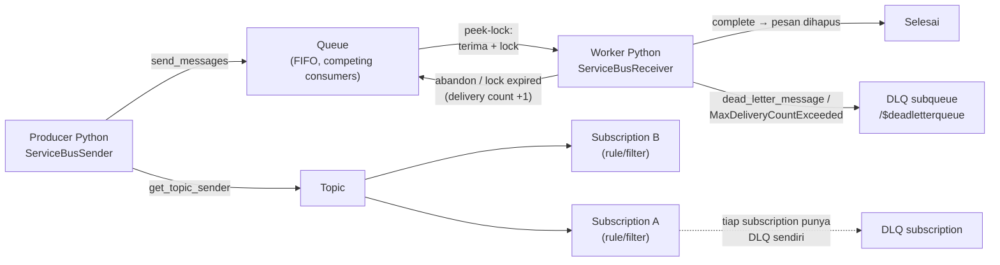

# Azure Service Bus

> Domain: 3 — Connect to and consume Azure services (20–25%)
> Exam: AI-200 — Developing AI Cloud Solutions on Azure
> Status: Draft
> Last reviewed: 2026-07-15
> [← Kembali ke README](README.md)

## 1. Posisi Topik dalam Exam

Subheading **"Develop event- and message-based AI solutions"** memiliki dua bullet; bullet pertama adalah milik modul ini (SRC-002):

| Bullet resmi (parafrase) | Coverage matrix | Modul |
|---|---|---|
| Queue dan proses operasi back-end via Azure Service Bus — termasuk dead-letter queue handling, messages, topics, dan subscriptions | #20 | **d3-01 (modul ini)** |
| Custom events via Azure Event Grid (filter, retry) | #21 | [d3-02](d3-02-azure-event-grid.md) |

Modul ini juga **melunasi janji lintas-modul** dari [d1-03](d1-03-azure-container-apps-keda.md): validasi end-to-end KEDA scale rule `azure-servicebus` (kirim N pesan → replica naik dari 0) dieksekusi di [§8.8](#88-validasi-hasil). Source ID utama: SRC-002, SRC-030 (hub), SRC-039, SRC-079–SRC-082 ([§15](#15-sumber-resmi)).

## 2. Learning Outcomes

Setelah menyelesaikan modul ini, saya mampu:

- Menjelaskan anatomi Service Bus: **namespace** (container aplikasi, FQDN `<namespace>.servicebus.windows.net`), **queue** (point-to-point), **topic + subscriptions** (publish/subscribe 1:N).
- Memilih **queue vs topic** berdasarkan pola konsumsi (competing consumers vs salinan per subscriber).
- Membedakan dua **receive mode**: `RECEIVE_AND_DELETE` (at-most-once) vs `PEEK_LOCK` (default; at-least-once, dua tahap) — dan kapan **duplicate detection** menaikkan jaminan ke exactly-once.
- Menggunakan empat **settlement API** Python: `complete_message`, `abandon_message`, `dead_letter_message`, `defer_message`, plus pengelolaan lock (`renew_message_lock`, `AutoLockRenewer`).
- Menangani **dead-letter queue (DLQ)**: memahami DLQ sebagai subqueue bawaan, alasan dead-letter (eksplisit vs otomatis seperti `MaxDeliveryCountExceeded`), membaca DLQ via `sub_queue=ServiceBusSubQueue.DEAD_LETTER`, dan mengapa DLQ wajib dipantau (tanpa pembersihan otomatis).
- Mengirim/menerima pesan secara **passwordless** (Microsoft Entra ID + RBAC data-plane roles) dari Python async.
- Memvalidasi integrasi **KEDA `azure-servicebus`** (worker Container Apps scale-to-zero) secara end-to-end.

## 3. Mental Model

**Fakta resmi (SRC-080, SRC-039, SRC-082):** Service Bus adalah cloud messaging service untuk komunikasi asinkron antar aplikasi. Producer mengirim `ServiceBusMessage` ke **queue** (satu antrean, konsumen saling berkompetisi) atau **topic** (setiap **subscription** menerima salinan pesan — subscription berperilaku seperti virtual queue). Setiap queue **dan** setiap topic subscription otomatis memiliki subqueue kedua bernama **dead-letter queue** untuk pesan yang tidak dapat diproses.



Penjelasan teks: dalam mode default **peek-lock**, menerima pesan adalah transaksi dua tahap — pesan dikunci (tidak terlihat konsumen lain) lalu di-*settle*: `complete` (sukses, hapus), `abandon` (kembalikan ke queue, delivery count naik), `dead_letter` (pindahkan ke DLQ), atau `defer` (sisihkan, ambil ulang via sequence number). Jika worker crash atau lock kedaluwarsa, pesan otomatis tersedia lagi — inilah jaminan **at-least-once**. Pesan yang gagal berulang kali (melewati max delivery count) dipindahkan broker ke DLQ secara otomatis; DLQ tidak pernah membersihkan dirinya sendiri, sehingga "DLQ handling" (bunyi bullet exam) berarti: pantau, baca, diagnosis, lalu proses ulang/buang secara eksplisit.

## 4. Konsep dan Fitur Kunci

### 4.1 Namespace, tier, dan entitas

**Fakta resmi (SRC-079, SRC-082):**

- **Namespace** = container untuk queues/topics; FQDN `<namespace>.servicebus.windows.net`. Nama namespace: **6–50 karakter**, huruf/angka/hyphen, **mulai dengan huruf**, diakhiri huruf atau angka, dan **tidak boleh berakhiran `-sb` atau `-mgmt`** (SRC-079).
- ⚠️ **Tier Basic tidak mendukung topics dan subscriptions** (SRC-079) — untuk melatih seluruh bullet #20, lab modul ini memakai **Standard**.
- Pembuatan namespace via CLI: `az servicebus namespace create --resource-group <RG> --name <NS> --location <LOC>` (SRC-082).
- **Pemisahan plane:** library data-plane `azure-servicebus` dipakai untuk kirim/terima/settle; tugas manajemen (membuat/menghapus queue, topic, subscription secara programatik) memakai library terpisah `azure-mgmt-servicebus` (SRC-082). Di lab ini entitas dibuat via Portal/CLI, bukan dari kode aplikasi.

### 4.2 Queues: point-to-point work queue

**Fakta resmi (SRC-080):** queue menyimpan pesan sampai konsumen siap — memberi:

- **FIFO**: pesan diterima dalam urutan tiba;
- **Competing consumers**: banyak worker membaca queue yang sama, tiap pesan diproses **satu** konsumen;
- **Load leveling**: producer dan consumer boleh punya laju berbeda — antrean meratakan beban puncak sehingga consumer di-sizing untuk beban rata-rata, bukan puncak;
- **Temporal decoupling**: producer dan consumer tidak harus online bersamaan; konsumsi memakai **pull model** (aplikasi meminta pesan).

### 4.3 Topics dan subscriptions: publish/subscribe

**Fakta resmi (SRC-080, SRC-081, SRC-082):**

- Topic menerima pesan dari publisher; **setiap subscription menerima salinan** pesan yang dikirim ke topic (1:N). Subscription berperilaku seperti **virtual queue** — receiver membaca dari *subscription* (`get_subscription_receiver(topic_name=..., subscription_name=...)`), tidak pernah langsung dari topic.
- **Rules, filters, dan actions** (SRC-080): subscription dapat memfilter pesan yang ia terima. Default = **true filter** (semua pesan masuk). SQL filter mengevaluasi kondisi atas system/custom properties pesan; **action** dapat memodifikasi properti pesan saat lolos filter. (Pada lab ini dipakai default filter; penulisan SQL rule tidak dilatih hands-on karena di luar artikel yang diverifikasi.)
- Halaman Subscription di Portal menampilkan hitungan pesan **active** vs **dead-letter** (SRC-081) — alat validasi utama lab.

### 4.4 Receive modes dan settlement — inti keputusan exam

**Fakta resmi (SRC-080, SRC-082):**

| Mode | Cara kerja | Jaminan | Risiko |
|---|---|---|---|
| **Receive and delete** | Pesan dihapus dari queue **saat diterima** (satu tahap) | **At-most-once** | Worker crash setelah terima, sebelum selesai proses → pesan **hilang** |
| **Peek lock** (default SDK) | Dua tahap: (1) pesan dikunci & tak terlihat receiver lain; (2) aplikasi settle | **At-least-once**; + **duplicate detection** = **exactly-once** (SRC-080) | Proses lebih lama dari lock duration → lock lepas, pesan diterima ulang (duplikat) |

Empat **settlement API** pada `ServiceBusReceiver` (SRC-082) — hanya berlaku untuk pesan yang diterima dalam `PEEK_LOCK`:

- `complete_message(msg)` — proses sukses; pesan dihapus dari queue.
- `abandon_message(msg)` — lepaskan pesan **segera** kembali ke queue untuk diterima ulang (receiver lain atau yang sama).
- `dead_letter_message(msg)` — pindahkan pesan ke subqueue dead-letter (opsional `reason=`/`error_description=` pada API reference yang ditautkan SRC-082).
- `defer_message(msg)` — sisihkan pesan; tidak bisa diterima secara normal lagi, hanya via `receive_deferred_messages` dengan **sequence number**.

Aturan lock (SRC-082): **lock duration diatur pada queue/topic di Azure**, bukan di kode. Jika pemrosesan lebih lama, perbarui via `receiver.renew_message_lock(msg)` atau daftar ke **`AutoLockRenewer`** (watchdog otomatis); telat = `MessageLockLostError` dan pesan kembali ke queue. Catatan penting: `peek_messages()` **tidak mengambil lock** — pesan hasil peek **tidak bisa di-settle** (hanya untuk inspeksi).

### 4.5 Dead-letter queue (DLQ)

**Fakta resmi (SRC-039, SRC-082):**

- DLQ adalah **subqueue sekunder yang otomatis ada** pada **setiap queue dan setiap topic subscription** — tidak perlu dibuat, tidak bisa dihapus, dan **bukan fitur tier**.
- Path-nya `<queue>/$deadletterqueue` dan `<topic>/Subscriptions/<subscription>/$deadletterqueue` (SRC-039).
- Pesan masuk DLQ karena: (a) **aplikasi memindahkannya eksplisit** (`dead_letter_message`); atau (b) **broker memindahkannya otomatis**, dengan reason code seperti `MaxDeliveryCountExceeded` (melebihi max delivery count — **default 10**), `TTLExpiredException` (pesan kedaluwarsa), `HeaderSizeExceeded`, atau kegagalan evaluasi filter subscription (SRC-039).
- **Tidak ada pembersihan otomatis**: pesan tinggal di DLQ sampai diambil secara eksplisit — DLQ yang tidak dipantau akan terus tumbuh; pesan pada subqueue ikut diperhitungkan saat entitas mencapai kuota ukurannya (`ServiceBusQuotaExceededError` menyarankan "receive messages from the entity **or its subqueues**", SRC-082).
- Cara baca dari Python: receiver biasa dengan parameter **`sub_queue=ServiceBusSubQueue.DEAD_LETTER`** pada `get_queue_receiver`/`get_subscription_receiver` — lalu dikonsumsi seperti receiver mana pun (SRC-082).
- **Resubmit**: Service Bus Explorer di Portal mendukung mengirim ulang pesan DLQ ke entitas asalnya (SRC-039). Ada juga **transfer DLQ** untuk pesan yang gagal saat transfer antar-entitas (SRC-039).

### 4.6 Python SDK essentials

**Fakta resmi (SRC-079, SRC-082):**

- Objek inti: `ServiceBusClient` → `get_queue_sender`/`get_topic_sender` (mengembalikan `ServiceBusSender`) dan `get_queue_receiver`/`get_subscription_receiver` (`ServiceBusReceiver`); payload dibungkus `ServiceBusMessage`.
- **Async API** di `azure.servicebus.aio` — membutuhkan transport async **`aiohttp`**; credential async dari `azure.identity.aio` (SRC-079).
- Batch: `create_message_batch()` lalu `add_message(...)` (melempar `ValueError` bila batch penuh) (SRC-079); payload terlalu besar → `MessageSizeExceededError` (SRC-082).
- `receive_messages(max_wait_time=..., max_message_count=...)` = ad-hoc, selalu mengembalikan list; receiver juga bisa dipakai sebagai **generator** (`for msg in receiver`). `max_wait_time=None` (default) = menerima terus; link idle ditutup layanan setelah **10 menit** (SRC-082).
- **Scheduled delivery**: `sender.schedule_messages()` atau set `ServiceBusMessage.scheduled_enqueue_time_utc` (SRC-082).
- **Sessions**: semantik FIFO + single-receiver di atas queue/subscription; kirim dengan `session_id=...`, terima dengan `get_queue_receiver(queue, session_id=...)`; lock dikelola per **session** (`receiver.session.renew_lock()`) (SRC-082).
- `ServiceBusClient`/`Sender`/`Receiver` **tidak dijamin thread-safe/coroutine-safe** — jangan berbagi antar thread/coroutine tanpa lock (SRC-082).
- Debugging: aktifkan logger `azure.servicebus` dan `logging_enable=True` untuk AMQP frame trace (SRC-082).

## 5. Decision Guide

| Kebutuhan | Pilihan | Alasan (sumber) |
|---|---|---|
| Satu pekerjaan diproses tepat satu worker (work queue AI: job embedding, inferensi batch) | **Queue** | Competing consumers + load leveling (SRC-080) |
| Satu kejadian dikonsumsi beberapa sistem berbeda (audit + cache-invalidator + notifier) | **Topic + subscriptions** | Tiap subscription menerima salinan; filter per subscription (SRC-080) |
| Pesan boleh hilang saat crash; alur paling sederhana | Receive-and-delete | At-most-once, satu tahap (SRC-080) |
| Pesan tidak boleh hilang | **Peek-lock** (default) + `complete` hanya setelah proses sukses | At-least-once (SRC-080, SRC-082) |
| Tidak boleh hilang **dan** tidak boleh dobel diproses | Peek-lock + **duplicate detection** (+ konsumen idempotent — *rekomendasi*) | Kombinasi resmi exactly-once (SRC-080) |
| Pesan rusak/poison — jangan blokir antrean | `dead_letter_message` eksplisit, atau biarkan `MaxDeliveryCountExceeded` bekerja; proses DLQ terpisah | SRC-039, SRC-082 |
| Pemrosesan lama melebihi lock duration | `AutoLockRenewer` / `renew_message_lock` | SRC-082 |
| Urutan ketat per entitas (per pelanggan/percakapan LLM) | **Sessions** (`session_id`) | FIFO + single receiver per session (SRC-082) |
| Kirim nanti (delayed job) | `schedule_messages` / `scheduled_enqueue_time_utc` | SRC-082 |
| Worker harus scale-to-zero mengikuti panjang antrean | Container Apps + KEDA rule `azure-servicebus` ([d1-03](d1-03-azure-container-apps-keda.md)) | SRC-025 di d1-03; validasi §8.8 |
| Notifikasi event reaktif ringan (bukan perintah kerja yang harus diantre) | Event Grid ([d3-02](d3-02-azure-event-grid.md)) | *Interpretasi arsitektur README*; perbandingan resmi dibahas di d3-02 |

## 6. Security

- **Passwordless by default (fakta SRC-079, SRC-082):** `ServiceBusClient(fully_qualified_namespace, credential)` dengan `DefaultAzureCredential` (`azure-identity`). Alternatif connection string + SAS key ada (SRC-082) tetapi **tidak dipakai di repo ini** — sesuai guardrail README (tanpa secret statis; bila terpaksa, simpan di Key Vault — [d4-01](d4-01-azure-key-vault.md)).
- **RBAC data-plane roles (fakta SRC-079):** **Azure Service Bus Data Owner**, **Azure Service Bus Data Sender**, **Azure Service Bus Data Receiver**. *Rekomendasi (least privilege):* aplikasi producer cukup **Data Sender**; worker cukup **Data Receiver**; **Data Owner** hanya untuk akun lab/administrasi.
- ⚠️ **Propagasi role assignment bisa memakan waktu hingga beberapa menit (dokumen menyebut sampai 8 menit)** (SRC-079) — error otorisasi sesaat setelah penetapan role bukan berarti konfigurasi salah; tunggu lalu coba lagi.
- Pisahkan error: `ServiceBusAuthenticationError` = identitas salah/gagal login; `ServiceBusAuthorizationError` = identitas benar tetapi **tidak punya role** (SRC-082).
- Scope role dapat diberikan pada level namespace (praktik lab) — pesan berisi data AI (prompt/hasil inferensi) sehingga akses baca antrean = akses data; perlakukan sama ketatnya dengan database (*interpretasi*).

## 7. Reliability, Performance, dan Cost

- **Idempotency adalah kewajiban konsumen:** peek-lock = at-least-once → duplikat mungkin terjadi (lock kedaluwarsa/abandon). Desain worker agar aman diulang; duplicate detection menghilangkan duplikat pengiriman ulang producer (SRC-080). *(Klasifikasi jaminan = fakta; desain idempotent = rekomendasi.)*
- **Lock & long processing:** lock duration diatur pada entitas; gunakan `AutoLockRenewer` untuk pemrosesan panjang; `MessageLockLostError` berarti pesan sudah kembali ke antrean (SRC-082).
- **Transient errors:** `ServiceBusConnectionError`/`OperationTimeoutError` → retry; `ServiceBusServerBusyError` → tunggu sejenak lalu retry (SRC-082).
- **Kuota entitas:** entitas penuh → `ServiceBusQuotaExceededError`; kosongkan dengan menerima pesan dari entitas **atau subqueue-nya** — DLQ yang menumpuk ikut memakan kuota (SRC-082) dan tidak membersihkan diri (SRC-039) → jadikan *DLQ depth* metrik yang dipantau (*rekomendasi*; observability di [d4-03](d4-03-observability-opentelemetry-kql.md)).
- **Cost guardrail (selaras README §6):** namespace menagih sesuai tier. Queue + DLQ bisa dilatih di tier mana pun (DLQ = subqueue bawaan, SRC-039), tetapi **topics butuh minimal Standard** (Basic tidak mendukung — SRC-079) → lab memakai **satu namespace Standard** untuk semua latihan, dihapus bersama resource group di §8.11. Biaya lab rendah–sedang.

## 8. Praktik Hands-on

Tujuan lab: namespace Standard → queue + topic + 2 subscriptions → role RBAC → Python async kirim/terima queue → topic/subscription fan-out → **tiga jalur DLQ** (eksplisit, `MaxDeliveryCountExceeded`, baca & kuras DLQ) → validasi end-to-end KEDA `azure-servicebus` (janji d1-03).

### 8.1 Prasyarat

- Azure subscription; Azure CLI (`az login`).
- Python + packages §8.2; identitas Anda diberi role **Azure Service Bus Data Owner** pada namespace (SRC-079) — atau Sender/Receiver terpisah untuk latihan least privilege (§6).
- Untuk §8.8 langkah KEDA: Container Apps environment + worker dari lab [d1-03](d1-03-azure-container-apps-keda.md).

### 8.2 Environment dan dependency versions

| Komponen | Nilai | Sumber |
|---|---|---|
| Python | ≥ 3.8 (quickstart); README paket 7.14.3 mensyaratkan **≥ 3.9** — pakai ≥ 3.9 | SRC-079, SRC-082 |
| `azure-servicebus` | 7.14.3 (versi halaman README yang diverifikasi) | SRC-082 |
| `azure-identity`, `aiohttp` | terbaru (aiohttp = async transport) | SRC-079 |
| Receive mode default | `PEEK_LOCK` | SRC-082 |
| Max delivery count | default 10 | SRC-039 |
| Tanggal verifikasi | 2026-07-15 | — |

`requirements.txt`:

```text
azure-servicebus
azure-identity
aiohttp
```

### 8.3 Resource yang dibuat

`<RESOURCE_GROUP>` berisi satu namespace **Standard** `<SERVICE_BUS_NAMESPACE>` dengan: queue `<QUEUE_NAME>`, topic `<TOPIC_NAME>`, dua subscriptions `<SUB_ALL>` dan `<SUB_AUDIT>` (default true filter). DLQ tidak dibuat — otomatis ada (SRC-039).

### 8.4 Placeholder dan naming convention

| Placeholder | Contoh | Catatan |
|---|---|---|
| `<RESOURCE_GROUP>` | `rg-ai200-d301` | — |
| `<SERVICE_BUS_NAMESPACE>` | `sbns-ai200-d301` | 6–50 karakter, mulai huruf, akhir huruf/angka, tanpa akhiran `-sb`/`-mgmt` (SRC-079) |
| `<QUEUE_NAME>` | `jobs` | — |
| `<TOPIC_NAME>` / `<SUB_ALL>` / `<SUB_AUDIT>` | `doc-events` / `sub-processor` / `sub-audit` | — |

### 8.5 Langkah Azure Portal

(1) Buat namespace (quickstart SRC-079): pilih resource group, nama sesuai aturan §8.4, **pricing tier Standard** (Basic tidak mendukung topics — SRC-079); (2) buat **queue** `<QUEUE_NAME>` dari halaman namespace (SRC-079); (3) buat **topic** `<TOPIC_NAME>`, lalu dari halaman topic buat **subscriptions** `<SUB_ALL>` dan `<SUB_AUDIT>` (SRC-081); (4) **Access control (IAM)** → Add role assignment → **Azure Service Bus Data Owner** → pilih akun Anda (SRC-079; propagasi hingga 8 menit); (5) catat host name `<SERVICE_BUS_NAMESPACE>.servicebus.windows.net` dari Overview.

### 8.6 Langkah CLI

```bash
az group create --name <RESOURCE_GROUP> --location <LOCATION>

# Pembuatan namespace — perintah dari README SDK resmi (SRC-082):
az servicebus namespace create \
  --resource-group <RESOURCE_GROUP> \
  --name <SERVICE_BUS_NAMESPACE> \
  --location <LOCATION>
```

Queue/topic/subscription dan role assignment dibuat via **Portal** (§8.5) mengikuti quickstart resmi (SRC-079, SRC-081); sub-perintah CLI untuk entitas & role ada pada referensi CLI tetapi tidak dibuka pada verifikasi modul ini, sehingga tidak dituliskan di sini (kebijakan sumber repo).

### 8.7 Implementasi Python SDK

**(a) Kirim ke queue — async, passwordless (adaptasi quickstart SRC-079):**

```python
# send_queue.py
import asyncio
from azure.identity.aio import DefaultAzureCredential
from azure.servicebus import ServiceBusMessage
from azure.servicebus.aio import ServiceBusClient

FQNS = "<SERVICE_BUS_NAMESPACE>.servicebus.windows.net"
QUEUE = "<QUEUE_NAME>"

async def main():
    credential = DefaultAzureCredential()
    async with ServiceBusClient(FQNS, credential) as client:
        sender = client.get_queue_sender(queue_name=QUEUE)
        async with sender:
            await sender.send_messages(ServiceBusMessage("job-001: generate-embedding"))
            batch = await sender.create_message_batch()
            for i in range(2, 12):
                batch.add_message(ServiceBusMessage(f"job-{i:03d}: generate-embedding"))
            await sender.send_messages(batch)
            # pesan "poison" untuk latihan DLQ (c)
            await sender.send_messages(ServiceBusMessage("poison: payload rusak"))
    await credential.close()
    print("Terkirim: 1 tunggal + 10 batch + 1 poison")

asyncio.run(main())
```

**(b) Terima dari queue — peek-lock + complete (adaptasi quickstart SRC-079):**

```python
# receive_queue.py
import asyncio
from azure.identity.aio import DefaultAzureCredential
from azure.servicebus.aio import ServiceBusClient

FQNS = "<SERVICE_BUS_NAMESPACE>.servicebus.windows.net"
QUEUE = "<QUEUE_NAME>"

async def main():
    credential = DefaultAzureCredential()
    async with ServiceBusClient(FQNS, credential) as client:
        receiver = client.get_queue_receiver(queue_name=QUEUE)
        async with receiver:
            msgs = await receiver.receive_messages(max_wait_time=5, max_message_count=20)
            for msg in msgs:
                body = str(msg)
                if body.startswith("poison"):
                    # settlement eksplisit ke DLQ (SRC-082)
                    await receiver.dead_letter_message(msg)
                    print("→ DLQ:", body)
                else:
                    await receiver.complete_message(msg)
                    print("Selesai:", body)
    await credential.close()

asyncio.run(main())
```

**(c) Baca & kuras DLQ — `sub_queue=ServiceBusSubQueue.DEAD_LETTER` (SRC-082):**

```python
# drain_dlq.py — versi sync, mengikuti sampel README SDK (SRC-082)
from azure.identity import DefaultAzureCredential
from azure.servicebus import ServiceBusClient, ServiceBusSubQueue

FQNS = "<SERVICE_BUS_NAMESPACE>.servicebus.windows.net"
QUEUE = "<QUEUE_NAME>"

credential = DefaultAzureCredential()
with ServiceBusClient(FQNS, credential) as client:
    with client.get_queue_receiver(
        queue_name=QUEUE,
        sub_queue=ServiceBusSubQueue.DEAD_LETTER,
        max_wait_time=5,
    ) as dlq_receiver:
        for msg in dlq_receiver:
            print("DLQ:", str(msg))
            # setelah diagnosis/proses-ulang, complete = hapus dari DLQ
            dlq_receiver.complete_message(msg)
```

Alasan dead-letter (mis. `MaxDeliveryCountExceeded` vs eksplisit) dapat diperiksa via Service Bus Explorer di Portal (SRC-039); resubmit ke queue asal juga dari sana.

**(d) Simulasi `MaxDeliveryCountExceeded` — abandon berulang (SRC-082 + SRC-039):**

```python
# abandon_loop.py — pesan yang terus di-abandon melewati max delivery count
# (default 10, SRC-039) dipindahkan broker ke DLQ secara otomatis.
from azure.identity import DefaultAzureCredential
from azure.servicebus import ServiceBusClient, ServiceBusMessage

FQNS = "<SERVICE_BUS_NAMESPACE>.servicebus.windows.net"
QUEUE = "<QUEUE_NAME>"

credential = DefaultAzureCredential()
with ServiceBusClient(FQNS, credential) as client:
    with client.get_queue_sender(queue_name=QUEUE) as sender:
        sender.send_messages(ServiceBusMessage("selalu-gagal"))
    with client.get_queue_receiver(queue_name=QUEUE, max_wait_time=10) as receiver:
        for msg in receiver:
            print("Percobaan — abandon:", str(msg))
            receiver.abandon_message(msg)
# Loop berhenti sendiri (max_wait_time) setelah pesan berpindah ke DLQ.
```

**(e) Topic + subscriptions — fan-out (adaptasi quickstart SRC-081):**

```python
# topic_pubsub.py
import asyncio
from azure.identity.aio import DefaultAzureCredential
from azure.servicebus import ServiceBusMessage
from azure.servicebus.aio import ServiceBusClient

FQNS = "<SERVICE_BUS_NAMESPACE>.servicebus.windows.net"
TOPIC = "<TOPIC_NAME>"
SUBS = ["<SUB_ALL>", "<SUB_AUDIT>"]

async def main():
    credential = DefaultAzureCredential()
    async with ServiceBusClient(FQNS, credential) as client:
        sender = client.get_topic_sender(topic_name=TOPIC)
        async with sender:
            await sender.send_messages(ServiceBusMessage("doc-42: reindex"))
        # setiap subscription menerima SALINAN pesan (SRC-080)
        for sub in SUBS:
            receiver = client.get_subscription_receiver(
                topic_name=TOPIC, subscription_name=sub, max_wait_time=5
            )
            async with receiver:
                msgs = await receiver.receive_messages(max_wait_time=5, max_message_count=10)
                for msg in msgs:
                    print(f"[{sub}] menerima:", str(msg))
                    await receiver.complete_message(msg)
    await credential.close()

asyncio.run(main())
```

### 8.8 Validasi hasil

1. Setelah (a): Portal → queue → hitungan **active messages** = 12.
2. Setelah (b): active berkurang; **dead-letter message count** = 1 (pesan poison). Hitungan active vs dead-letter juga tampil pada halaman entitas (SRC-081 menunjukkannya untuk Subscription).
3. Setelah (c): DLQ kosong kembali (pesan di-complete dari DLQ).
4. Setelah (d): pesan "selalu-gagal" muncul di DLQ **tanpa** `dead_letter_message` dipanggil — bukti jalur otomatis `MaxDeliveryCountExceeded` (SRC-039); periksa reason di Service Bus Explorer, lalu kuras ulang dengan (c).
5. Setelah (e): **kedua** subscription mencetak pesan yang sama — bukti pub/sub 1:N (SRC-080).
6. **KEDA end-to-end (janji d1-03 §8.6/§8.8):** dengan worker Container Apps ber-scale-rule `azure-servicebus` (dibuat di lab d1-03; `messageCount` per replica), kirim ≥ `messageCount × maxReplicas` pesan dengan (a) yang diulang → amati **replica count naik dari 0**; hentikan pengiriman & biarkan worker menguras queue → setelah cooldown (default 300 detik, SRC-025 di d1-03) replica kembali **0**.

### 8.9 Expected output

```text
$ python send_queue.py
Terkirim: 1 tunggal + 10 batch + 1 poison

$ python receive_queue.py
Selesai: job-001: generate-embedding
Selesai: job-002: generate-embedding
...
→ DLQ: poison: payload rusak

$ python drain_dlq.py
DLQ: poison: payload rusak

$ python topic_pubsub.py
[sub-processor] menerima: doc-42: reindex
[sub-audit] menerima: doc-42: reindex
```

### 8.10 Troubleshooting test

Uji negatif yang disengaja: jalankan `receive_queue.py` dengan identitas **tanpa** role data-plane → harapkan `ServiceBusAuthorizationError` (SRC-082). Beri role **Azure Service Bus Data Receiver**, tunggu propagasi (hingga 8 menit — SRC-079), jalankan ulang → sukses. Ini membuktikan pemisahan authentication vs authorization di §6.

### 8.11 Cleanup

```bash
az group delete --name <RESOURCE_GROUP> --yes --no-wait
```

Menghapus resource group menghapus namespace beserta seluruh queue/topic/subscription (dan DLQ di dalamnya). Bila memakai environment Container Apps dari d1-03 yang masih diperlukan modul lain, **jangan** hapus resource group d1-03 — cukup nonaktifkan/atur ulang scale rule.

### 8.12 Verifikasi cleanup

```bash
az group exists --name <RESOURCE_GROUP>    # harus: false
```

Portal: pastikan namespace tidak lagi terdaftar di subscription. Tidak ada resource menagih yang tersisa dari lab ini.

## 9. Troubleshooting Playbook

| Gejala | Kemungkinan penyebab | Cara memeriksa | Solusi |
|---|---|---|---|
| `ServiceBusAuthorizationError` | Identitas belum punya role data-plane; atau role baru belum terpropagasi | IAM namespace; waktu sejak assignment | Beri Data Sender/Receiver/Owner sesuai peran; tunggu hingga 8 menit (SRC-079, SRC-082) |
| `ServiceBusAuthenticationError` | Credential salah/`az login` belum jalan | `az account show` | Perbaiki login/credential chain (SRC-082) |
| Pesan "hilang" tanpa pernah diproses | Receiver berjalan dalam mode receive-and-delete lalu crash | Audit `receive_mode` pada kode | Gunakan `PEEK_LOCK` (default) + complete setelah sukses (SRC-080, SRC-082) |
| `MessageLockLostError` saat complete | Pemrosesan lebih lama dari lock duration | Bandingkan durasi proses vs lock duration entitas | `renew_message_lock` / `AutoLockRenewer`; atau perbesar lock duration pada entitas (SRC-082) |
| Pesan yang sama diproses dua kali | At-least-once (lock lepas/abandon) — bukan bug | Delivery count pesan | Konsumen idempotent; duplicate detection untuk kiriman ulang producer (SRC-080) |
| `MessageAlreadySettled` | Settle dua kali / settle pesan hasil `peek_messages()` | Alur kode settlement | Settle sekali; jangan settle hasil peek — peek tidak mengunci (SRC-082) |
| Pesan menumpuk di DLQ | Poison messages / TTL / max delivery count terlampaui | Reason code via Service Bus Explorer (`MaxDeliveryCountExceeded`, `TTLExpiredException`, …) | Perbaiki akar masalah; kuras DLQ via `sub_queue=DEAD_LETTER`; resubmit dari Explorer (SRC-039, SRC-082) |
| `MessagingEntityNotFoundError` | Nama queue/topic/subscription salah atau entitas terhapus | Daftar entitas di Portal | Cocokkan nama; buat ulang entitas (SRC-082) |
| Gagal membuat topic | Namespace tier **Basic** | Tier di Overview namespace | Buat namespace Standard — Basic tanpa topics (SRC-079) |
| `ServiceBusQuotaExceededError` | Entitas penuh — termasuk DLQ yang tak pernah dikuras | Ukuran entitas + DLQ depth | Terima/kuras pesan dari entitas dan subqueue-nya (SRC-082); pantau DLQ rutin (SRC-039) |
| `ServiceBusServerBusyError` / timeout sporadis | Layanan sibuk / transient network | — | Tunggu lalu retry; `OperationTimeoutError`: verifikasi status lalu retry (SRC-082) |
| Worker KEDA tidak scale dari 0 | Scale rule salah nama queue/auth; pesan < `messageCount` | Konfigurasi rule di d1-03; panjang antrean | Perbaiki rule/auth; kirim pesan ≥ ambang (d1-03, SRC-025) |

## 10. Kaitan dengan Modul Lain

- **[d1-03 Container Apps + KEDA](d1-03-azure-container-apps-keda.md):** scale rule `azure-servicebus` dikonfigurasi di sana; namespace/queue + worker + validasi end-to-end dilunasi di §8.8 modul ini.
- **[d3-02 Event Grid](d3-02-azure-event-grid.md):** pasangan bullet pada subheading yang sama — event notification vs work queue; decision guide gabungan di d3-02.
- **[d3-03 Azure Functions](d3-03-azure-functions.md):** Functions sebagai konsumen ringan antrean (trigger); pola settlement di modul ini tetap fondasinya.
- **[d2-01](d2-01-cosmos-db-nosql.md)/[d2-02](d2-02-azure-database-postgresql.md)/[d2-03](d2-03-azure-managed-redis.md):** worker antrean menulis hasil (embedding/cache invalidation) ke data stores Domain 2 — skenario end-to-end README §3.
- **[d4-01 Key Vault](d4-01-azure-key-vault.md):** arsitektur passwordless modul ini meniadakan connection string; Key Vault untuk secret yang tak terhindarkan.
- **[d4-03 Observability](d4-03-observability-opentelemetry-kql.md):** logging `azure.servicebus`/AMQP trace (SRC-082) + metrik antrean & DLQ depth sebagai sinyal operasional.
- [← README](README.md) — coverage matrix baris #20.

## 11. Common Misconceptions dan Exam Decision Points

| Miskonsepsi | Fakta terverifikasi |
|---|---|
| "DLQ harus dibuat/diaktifkan dulu, atau hanya ada di tier tertentu" | DLQ = subqueue bawaan **setiap** queue dan topic subscription; tidak dibuat, tidak bisa dihapus (SRC-039) |
| "Pesan DLQ akan dibersihkan otomatis" | Tidak ada pembersihan otomatis — pesan menetap sampai diambil eksplisit; ikut memakan kuota entitas (SRC-039, SRC-082) |
| "Default SDK adalah receive-and-delete" | Default `PEEK_LOCK`; receive-and-delete harus dipilih sadar dan menerima risiko at-most-once (SRC-082, SRC-080) |
| "peek_messages cocok untuk memproses pesan" | Peek tidak mengambil lock → hasilnya **tidak bisa di-settle**; hanya inspeksi (SRC-082) |
| "Peek-lock berarti exactly-once" | Peek-lock = **at-least-once**; exactly-once = peek-lock **+ duplicate detection** (SRC-080) |
| "Topics tersedia di semua tier" | Basic tidak mendukung topics/subscriptions (SRC-079) |
| "Role assignment RBAC langsung aktif" | Propagasi bisa sampai 8 menit (SRC-079) |
| "Consumer membaca langsung dari topic" | Selalu dari **subscription** (virtual queue); tiap subscription mendapat salinan (SRC-080, SRC-082) |
| "Abandon = buang pesan" | Abandon mengembalikan pesan ke queue untuk diterima ulang (delivery count naik); membuang permanen = dead-letter lalu tangani DLQ (SRC-082, SRC-039) |
| "azure-servicebus bisa membuat queue/topic" | Data-plane library untuk kirim/terima; manajemen entitas via `azure-mgmt-servicebus` (SRC-082) |

## 12. Checklist Pemahaman

- [ ] Saya bisa memilih queue vs topic+subscriptions dari pola konsumsi (satu pemroses vs salinan per subscriber).
- [ ] Saya bisa menjelaskan peek-lock dua tahap vs receive-and-delete, beserta jaminan at-least-once/at-most-once dan jalur ke exactly-once.
- [ ] Saya hafal empat settlement API dan efek masing-masing (complete/abandon/dead_letter/defer + receive_deferred_messages).
- [ ] Saya bisa menjelaskan DLQ: subqueue bawaan, path `$deadletterqueue`, alasan otomatis (MaxDeliveryCountExceeded default 10, TTLExpiredException) vs eksplisit, tanpa auto-cleanup.
- [ ] Saya bisa menulis receiver DLQ Python dengan `sub_queue=ServiceBusSubQueue.DEAD_LETTER`.
- [ ] Saya bisa mengonfigurasi akses passwordless: tiga role data-plane + propagasi hingga 8 menit.
- [ ] Saya tahu batasan tier Basic (tanpa topics) dan aturan penamaan namespace.
- [ ] Saya bisa menangani pemrosesan panjang (renew lock/AutoLockRenewer) dan error umum (LockLost, ServerBusy, QuotaExceeded).

## 13. Self-Assessment

**Q1.** Worker Anda crash setelah menerima pesan tetapi sebelum selesai memproses. Dengan receive-and-delete pesan hilang; dengan peek-lock tidak. Jelaskan mekanismenya.
**Jawaban:** Receive-and-delete menghapus pesan **saat diterima** (at-most-once) — crash setelah itu berarti hilang. Peek-lock hanya **mengunci**; tanpa `complete_message`, lock kedaluwarsa dan pesan tersedia lagi untuk receiver (at-least-once). (SRC-080, SRC-082)

**Q2.** Sebuah pesan muncul di DLQ padahal kode Anda tidak pernah memanggil `dead_letter_message`. Sebutkan dua penyebab otomatis yang paling umum dan cara memastikannya.
**Jawaban:** `MaxDeliveryCountExceeded` (diterima-ulang/di-abandon melebihi max delivery count, default 10) dan `TTLExpiredException` (kedaluwarsa). Periksa reason code pesan via Service Bus Explorer. (SRC-039)

**Q3.** Tim Anda "membersihkan" DLQ dengan menunggu pesannya kedaluwarsa. Mengapa strategi ini salah?
**Jawaban:** DLQ **tidak punya pembersihan otomatis** — pesan menetap sampai diambil eksplisit, dan menumpuknya pesan subqueue ikut menghitung kuota entitas (bisa berujung `ServiceBusQuotaExceededError`). DLQ harus dikuras/diproses eksplisit. (SRC-039, SRC-082)

**Q4.** Satu event "dokumen diperbarui" harus memicu reindex, invalidasi cache, dan pencatatan audit oleh tiga layanan berbeda. Queue atau topic? Jelaskan.
**Jawaban:** **Topic dengan tiga subscriptions** — setiap subscription menerima salinan pesan dan dikonsumsi independen (virtual queue); queue hanya memberi pesan ke satu konsumen (competing consumers). (SRC-080)

**Q5.** Pemrosesan pesan Anda memakan 15 menit; lock duration entitas jauh lebih pendek. Apa yang terjadi tanpa mitigasi, dan apa dua mitigasinya?
**Jawaban:** Lock kedaluwarsa → `MessageLockLostError` saat settle, pesan kembali ke queue dan diproses ulang (duplikat). Mitigasi: `receiver.renew_message_lock` berkala atau `AutoLockRenewer`; (lock duration diatur pada entitas di Azure). (SRC-082)

**Q6.** Aplikasi mendapat `ServiceBusAuthorizationError` lima menit setelah Anda memberi role Data Receiver. Apa diagnosis yang tepat?
**Jawaban:** Kemungkinan besar **propagasi role assignment belum selesai** (dokumen resmi: bisa sampai 8 menit). Tunggu lalu coba lagi sebelum mengubah konfigurasi. (SRC-079)

**Q7.** Mengapa `peek_messages()` tidak boleh dipakai sebagai dasar pemrosesan pesan produksi?
**Jawaban:** Peek tidak mengambil lock — pesan tetap tersedia untuk receiver lain dan hasil peek **tidak bisa di-settle** (complete/dead-letter); peek hanya untuk inspeksi. (SRC-082)

**Q8.** Bagaimana mencapai perilaku exactly-once processing menurut dokumentasi resmi, dan apa peran aplikasi Anda di dalamnya?
**Jawaban:** Peek-lock (at-least-once) **+ duplicate detection** pada entitas = exactly-once menurut SRC-080; dalam praktik, konsumen tetap dirancang idempotent karena redelivery pasca lock-expiry tetap mungkin (*rekomendasi/interpretasi*).

**Q9.** Anda ingin worker Container Apps diam di 0 replica saat antrean kosong dan bangun saat pesan masuk. Komponen apa yang menghubungkan keduanya dan bagaimana memvalidasinya?
**Jawaban:** KEDA scale rule `azure-servicebus` (d1-03) yang membaca panjang queue: kirim ≥ `messageCount × maxReplicas` pesan → replica naik dari 0; kosongkan queue → setelah cooldown (default 300 detik) kembali ke 0. (SRC-025 di d1-03; lab §8.8)

## 14. Ringkasan Cepat

| Hal | Nilai |
|---|---|
| Entitas | Namespace (`<ns>.servicebus.windows.net`) → queue / topic + subscriptions; nama namespace 6–50 karakter, tanpa akhiran `-sb`/`-mgmt` |
| Tier | Basic **tanpa topics**; lab memakai Standard |
| Queue | FIFO, competing consumers, load leveling, temporal decoupling, pull model |
| Topic/Subscription | Pub/sub 1:N; subscription = virtual queue + rules/filters (default true filter) |
| Receive modes | `PEEK_LOCK` (default; at-least-once; bisa settle) vs `RECEIVE_AND_DELETE` (at-most-once) |
| Settlement | `complete` / `abandon` / `dead_letter` / `defer` (+ `receive_deferred_messages`); peek tidak bisa settle |
| Lock | Duration diatur di entitas; `renew_message_lock` / `AutoLockRenewer`; telat → `MessageLockLostError` |
| DLQ | Subqueue bawaan tiap queue & subscription (`…/$deadletterqueue`); reason: eksplisit, MaxDeliveryCountExceeded (default 10), TTLExpired…; tanpa auto-cleanup; baca via `sub_queue=ServiceBusSubQueue.DEAD_LETTER`; resubmit via Service Bus Explorer |
| Exactly-once | Peek-lock + duplicate detection |
| Auth | Passwordless Entra ID; roles: Data Owner / Data Sender / Data Receiver; propagasi ≤ 8 menit |
| Python | `azure-servicebus` (+`azure-identity`, `aiohttp` untuk async); sender/receiver dari `ServiceBusClient`; klien tidak thread-safe |
| Integrasi | KEDA `azure-servicebus` (d1-03) untuk scale-to-zero worker |

## 15. Sumber Resmi

| Source ID | Link | Bagian yang digunakan | Diakses |
|---|---|---|---|
| SRC-002 | <https://learn.microsoft.com/en-us/credentials/certifications/resources/study-guides/ai-200> | Bullet skills measured Domain 3 (#20) | 2026-07-15 |
| SRC-030 | <https://learn.microsoft.com/en-us/azure/service-bus-messaging/> | Hub docs Service Bus Messaging | 2026-07-15 |
| SRC-039 | <https://learn.microsoft.com/en-us/azure/service-bus-messaging/service-bus-dead-letter-queues> | DLQ = subqueue bawaan queue & subscription; path `$deadletterqueue`; reason codes (MaxDeliveryCountExceeded default 10, TTLExpiredException, HeaderSizeExceeded); transfer DLQ; tanpa auto-cleanup; resubmit via Service Bus Explorer | 2026-07-15 |
| SRC-079 | <https://learn.microsoft.com/en-us/azure/service-bus-messaging/service-bus-python-how-to-use-queues> | Packages (`azure-servicebus`/`azure-identity`/`aiohttp`); aturan penamaan namespace; **Basic tanpa topics**; roles Data Owner/Sender/Receiver + propagasi ≤ 8 menit; kode async send/receive queue (sender/receiver, batch, `receive_messages(max_wait_time, max_message_count)`, `complete_message`) | 2026-07-15 |
| SRC-080 | <https://learn.microsoft.com/en-us/azure/service-bus-messaging/service-bus-queues-topics-subscriptions> | Queue: FIFO/competing consumers/load leveling/temporal decoupling; topic/subscription 1:N (virtual queue); receive-and-delete vs peek-lock; duplicate detection = exactly-once; rules/filters/actions (default true filter) | 2026-07-15 |
| SRC-081 | <https://learn.microsoft.com/en-us/azure/service-bus-messaging/service-bus-python-how-to-use-topics-subscriptions> | `get_topic_sender(topic_name)` / `get_subscription_receiver(topic_name, subscription_name, max_wait_time)`; pembuatan topic+subscriptions via Portal; hitungan pesan active vs dead-letter pada halaman Subscription | 2026-07-15 |
| SRC-082 | <https://learn.microsoft.com/en-us/python/api/overview/azure/servicebus-readme> | azure-servicebus 7.14.3 (Python ≥3.9); konsep client/sender/receiver/message; `PEEK_LOCK` default; settlement complete/abandon/dead_letter/defer + `receive_deferred_messages`; DLQ via `sub_queue=ServiceBusSubQueue.DEAD_LETTER`; peek tidak bisa settle; lock & `AutoLockRenewer`; sessions; scheduled messages; `az servicebus namespace create`; daftar exceptions; manajemen entitas via `azure-mgmt-servicebus`; klien tidak thread-safe; logging | 2026-07-15 |
