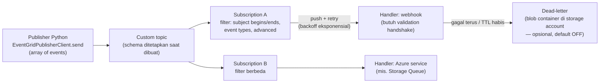

# Azure Event Grid

> Domain: 3 — Connect to and consume Azure services (20–25%)
> Exam: AI-200 — Developing AI Cloud Solutions on Azure
> Status: Draft
> Last reviewed: 2026-07-15
> [← Kembali ke README](README.md)

## 1. Posisi Topik dalam Exam

Subheading **"Develop event- and message-based AI solutions"** memiliki dua bullet; bullet kedua adalah milik modul ini (SRC-002):

| Bullet resmi (parafrase) | Coverage matrix | Modul |
|---|---|---|
| Queue dan proses operasi back-end via Service Bus (DLQ, messages, topics, subscriptions) | #20 | [d3-01](d3-01-azure-service-bus.md) |
| Implementasi solusi dengan **custom events** via Azure Event Grid — termasuk **filters** dan **retries** | #21 | **d3-02 (modul ini)** |

⚠️ **Penjagaan cakupan:** Event Grid punya **dua model resource**: **Event Grid Basic** (custom/system/partner topics; **push delivery** saja) dan **Event Grid Namespaces** (model baru; pull + push; hanya CloudEvents 1.0) (SRC-086). Bullet exam menyebut **custom events** → jalur **custom topic (Basic, push delivery)** menjadi fokus modul ini; namespaces disinggung sebagai pembeda. Source ID utama: SRC-002, SRC-031 (hub), SRC-083–SRC-089 ([§15](#15-sumber-resmi)).

## 2. Learning Outcomes

Setelah menyelesaikan modul ini, saya mampu:

- Menjelaskan anatomi Event Grid push delivery: **events → publisher → topic (custom/system/partner) → event subscriptions (dengan filter) → event handlers** (webhook/Azure services).
- Membedakan format event: **CloudEvents 1.0** (format pilihan; structured JSON) vs **Event Grid schema** (proprietary) vs custom schema — dan bahwa **schema topic ditetapkan saat pembuatan**.
- Mem-publish **custom events** dari Python (`azure-eventgrid`, `EventGridPublisherClient.send`) secara passwordless (role **Event Grid Data Sender**) dan via `curl` + access key.
- Mengonfigurasi **tiga jenis filter** event subscription: event types, subject begins/ends with, dan **advanced filters** (operator + key + values), termasuk semantik OR/AND dan batasannya.
- Menjelaskan **delivery & retry**: at-least-once, tanpa jaminan urutan, jadwal exponential backoff, error yang tidak di-retry, dan **retry policy** (max delivery attempts 1–30, event TTL 1–1440 menit).
- Mengonfigurasi **dead-lettering** ke storage account (kondisi, delay 5 menit, format blob, `deadLetterReason`/`lastDeliveryOutcome`) — dan mengapa tanpa DLQ event bisa **hilang diam-diam**.
- Memilih Event Grid vs Service Bus untuk skenario messaging/eventing AI.

## 3. Mental Model

**Fakta resmi (SRC-083, SRC-085):** Event Grid adalah **event routing service** publish-subscribe. Event = catatan terkecil tentang "sesuatu terjadi" (source, time, id + data spesifik). Publisher mengirim event ke **topic**; setiap **event subscription** pada topic itu menyatakan endpoint (**event handler**) dan **filter**-nya; Event Grid **mendorong (push)** event ke setiap subscription yang cocok dengan jaminan **at-least-once** dan retry otomatis.



Penjelasan teks: berbeda dari Service Bus (konsumen **menarik** pesan dari queue — d3-01), Event Grid **mengantar** event ke endpoint subscriber. Konsekuensinya, keandalan berpindah ke sisi pengiriman: Event Grid menunggu respons sukses (HTTP 200–204), me-retry dengan jadwal backoff bila gagal, dan — **hanya jika dikonfigurasi** — menyimpan event yang gagal terkirim ke **dead-letter storage**. Filter dievaluasi per subscription sehingga satu event bisa diantar ke banyak handler yang berbeda kepentingan.

## 4. Konsep dan Fitur Kunci

### 4.1 Anatomi: topics, subscriptions, handlers

**Fakta resmi (SRC-083):**

- **Custom topics** = topik milik aplikasi Anda; resource mandiri dengan endpoint publish sendiri; mendukung push delivery. **System topics** = topik bawaan layanan Azure (Storage, Event Hubs, Service Bus, dll.). **Partner topics** = event dari SaaS partner.
- **Event subscription** menyatakan event apa yang ingin diterima + endpoint handler-nya (webhook atau resource Azure). Subscription bisa diberi **expiration time** (otomatis kedaluwarsa — berguna untuk uji coba).
- **Event handlers**: untuk webhook, event di-retry sampai handler mengembalikan **`200 – OK`**; untuk Azure Storage Queue, sampai pesan berhasil didorong ke queue.
- **Batching**: publish ke custom topic **selalu berupa array** — meski hanya satu event.
- Ukuran event maksimum **1 MB**; event di atas 64 KB ditagih dalam kelipatan **64 KB**.

### 4.2 Format event: CloudEvents vs Event Grid schema

**Fakta resmi (SRC-083, SRC-086, SRC-087):**

- **CloudEvents 1.0** (standar CNCF) adalah format **yang disarankan** — interoperabilitas dan tooling seragam; didukung dalam content mode **structured JSON** (binary: tidak).
- **Event Grid schema** (proprietary) tetap didukung; contoh field pada event custom: `id`, `eventType`, `subject`, `eventTime`, `data`, `dataVersion` (SRC-087). Custom schema juga dimungkinkan.
- **Schema yang diterima sebuah topic ditetapkan saat topic dibuat** — mengirim event dengan schema berbeda menimbulkan error (SRC-086).
- Field `subject` didesain untuk routing/filtering: susun sebagai path bersegmen (mis. `/A/B/C`) supaya subscriber bisa memfilter luas (`/A`) atau sempit (`/A/B`) (SRC-084).

### 4.3 Publishing custom events dari Python

**Fakta resmi (SRC-086):**

- Package **`azure-eventgrid`** (versi halaman README yang diverifikasi: 4.22.0; Python ≥3.8). `EventGridPublisherClient(endpoint, credential)` untuk Basic; endpoint topic berbentuk `https://<topic-name>.<region>.eventgrid.azure.net/api/events`.
- Bentuk event yang bisa dikirim `send` ke resource Basic: `EventGridEvent` (objek atau dict hasil serialisasi), `CloudEvent` (objek `azure.core.messaging.CloudEvent` atau dict), atau dict custom schema. **Kirim list sekaligus** untuk performa (bukan loop per event).
- Kredensial: **`DefaultAzureCredential`** (Entra ID), `AzureKeyCredential` (access key), atau SAS. RBAC data plane: **Event Grid Data Sender** (kirim), **Event Grid Data Receiver** (terima dari namespace subscription), **Event Grid Data Contributor** (keduanya).
- `EventGridConsumerClient` (receive/acknowledge/release/reject/renew_locks) **hanya untuk Event Grid Namespaces** (pull delivery) — pada model Basic, konsumsi terjadi di handler yang menerima push.

### 4.4 Filters — tiga tingkat penyaringan

**Fakta resmi (SRC-084):** saat membuat event subscription ada tiga opsi filter:

| Jenis | Cara kerja | Sintaks/parameter |
|---|---|---|
| **Event types** | Default: semua event type terkirim; batasi dengan daftar | `includedEventTypes` / CLI `--included-event-types` (SRC-088) |
| **Subject** | Awalan/akhiran string subject | `subjectBeginsWith` / `subjectEndsWith` (CLI `--subject-begins-with`/`--subject-ends-with`); opsi case-sensitive khusus subject |
| **Advanced** | Operator + key + values atas data event | `advancedFilters`; CLI `--advanced-filter data.color stringin blue red green` (SRC-088) |

Detail advanced filters (SRC-084):

- **Operator angka**: NumberIn/NotIn, LessThan(OrEquals), GreaterThan(OrEquals), InRange/NotInRange. **Boolean**: BoolEquals. **String**: StringContains/NotContains, BeginsWith/NotBeginsWith, EndsWith/NotEndsWith, In/NotIn — **semua perbandingan string tidak case-sensitive**. Null check: IsNullOrUndefined, IsNotNull.
- **Key** = field event: untuk CloudEvents `id`/`source`/`type`/`dataschema`/`data.x`; untuk Event Grid schema `ID`/`Topic`/`Subject`/`EventType`/`DataVersion`/`data.x` (dot notation untuk field bersarang).
- **Satu filter multi-values = OR; beberapa filter berbeda = AND.**
- Jika key tidak ada di event: mayoritas operator = **not matched**; kecuali NumberNotIn/StringNotIn = matched.
- **Batasan**: maksimum **25 advanced filters dan 25 values** total per subscription; **512 karakter** per string value; key ber-titik (`john.doe@…`) tidak didukung; filter array butuh `enableAdvancedFilteringOnArrays: true`; array of objects tidak didukung.

### 4.5 Delivery, retry schedule, dan retry policy

**Fakta resmi (SRC-085, SRC-089):**

- **At-least-once** per subscription yang cocok; **urutan tidak dijamin**; default satu event per pengiriman (payload tetap array berisi satu event).
- Event Grid menunggu **30 detik** respons. Sukses = HTTP **200/201/202/203/204** saja. Gagal → masuk jadwal retry **exponential backoff**: 10 dtk → 30 dtk → 1 mnt → 5 mnt → 10 mnt → 30 mnt → 1 jam → 3 jam → 6 jam → setiap 12 jam hingga 24 jam (plus randomisasi; retry bisa dilewati untuk endpoint yang terus tidak sehat). Jika endpoint merespons dalam 3 menit, penghapusan dari antrean retry bersifat best-effort — **duplikat tetap mungkin**.
- **Error yang TIDAK di-retry**: webhook **400, 413, 401, 403**; resource Azure **400, 413, 403** → event langsung di-dead-letter, atau **dibuang** bila dead-letter tidak dikonfigurasi. Kode lain punya jeda spesifik (mis. 404 → ≥5 menit; 503 → ≥30 detik).
- **Retry policy** (per subscription; **jadwal retry-nya sendiri tidak bisa diubah**): **Maximum number of attempts** 1–30 (default **30**) dan **Event TTL** 1–1440 menit (default **1440**). Yang habis lebih dulu yang menang (contoh resmi: TTL 30 menit membuat max-attempts > 6 tidak berpengaruh).
- **Delayed delivery/probation**: endpoint yang berulang gagal membuat pengiriman ditunda (durasi probation per jenis error, mis. NotFound 5 menit, Busy 10 detik) demi melindungi endpoint dan sistem.
- **Output batching** opsional (default OFF): `--max-events-per-batch` (1–5000) dan `--preferred-batch-size-in-kilobytes` (1–1024); semantik all-or-none.

### 4.6 Dead-letter events

**Fakta resmi (SRC-085, SRC-089):**

- Dead-lettering **default OFF**. Aktifkan dengan menunjuk **storage account + blob container** saat membuat subscription (CLI: `--deadletter-endpoint <storage-id>/blobServices/default/containers/<container>`).
- Event di-dead-letter bila: **TTL habis** ATAU **jumlah percobaan melebihi batas**; plus **400/413 langsung dijadwalkan dead-letter** tanpa retry.
- Perilaku waktu: TTL **hanya diperiksa pada percobaan pengiriman terjadwal berikutnya**; ada **delay 5 menit** antara percobaan terakhir dan penulisan ke dead-letter location; bila lokasi dead-letter tidak tersedia **4 jam**, event dibuang.
- Format blob (SRC-089): nama blob memuat **nama subscription dalam HURUF BESAR** + path `YYYY/MM/DD/HH`, contoh `container/MY-SUB/2019/8/8/5/<guid>.json`; **satu blob bisa berisi array beberapa event**.
- Event dead-letter membawa metadata: `deadLetterReason` (mis. `MaxDeliveryAttemptsExceeded`), `deliveryAttempts`, `lastDeliveryOutcome` (mis. `NotFound`, `Unauthorized`, `Forbidden`, `TimedOut`, `Busy`, `Probation`), `publishTime`, `lastDeliveryAttemptTime` (SRC-085).
- Anda bisa **bereaksi otomatis** atas dead-letter: buat event subscription (system topic Storage) pada blob container dead-letter tersebut. Bila memakai **managed identity** untuk dead-lettering, identity harus punya role RBAC yang bisa menulis ke storage.

## 5. Decision Guide

| Kebutuhan | Pilihan | Alasan (sumber) |
|---|---|---|
| Perintah kerja yang harus diantre, ditarik worker, di-settle satu-satu | **Service Bus** ([d3-01](d3-01-azure-service-bus.md)) | Pull model + peek-lock settlement (SRC-080 di d3-01); Event Grid = push notifikasi (SRC-083) — *pemetaan = interpretasi arsitektur README* |
| Reaksi ringan atas kejadian ("dokumen berubah", "blob dibuat") ke satu/beberapa handler | **Event Grid** custom/system topic | Push + filter per subscription (SRC-083, SRC-084) |
| Event aplikasi sendiri (custom events) | **Custom topic** | Endpoint publish sendiri; kumpulkan event terkait dalam satu topic per kategori (SRC-083) |
| Event layanan Azure (blob created, dll.) | **System topic** | Topik bawaan layanan (SRC-083) |
| Format event | **CloudEvents 1.0** kecuali ada alasan kompatibilitas | Format pilihan resmi (SRC-083); ingat schema per topic ditetapkan saat pembuatan (SRC-086) |
| Handler hanya butuh subset event | Filter **event types** → **subject** → **advanced** (urut dari termurah dipahami) | Tiga tingkat filter (SRC-084) — *urutan = rekomendasi* |
| Event gagal tidak boleh hilang | **Selalu konfigurasi dead-letter** + pantau container-nya | Tanpa DLQ, error non-retry membuang event (SRC-085) — *"selalu" = rekomendasi dari fakta tersebut* |
| Endpoint lambat >30 detik | Perkecil kerja sinkron handler (antrekan ke Service Bus, proses async) | Timeout respons 30 dtk (SRC-085) — *pola = rekomendasi* |
| Throughput tinggi | Aktifkan **output batching** per subscription | 1–5000 events/batch (SRC-085) |
| Butuh pull delivery / MQTT | **Event Grid Namespaces** (di luar fokus bullet) | Basic = push only (SRC-086) |

## 6. Security

- **Publish**: butuh **access key/SAS** atau **Microsoft Entra ID** (SRC-083, SRC-086). Prioritas repo: **Entra ID + `DefaultAzureCredential`** dengan role **Event Grid Data Sender** pada topic (SRC-086). Access key (`aeg-sas-key` header — SRC-087) hanya dipakai untuk uji `curl` di lab; jangan tanam key di kode/konfigurasi — bila terpaksa, simpan di Key Vault ([d4-01](d4-01-azure-key-vault.md)) (*guardrail repo*).
- **Webhook handshake**: saat subscription webhook dibuat, Event Grid mengirim **subscription validation event** dan endpoint harus membuktikan bersedia menerima event (app Event Grid Viewer resmi sudah menangani ini) (SRC-087, SRC-083).
- **Delivery dengan managed identity**: jika handler adalah layanan Azure dan Event Grid mengautentikasi dengan managed identity, identity itu harus punya role RBAC yang sesuai di tujuan (contoh resmi: kirim ke Event Hubs → **Event Hubs Data Sender**) (SRC-083). Hal yang sama berlaku untuk **dead-letter storage** (SRC-085, SRC-089).
- **Subscribe/kelola** subscription memerlukan izin yang memadai pada topic (SRC-083).

## 7. Reliability, Performance, dan Cost

- **Desain handler idempotent** — at-least-once + best-effort dedup berarti duplikat mungkin; dan **jangan mengandalkan urutan** (SRC-085; desain = rekomendasi).
- **Kecepatan respons handler menentukan keandalan**: balas 200–204 dalam 30 detik; kerja berat sebaiknya dialihkan async (SRC-085; pola = rekomendasi).
- **Retry policy vs schedule**: hanya max attempts + TTL yang bisa diatur; pahami interaksi first-to-expire agar konfigurasi tidak sia-sia (SRC-085, SRC-089).
- **Probation** menjelaskan "kenapa event lama tiba setelah endpoint sempat mati" (SRC-085).
- **Dead-letter adalah jaring pengaman satu-satunya** untuk error non-retry; pantau container dead-letter (bisa via event subscription pada storage-nya) (SRC-085).
- **Cost guardrail (selaras README §6):** Event Grid Basic dibayar per operasi (baris README d3-02); event >64 KB ditagih kelipatan 64 KB (SRC-083). Perhatikan: lab ini juga men-deploy **Event Grid Viewer** (App Service plan + web app — SRC-087) dan **storage account** dead-letter — komponen ini yang menagih terus bila lupa dihapus → cleanup §8.11 menghapus seluruh resource group.

## 8. Praktik Hands-on

Tujuan lab: custom topic → deploy Event Grid Viewer (handler webhook) → subscription default → publish via `curl` (key) dan Python (Entra ID) → **filter lab** (subject + advanced `data.color`, uji positif & negatif) → **retry + dead-letter lab** (subscription ber-DLQ; hentikan viewer; amati blob dead-letter).

### 8.1 Prasyarat

- Azure subscription; Azure CLI ≥2.0.70 (`az login`) (SRC-087).
- Provider terdaftar: `az provider register --namespace Microsoft.EventGrid` (cek `registrationState` = `Registered`) (SRC-087).
- Python + packages §8.2; identitas Anda diberi role **Event Grid Data Sender** pada topic (SRC-086) untuk publish passwordless.
- Storage account + blob container untuk dead-letter (dibuat via Portal — perintah pembuatannya tidak ada di artikel yang diverifikasi modul ini; ID-nya diambil dengan `az storage account show` per SRC-089).

### 8.2 Environment dan dependency versions

| Komponen | Nilai | Sumber |
|---|---|---|
| Python | ≥ 3.8 | SRC-086 |
| `azure-eventgrid` | 4.22.0 (versi halaman README yang diverifikasi) | SRC-086 |
| `azure-identity` | terbaru | SRC-086 |
| Azure CLI | ≥ 2.0.70 | SRC-087 |
| Retry defaults | 30 attempts / TTL 1440 menit | SRC-085 |
| Tanggal verifikasi | 2026-07-15 | — |

`requirements.txt`:

```text
azure-eventgrid
azure-identity
```

### 8.3 Resource yang dibuat

`<RESOURCE_GROUP>` berisi: custom topic `<TOPIC_NAME>`; Event Grid Viewer (App Service plan `viewerhost` + web app `<SITE_NAME>`); storage account `<STORAGE_NAME>` + container `<DLQ_CONTAINER>`; tiga event subscriptions (`demoViewerSub`, `demoAdvancedSub`, `demoDlqSub`).

### 8.4 Placeholder dan naming convention

| Placeholder | Contoh | Catatan |
|---|---|---|
| `<RESOURCE_GROUP>` / `<LOCATION>` | `rg-ai200-d302` / `westus2` | — |
| `<TOPIC_NAME>` | `egt-ai200-d302` | 3–50 karakter; a-z, A-Z, 0-9, `-`; unik (DNS) (SRC-087) |
| `<SITE_NAME>` | `egviewer-ai200-<acak>` | unik (DNS) (SRC-087) |
| `<STORAGE_NAME>` / `<DLQ_CONTAINER>` | `stai200d302` / `deadletter` | dibuat via Portal (§8.1) |

### 8.5 Langkah Azure Portal

(1) Buat storage account `<STORAGE_NAME>` + blob container `<DLQ_CONTAINER>` (prasyarat dead-letter — SRC-089); (2) setelah topic dibuat via CLI (§8.6): **topic → Access control (IAM)** → Add role assignment → **Event Grid Data Sender** → akun Anda (SRC-086); (3) gunakan halaman **Event Subscription → Filters/Additional features** untuk melihat konfigurasi filter, retry policy, dan dead-letter yang dibuat CLI (SRC-088, SRC-089).

### 8.6 Langkah CLI

Semua perintah mengikuti quickstart/how-to resmi (SRC-087, SRC-088, SRC-089):

```bash
az group create --name <RESOURCE_GROUP> --location <LOCATION>
az provider register --namespace Microsoft.EventGrid
az provider show --namespace Microsoft.EventGrid --query "registrationState"   # tunggu: Registered

# 1. Custom topic
topicname=<TOPIC_NAME>
az eventgrid topic create --name $topicname -l <LOCATION> -g <RESOURCE_GROUP>

# 2. Event Grid Viewer (handler webhook contoh resmi)
sitename=<SITE_NAME>
az deployment group create \
  --resource-group <RESOURCE_GROUP> \
  --template-uri "https://raw.githubusercontent.com/Azure-Samples/azure-event-grid-viewer/master/azuredeploy.json" \
  --parameters siteName=$sitename hostingPlanName=viewerhost
# buka https://<SITE_NAME>.azurewebsites.net — halaman viewer tampil kosong

# 3. Subscription default (tanpa filter) ke viewer
endpoint=https://$sitename.azurewebsites.net/api/updates
topicresourceid=$(az eventgrid topic show --resource-group <RESOURCE_GROUP> --name $topicname --query "id" --output tsv)
az eventgrid event-subscription create \
  --source-resource-id $topicresourceid \
  --name demoViewerSub \
  --endpoint $endpoint
# viewer menampilkan subscription validation event (handshake webhook)

# 4. Subscription dengan ADVANCED FILTER data.color ∈ {blue, red, green} (SRC-088)
az eventgrid event-subscription create \
  --source-resource-id $topicresourceid \
  -n demoAdvancedSub \
  --advanced-filter data.color stringin blue red green \
  --endpoint $endpoint \
  --expiration-date "<yyyy-mm-dd>"        # subscription uji: auto-expire (SRC-083)

# 5. Subscription dengan RETRY POLICY + DEAD-LETTER (SRC-089)
storageid=$(az storage account show --name <STORAGE_NAME> --resource-group <RESOURCE_GROUP> --query id --output tsv)
az eventgrid event-subscription create \
  --source-resource-id $topicresourceid \
  --name demoDlqSub \
  --endpoint $endpoint \
  --event-ttl 720 \
  --max-delivery-attempts 18 \
  --deadletter-endpoint $storageid/blobServices/default/containers/<DLQ_CONTAINER>

# 6. Publish via curl + access key (format Event Grid schema — SRC-087)
publish_endpoint=$(az eventgrid topic show --name $topicname -g <RESOURCE_GROUP> --query "endpoint" --output tsv)
key=$(az eventgrid topic key list --name $topicname -g <RESOURCE_GROUP> --query "key1" --output tsv)
event='[ {"id": "'"$RANDOM"'", "eventType": "recordInserted", "subject": "myapp/vehicles/motorcycles", "eventTime": "'`date +%Y-%m-%dT%H:%M:%S%z`'", "data":{ "make": "Ducati", "model": "Monster"},"dataVersion": "1.0"} ]'
curl -X POST -H "aeg-sas-key: $key" -d "$event" $publish_endpoint
```

### 8.7 Implementasi Python SDK

Publish passwordless — event dikirim sebagai **list** dict Event Grid schema (bentuk yang diizinkan `send` untuk resource Basic — SRC-086; field mengikuti contoh resmi SRC-087):

```python
# publish_events.py
from datetime import datetime, timezone
from uuid import uuid4

from azure.identity import DefaultAzureCredential
from azure.eventgrid import EventGridPublisherClient

ENDPOINT = "https://<TOPIC_NAME>.<REGION>.eventgrid.azure.net/api/events"  # dari az eventgrid topic show --query endpoint

client = EventGridPublisherClient(ENDPOINT, DefaultAzureCredential())

def make_event(color: str):
    return {
        "id": str(uuid4()),
        "eventType": "recordInserted",
        "subject": "myapp/vehicles/cars",
        "eventTime": datetime.now(timezone.utc).isoformat(),
        "data": {"model": "SUV", "color": color},
        "dataVersion": "1.0",
    }

# Uji filter (SRC-088): green LOLOS advanced filter; yellow TIDAK
client.send([make_event("green"), make_event("yellow")])
print("Terkirim: green (lolos filter) + yellow (tidak lolos)")
```

Catatan format: topic pada lab ini dibuat dengan schema default; alternatif **CloudEvents** (`azure.core.messaging.CloudEvent(type=..., source=..., data=...)` — SRC-086) memerlukan topic yang dibuat dengan input schema CloudEvents (schema per topic ditetapkan saat pembuatan — SRC-086).

**Uji dead-letter:** hentikan (**Stop**) web app viewer di Portal, lalu kirim ulang beberapa event. Pengiriman webhook yang gagal dengan **400/413/401/403 tidak di-retry** dan langsung menuju dead-letter; error lain mengikuti jadwal retry sampai TTL/attempts `demoDlqSub` habis (SRC-085). Ingat ada **delay ±5 menit** sebelum blob dead-letter ditulis (SRC-085). Setelah selesai, **Start** kembali web app.

### 8.8 Validasi hasil

1. Setelah §8.6 langkah 3: viewer menampilkan **subscription validation event** — bukti handshake webhook (SRC-087).
2. Setelah langkah 6 (`curl`): event `recordInserted` muncul di viewer melalui `demoViewerSub` (tanpa filter).
3. Setelah §8.7: event **green** tiba dua kali di viewer (via `demoViewerSub` tanpa filter dan via `demoAdvancedSub` yang meloloskannya), event **yellow** hanya sekali (`demoAdvancedSub` menyaringnya) — bukti advanced filter bekerja (SRC-088). *(Interpretasi hitungan: dua subscription menunjuk endpoint yang sama.)*
4. Uji dead-letter: blob JSON muncul di `<DLQ_CONTAINER>` pada path `NAMA-SUBSCRIPTION-HURUF-BESAR/YYYY/MM/DD/HH/…json` (SRC-089); isinya array event dengan `deadLetterReason`/`deliveryAttempts`/`lastDeliveryOutcome` (SRC-085).
5. Portal → Event Subscription → **Additional features**: nilai retry policy (720/18) dan dead-letter container tampak sesuai (SRC-089).

### 8.9 Expected output

```text
$ curl -X POST -H "aeg-sas-key: $key" -d "$event" $publish_endpoint
(tanpa output — status HTTP sukses; event muncul di viewer)

$ python publish_events.py
Terkirim: green (lolos filter) + yellow (tidak lolos)

# Viewer (https://<SITE_NAME>.azurewebsites.net):
- Microsoft.EventGrid.SubscriptionValidationEvent
- recordInserted  subject: myapp/vehicles/motorcycles
- recordInserted  subject: myapp/vehicles/cars   (green ×2, yellow ×1)

# Blob dead-letter (setelah uji §8.7 + delay ±5 menit):
deadletter/DEMODLQSUB/2026/07/15/…/<guid>.json
  "deadLetterReason": "MaxDeliveryAttemptsExceeded", "lastDeliveryOutcome": "…"
```

### 8.10 Troubleshooting test

Uji negatif yang disengaja: kirim event **yellow** (§8.7) — `demoAdvancedSub` tidak mengantarkannya karena `data.color` bukan anggota `stringin blue red green` (SRC-088). Kedua: jalankan `publish_events.py` **sebelum** role Event Grid Data Sender diberikan → panggilan `send` gagal dengan error autorisasi; beri role lalu ulangi (SRC-086).

### 8.11 Cleanup

```bash
az group delete --name <RESOURCE_GROUP> --yes --no-wait
```

Menghapus resource group menghapus topic + subscriptions, viewer (App Service plan + web app), dan storage account dead-letter. Subscription `demoAdvancedSub` juga punya `--expiration-date` sebagai jaring pengaman kedua (SRC-083).

### 8.12 Verifikasi cleanup

```bash
az group exists --name <RESOURCE_GROUP>    # harus: false
```

Portal: pastikan tidak ada topic, App Service plan `viewerhost`, atau storage account tersisa. Komponen paling berisiko menagih diam-diam adalah App Service plan viewer — pastikan hilang.

## 9. Troubleshooting Playbook

| Gejala | Kemungkinan penyebab | Cara memeriksa | Solusi |
|---|---|---|---|
| Pembuatan subscription webhook gagal | Endpoint tidak menjawab **validation event** | Log endpoint saat pembuatan | Gunakan handler yang mengimplementasikan handshake (viewer resmi sudah) (SRC-087, SRC-083) |
| Event tidak pernah tiba di handler | Filter menyaring: event types / subject / advanced (AND antar filter!) | Halaman Filters subscription; bandingkan payload event | Sesuaikan filter; ingat key hilang = not matched (mayoritas operator) (SRC-084) |
| Advanced filter pada array tidak jalan | `enableAdvancedFilteringOnArrays` belum true; atau array of objects | Definisi filter | Aktifkan properti; array objek tidak didukung (SRC-084) |
| Event hilang senyap saat endpoint bermasalah | Error non-retry (webhook 400/413/401/403) **tanpa dead-letter** → dibuang | Cek konfigurasi dead-letter subscription | Konfigurasi `--deadletter-endpoint`; baca `lastDeliveryOutcome` (SRC-085, SRC-089) |
| Handler menerima event ganda | At-least-once; respons >3 menit → penghapusan retry best-effort | Log waktu respons handler | Handler idempotent; respons cepat 200–204 (SRC-085) |
| Event tiba tidak berurutan | Tidak ada jaminan urutan | — | Jangan bergantung pada urutan; sertakan penanda urutan di `data` bila perlu (*rekomendasi*) (SRC-085) |
| Blob dead-letter tidak kunjung muncul | Delay 5 menit; TTL baru dicek pada attempt terjadwal berikutnya; identity tanpa akses tulis | Tunggu; cek RBAC managed identity ke storage | Pahami timing; beri role tulis storage (SRC-085, SRC-089) |
| Publish ditolak 401/403 | Key salah (`aeg-sas-key`) atau identitas tanpa **Event Grid Data Sender** | Coba key vs credential | Perbaiki key/role (SRC-086, SRC-087) |
| Error schema saat publish | Event schema ≠ input schema topic (ditetapkan saat pembuatan) | Properti topic | Kirim schema yang cocok atau buat topic baru (SRC-086) |
| Pengiriman tertunda setelah endpoint sempat down | **Probation/delayed delivery** | `lastDeliveryOutcome: Probation` | Tunggu pulih; perbaiki kesehatan endpoint (SRC-085) |
| Publish gagal: event terlalu besar | >1 MB | Ukuran payload | Kecilkan payload; ingat penagihan per 64 KB (SRC-083) |
| `az eventgrid topic create` gagal di subscription baru | Resource provider belum terdaftar | `az provider show --namespace Microsoft.EventGrid` | `az provider register` lalu tunggu Registered (SRC-087) |

## 10. Kaitan dengan Modul Lain

- **[d3-01 Service Bus](d3-01-azure-service-bus.md):** pasangan bullet subheading yang sama — Event Grid mengumumkan kejadian (push), Service Bus mengantre pekerjaan (pull + settlement); pola gabungan resmi: Service Bus queue/topic bisa menjadi **handler** Event Grid.
- **[d3-03 Azure Functions](d3-03-azure-functions.md):** Functions adalah handler umum (Event Grid trigger); `lastDeliveryOutcome: InvalidAzureFunctionDestination` muncul bila function tujuan tidak memakai EventGridTrigger (SRC-085).
- **[d1-02 App Service](d1-02-azure-app-service-container.md):** Event Grid Viewer pada lab ini adalah web app App Service — praktik deploy template dan biaya plan-nya relevan.
- **[d2-01](d2-01-cosmos-db-nosql.md)/[d2-03](d2-03-azure-managed-redis.md):** pola arsitektur README: event "data berubah" → handler menginvalidasi cache/memicu reindex (*interpretasi*).
- **[d4-01 Key Vault](d4-01-azure-key-vault.md):** access key topic adalah secret — jalur passwordless menghilangkannya; kalau key terpaksa dipakai, simpan di Key Vault.
- **[d4-03 Observability](d4-03-observability-opentelemetry-kql.md):** `azure-eventgrid` terintegrasi OpenTelemetry via azure-core tracing (`settings.tracing_implementation = OpenTelemetrySpan`) (SRC-086); pantau dead-letter container sebagai sinyal operasional.
- [← README](README.md) — coverage matrix baris #21.

## 11. Common Misconceptions dan Exam Decision Points

| Miskonsepsi | Fakta terverifikasi |
|---|---|
| "Event Grid menjamin urutan event" | Tidak ada jaminan urutan; subscriber bisa menerima out-of-order (SRC-085) |
| "Jadwal retry bisa dikustomisasi" | Jadwal backoff **tidak bisa diubah**; yang bisa diatur hanya max attempts (1–30) dan TTL (1–1440 menit) (SRC-089, SRC-085) |
| "Dead-letter aktif secara default" | Default **OFF**; tanpa DLQ, error non-retry membuang event (SRC-085) |
| "Semua kegagalan pengiriman pasti di-retry" | Webhook 400/413/401/403 (dan resource Azure 400/413/403) **tidak di-retry** (SRC-085) |
| "Publish satu event = kirim satu objek JSON" | Publish ke custom topic **selalu array** — meski satu event (SRC-083) |
| "Set max attempts tinggi selalu menambah percobaan" | TTL bisa habis lebih dulu — first-to-expire yang menang (SRC-085) |
| "TTL menjamin dead-letter tepat waktu" | TTL hanya dicek pada attempt terjadwal berikutnya + delay 5 menit penulisan DLQ (SRC-085) |
| "Filter string membedakan huruf besar/kecil" | Semua perbandingan string advanced filter **tidak case-sensitive** (subject filtering punya opsi case-sensitive terpisah) (SRC-084) |
| "Beberapa advanced filter = OR" | Beberapa filter berbeda = **AND**; multi-values dalam satu filter = OR (SRC-084) |
| "Satu topic bisa menerima schema campuran" | Schema ditetapkan **saat topic dibuat**; schema lain → error (SRC-086) |
| "Event Grid menggantikan Service Bus" | Push event notification vs pull work queue — saling melengkapi; Service Bus bahkan bisa jadi handler Event Grid (*pemetaan = interpretasi*; d3-01) |
| "EventGridConsumerClient bisa dipakai di custom topic Basic" | Consumer client (receive/acknowledge/…) hanya untuk **Namespaces** (pull); Basic dikonsumsi handler push (SRC-086) |

## 12. Checklist Pemahaman

- [ ] Saya bisa menggambar alur publisher → custom topic → subscriptions (filter) → handlers, termasuk handshake validation webhook.
- [ ] Saya tahu CloudEvents 1.0 adalah format pilihan, dan schema topic ditetapkan saat pembuatan.
- [ ] Saya bisa mem-publish custom events dari Python (list, `send`, Data Sender role) dan via curl (`aeg-sas-key`).
- [ ] Saya hafal tiga jenis filter + semantik OR/AND + batas 25 filter/25 values/512 karakter.
- [ ] Saya bisa menuliskan jadwal retry kasar (10 dtk → … → tiap 12 jam, maks 24 jam) dan kode sukses 200–204.
- [ ] Saya hafal error yang tidak di-retry (webhook 400/413/401/403) dan konsekuensinya tanpa dead-letter.
- [ ] Saya bisa mengonfigurasi retry policy (attempts/TTL, first-to-expire) dan dead-letter (`--deadletter-endpoint`).
- [ ] Saya bisa membaca blob dead-letter (`deadLetterReason`, `lastDeliveryOutcome`) dan merancang reaksi otomatisnya.

## 13. Self-Assessment

**Q1.** Endpoint webhook Anda sedang rusak dan mengembalikan 400 Bad Request. Apa yang terjadi pada event jika dead-letter (a) tidak dikonfigurasi, (b) dikonfigurasi?
**Jawaban:** 400 termasuk error yang **tidak di-retry**. (a) Event **dibuang**. (b) Event **langsung dijadwalkan dead-letter** ke storage container (tulis blob dengan delay ±5 menit). (SRC-085)

**Q2.** Anda menetapkan TTL 30 menit dan max delivery attempts 10. Berapa banyak percobaan yang realistis terjadi, dan mengapa?
**Jawaban:** Maksimum **6** percobaan — mengikuti jadwal backoff eksponensial, percobaan ke-7+ jatuh melewati 30 menit, sehingga TTL habis lebih dulu (first-to-expire); event lalu di-dead-letter/dibuang. (SRC-085)

**Q3.** Satu subscription punya dua advanced filters: `StringIn data.color [blue]` dan `NumberGreaterThan data.priority 5`. Event `{color: "blue", priority: 3}` — terkirim atau tidak?
**Jawaban:** **Tidak.** Beberapa filter berbeda digabung **AND**; syarat priority > 5 tidak terpenuhi. (SRC-084)

**Q4.** Event Anda tidak punya field `data.color` sama sekali. Bagaimana ia dievaluasi oleh filter `StringIn data.color […]` vs `StringNotIn data.color […]`?
**Jawaban:** Key yang tidak ada → `StringIn` = **not matched** (tidak terkirim); `StringNotIn` = **matched** (terkirim) — dua operator "Not…" (NumberNotIn/StringNotIn) diperlakukan matched saat key hilang. (SRC-084)

**Q5.** Handler menerima event yang sama dua kali padahal sudah merespons 200. Jelaskan penyebab resminya dan mitigasi desainnya.
**Jawaban:** Delivery **at-least-once**; jika respons datang lambat (endpoint merespons dalam ~3 menit), penghapusan dari antrean retry bersifat **best-effort** sehingga duplikat mungkin. Mitigasi: handler **idempotent** (dedup via `id` event — *rekomendasi*). (SRC-085)

**Q6.** Mengapa `curl -d "$event"` ke custom topic harus mengirim JSON **array**, bukan objek tunggal?
**Jawaban:** Publish ke custom topic **selalu berupa array** (bisa berisi satu event) — aturan resmi batching Event Grid. (SRC-083)

**Q7.** Tim ingin worker menarik pekerjaan dari antrean dan men-settle per pesan (complete/dead-letter). Event Grid Basic atau Service Bus? Jelaskan.
**Jawaban:** **Service Bus** (d3-01): pull model + peek-lock settlement. Event Grid Basic hanya **push** ke handler; tidak ada operasi settle per event di sisi konsumen (consumer client pull hanya ada di Namespaces). Event Grid tetap bisa berperan sebagai pengumum kejadian — bahkan bisa mengantarkan event ke Service Bus queue sebagai handler. (SRC-086, SRC-083; pemetaan = *interpretasi*)

**Q8.** Setelah endpoint Anda mati 10 menit lalu pulih, event baru terasa lambat masuk. Apa penjelasan resminya?
**Jawaban:** **Delayed delivery/probation** — setelah kegagalan beruntun, Event Grid menunda retry **dan pengiriman baru** ke endpoint itu (durasi tergantung jenis error, mis. NotFound 5 menit) untuk melindungi endpoint dan sistem. (SRC-085)

**Q9.** Sebutkan format nama blob dead-letter dan satu implikasi praktis saat memprosesnya.
**Jawaban:** `container/NAMA-SUBSCRIPTION-HURUF-BESAR/YYYY/MM/DD/HH/<guid>.json`; satu blob dapat berisi **array beberapa event** — pemroses dead-letter harus meng-iterate array, bukan mengasumsikan satu event per blob. (SRC-089)

## 14. Ringkasan Cepat

| Hal | Nilai |
|---|---|
| Model | Basic (custom/system/partner topics, **push**) vs Namespaces (pull+push, CloudEvents only) |
| Custom topic | Endpoint publish sendiri `https://<topic>.<region>.eventgrid.azure.net/api/events`; nama 3–50 karakter; schema ditetapkan saat dibuat; publish **selalu array**; maks 1 MB/event |
| Format | **CloudEvents 1.0** (pilihan) / Event Grid schema (`id`, `eventType`, `subject`, `eventTime`, `data`, `dataVersion`) / custom |
| Python | `azure-eventgrid` (`EventGridPublisherClient.send`, list events); roles: **Data Sender** / Data Receiver / Data Contributor; kunci: `aeg-sas-key` |
| Filters | Event types · subject begins/ends · advanced (Number*/Bool/String*/IsNull; string case-insensitive; 1 filter multi-values=OR, antar filter=AND; maks 25/25/512) |
| Delivery | At-least-once; tanpa urutan; tunggu 30 dtk; sukses = 200–204; backoff 10 dtk → … → tiap 12 jam (maks 24 jam); jadwal tidak bisa diubah |
| Tidak di-retry | Webhook 400/413/401/403; Azure resources 400/413/403 → dead-letter atau dibuang |
| Retry policy | Max attempts 1–30 (default 30); TTL 1–1440 mnt (default 1440); first-to-expire |
| Dead-letter | Default OFF; `--deadletter-endpoint <storage>/blobServices/default/containers/<c>`; delay 5 mnt; blob = array event + `deadLetterReason`/`lastDeliveryOutcome`; nama sub huruf besar di path |
| Handshake | Webhook wajib menjawab subscription validation event |
| vs Service Bus | Push notification vs pull work-queue + settlement (d3-01); SB queue/topic bisa jadi handler Event Grid |

## 15. Sumber Resmi

| Source ID | Link | Bagian yang digunakan | Diakses |
|---|---|---|---|
| SRC-002 | <https://learn.microsoft.com/en-us/credentials/certifications/resources/study-guides/ai-200> | Bullet skills measured Domain 3 (#21) | 2026-07-15 |
| SRC-031 | <https://learn.microsoft.com/en-us/azure/event-grid/> | Hub docs Event Grid | 2026-07-15 |
| SRC-083 | <https://learn.microsoft.com/en-us/azure/event-grid/concepts> | Konsep push delivery: events, CloudEvents 1.0 (structured JSON; 1 MB; kelipatan 64 KB), publishers/sources, custom/system/partner topics, subscriptions (+expiration), handlers (webhook 200-OK; Storage Queue), security (publish key/SAS; managed identity delivery → role tujuan), publish selalu array | 2026-07-15 |
| SRC-084 | <https://learn.microsoft.com/en-us/azure/event-grid/event-filtering> | Tiga jenis filter; desain subject bersegmen; operator advanced lengkap (Number*/BoolEquals/String*/IsNullOrUndefined/IsNotNull); string case-insensitive; key hilang → not matched (kecuali NumberNotIn/StringNotIn); OR/AND; key per schema; batas 25 filter/25 values/512 karakter; `enableAdvancedFilteringOnArrays` | 2026-07-15 |
| SRC-085 | <https://learn.microsoft.com/en-us/azure/event-grid/delivery-and-retry> | At-least-once; tanpa jaminan urutan; tunggu 30 dtk; jadwal backoff 10 dtk→12 jam (maks 24 jam, tidak bisa diubah); error non-retry per jenis endpoint; retry policy attempts/TTL + first-to-expire; delayed delivery/probation (+durasi); batching opsional (1–5000; 1–1024 KB; all-or-none); dead-letter (kondisi, 400/413 langsung, delay 5 mnt, 4 jam → drop, notifikasi via subscription storage, managed identity RBAC); contoh dead-letter event (`deadLetterReason`, `lastDeliveryOutcome` + tabel nilai); kode sukses 200–204 + tabel failure codes | 2026-07-15 |
| SRC-086 | <https://learn.microsoft.com/en-us/python/api/overview/azure/eventgrid-readme> | azure-eventgrid 4.22.0 (Python ≥3.8); Basic = push only vs Namespaces pull+push (CloudEvents only); `EventGridPublisherClient(endpoint, credential)`; bentuk event yang boleh dikirim (EventGridEvent/CloudEvent/dict); kirim list untuk performa; roles Event Grid Data Sender/Receiver/Contributor; endpoint topic Basic; `AzureKeyCredential`/SAS; schema topic ditetapkan saat pembuatan; `EventGridConsumerClient` hanya Namespaces; OpenTelemetry tracing; logger `azure.eventgrid` | 2026-07-15 |
| SRC-087 | <https://learn.microsoft.com/en-us/azure/event-grid/custom-event-quickstart> | `az provider register/show Microsoft.EventGrid`; `az eventgrid topic create` (nama 3–50, DNS-unik); deploy Event Grid Viewer via `az deployment group create --template-uri`; `az eventgrid event-subscription create --source-resource-id --endpoint`; subscription validation event; `az eventgrid topic show --query endpoint` / `topic key list --query key1`; contoh event Event Grid schema + `curl -H "aeg-sas-key"`; cleanup `az group delete` | 2026-07-15 |
| SRC-088 | <https://learn.microsoft.com/en-us/azure/event-grid/how-to-filter-events> | CLI `--included-event-types`, `--subject-begins-with`/`--subject-ends-with`, `--advanced-filter data.color stringin blue red green`, `--expiration-date`; Portal Filters tab (Enable subject filtering, case-sensitive, ADVANCED FILTERS); uji filter positif (green terkirim) & negatif (yellow tidak) | 2026-07-15 |
| SRC-089 | <https://learn.microsoft.com/en-us/azure/event-grid/manage-event-delivery> | Dead-letter CLI `--deadletter-endpoint $storageid/blobServices/default/containers/$c` (butuh storage+container; `az storage account show --query id`); nama blob = nama subscription HURUF BESAR + path YYYY/MM/DD/HH; blob berisi array event; matikan dengan membuat ulang tanpa flag; managed identity perlu role tulis storage; retry policy CLI `--event-ttl 720` / `--max-delivery-attempts 18` (default 1440/30; jadwal retry tidak bisa dikonfigurasi; first-to-expire) | 2026-07-15 |
