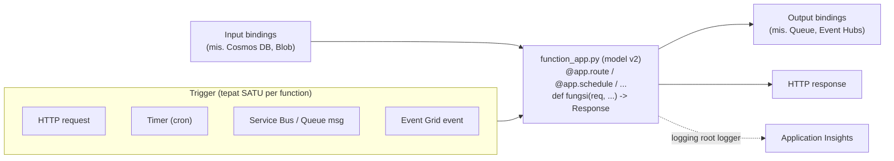

# Azure Functions

> Domain: 3 — Connect to and consume Azure services (20–25%)
> Exam: AI-200 — Developing AI Cloud Solutions on Azure
> Status: Draft
> Last reviewed: 2026-07-15
> [← Kembali ke README](README.md)

## 1. Posisi Topik dalam Exam

Subheading **"Develop and implement Azure Functions"** memiliki dua bullet — keduanya milik modul ini (SRC-002):

| Bullet resmi (parafrase) | Coverage matrix |
|---|---|
| Bangun serverless APIs menggunakan triggers dan bindings | #22 |
| Konfigurasi dan deploy function apps | #23 |

Modul ini **menutup Domain 3**: Functions adalah konsumen ringan dari messaging/eventing yang dibangun di [d3-01](d3-01-azure-service-bus.md) (Service Bus trigger) dan [d3-02](d3-02-azure-event-grid.md) (Event Grid trigger). Source ID utama: SRC-002, SRC-032 (hub), SRC-090–SRC-093 ([§15](#15-sumber-resmi)).

## 2. Learning Outcomes

Setelah menyelesaikan modul ini, saya mampu:

- Menjelaskan model **trigger dan binding**: setiap function punya **tepat satu trigger**; input/output bindings menghubungkan function ke layanan lain secara deklaratif tanpa hardcode akses.
- Menulis function Python dengan **programming model v2** (decorator di `function_app.py`): `@app.route`, route parameters, `@app.queue_output`, `@app.schedule`, `@app.cosmos_db_input`, blueprints.
- Menjalankan project secara lokal (`func init` → `func new` → `func start`) dan memahami peran `host.json`, `local.settings.json`, `requirements.txt`, `.funcignore`.
- Membuat resource pendukung dan function app **Flex Consumption** via CLI dengan **user-assigned managed identity** (tanpa shared key ke storage), lalu deploy dengan `func azure functionapp publish`.
- Mengelola konfigurasi: **application settings** (`az functionapp config appsettings set/delete`), pola `AzureWebJobsStorage__*` identity-based, dan membaca setting via `os.getenv`.
- Memilih **hosting plan** (Flex Consumption/Premium/Dedicated/Container Apps/Consumption-legacy) berdasarkan skala, cold start, timeout, networking, dan billing.
- Mengamankan endpoint HTTP dengan **authorization level** dan access key (`?code=` / header `x-functions-key`).

## 3. Mental Model

**Fakta resmi (SRC-090, SRC-092):** Functions adalah compute event-driven: **trigger** menyebabkan function berjalan (dan membawa data masuk), **bindings** mengalirkan data dari/ke layanan lain lewat parameter function — kode Anda menerima payload (mis. isi queue message) sebagai argumen dan mengirim output lewat return value/objek `func.Out`, tanpa menulis kode koneksi ke layanan tersebut.



Penjelasan teks: satu **function app** (unit deploy & konfigurasi bersama) berisi banyak function; semuanya dideploy sebagai satu unit dan berbagi `host.json` + application settings (SRC-091, SRC-092). Skala diurus platform sesuai hosting plan: pada **Flex Consumption**, instance naik-turun per function berdasarkan event (scale-to-zero saat sepi, hingga 1.000 instance) — pola serupa KEDA di Container Apps ([d1-03](d1-03-azure-container-apps-keda.md)), tetapi sepenuhnya dikelola platform (SRC-093).

## 4. Konsep dan Fitur Kunci

### 4.1 Triggers dan bindings (bullet #22)

**Fakta resmi (SRC-090):**

- **Trigger** = penyebab function berjalan; **wajib tepat satu** per function; trigger adalah tipe khusus input binding.
- **Bindings** opsional: **input** (data masuk) dan **output** (data keluar); satu function boleh punya beberapa input/output. Nama trigger/binding terbatas alfanumerik + underscore.
- Contoh kombinasi resmi: queue trigger → tulis ke queue lain; timer trigger + blob input → tulis dokumen Cosmos DB; Event Grid trigger + blob & Cosmos input → kirim email.
- Binding yang didukung runtime 4.x (sebagian): **HTTP/webhook** (trigger+output), **Timer** (trigger), **Queue Storage** (trigger+output), **Service Bus** (trigger+output), **Event Grid** (trigger+output), **Event Hubs**, **Cosmos DB** (trigger+input+output), **Blob** (trigger+input+output), **Azure SQL**, **Redis**. Selain HTTP dan timer, binding memerlukan registrasi extension.
- ⚠️ **Runtime 1.x berakhir dukungannya 14 September 2026** — semua materi modul ini memakai runtime 4.x.

### 4.2 Programming model Python v2 (decorator)

**Fakta resmi (SRC-092, SRC-090):**

- Dua versi model: **v2** (disarankan untuk app baru; trigger/binding didefinisikan sebagai **decorator** langsung di kode; setiap function = metode global stateless dalam **`function_app.py`**) vs v1 (legacy; `function.json` terpisah + `__init__.py`).
- Contoh dasar + binding output queue (bentuk resmi):

```python
import azure.functions as func

app = func.FunctionApp(http_auth_level=func.AuthLevel.FUNCTION)

@app.route(route="HttpExample")
@app.queue_output(arg_name="msg", queue_name="outqueue", connection="AzureWebJobsStorage")
def HttpExample(req: func.HttpRequest, msg: func.Out[func.QueueMessage]) -> func.HttpResponse:
    ...
```

- **Route parameters**: `@app.route(route="products/{product_id}")` lalu baca `req.route_params.get("product_id")` — **jangan** menambahkannya sebagai argumen function di model v2.
- **Output**: return langsung (bila satu output) atau `func.Out` + `.set()` (multi-output). Trigger lain: `@app.schedule(schedule="0 */10 * * * *", arg_name="mytimer")` (timer cron), `@app.cosmos_db_input(...)`, `@app.event_hub_output(...)`, `@app.blob_input(...)`.
- **Blueprints** untuk modularisasi: definisikan `bp = func.Blueprint()` + decorator di file terpisah, lalu `app.register_functions(bp)` di `function_app.py`.
- **SDK type bindings** (bekerja dengan tipe SDK asli, mis. `BlobClient`) hanya tersedia di model v2.
- Trigger **Service Bus** tersedia (tabel SRC-090) — sintaks decorator-nya tidak dimuat pada halaman yang diverifikasi modul ini; lihat referensi binding Service Bus saat mengerjakan integrasi d3-01 (*catatan sumber*).

### 4.3 Struktur project dan file konfigurasi

**Fakta resmi (SRC-092, SRC-091):**

| File | Peran |
|---|---|
| `function_app.py` | Entry point utama model v2 (semua function/decorator) — wajib |
| `host.json` | Konfigurasi global seluruh function dalam app (mis. `functionTimeout`) — wajib |
| `local.settings.json` | Setting & secret **lokal saja** — tidak pernah dipublish; masuk `.gitignore` default karena bisa berisi secret |
| `requirements.txt` | Dependency Python — di-install saat **remote build** ketika publish |
| `.funcignore` | Mengecualikan file dari deployment (mis. `.venv/`, `tests/`, `local.settings.json`) |

Package management (SRC-092): semua dependency wajib tercantum di `requirements.txt` (mencegah `ModuleNotFoundError`); jangan memasukkan modul standard library (`logging`, `uuid`) ke `requirements.txt`; ganti versi Python → rebuild + redeploy.

### 4.4 Konfigurasi: application settings dan environment variables (bullet #23)

**Fakta resmi (SRC-092, SRC-091):**

- Definisikan konfigurasi **lokal** di `local.settings.json`; **di Azure** sebagai **Application Settings** pada function app. Kode membacanya via `os.environ` / `os.getenv("myAppSetting", "default_value")`.
- Kelola dari CLI: `az functionapp config appsettings set --settings KEY=VALUE ...` dan `az functionapp config appsettings delete --setting-names KEY` (SRC-091).
- **Koneksi identity-based ke storage host** (pola quickstart resmi, SRC-091): ganti connection string `AzureWebJobsStorage` (shared secret) dengan set setting berprefiks `AzureWebJobsStorage__` — `AzureWebJobsStorage__accountName`, `AzureWebJobsStorage__credential=managedidentity`, `AzureWebJobsStorage__clientId` — lalu **hapus** setting `AzureWebJobsStorage`. Host Functions kemudian mengakses storage dengan **user-assigned managed identity**, tanpa shared key.
- Setting sistem runtime (mis. `PYTHON_ISOLATE_WORKER_DEPENDENCIES`, `PYTHON_ENABLE_DEBUG_LOGGING`) memengaruhi perilaku worker tanpa dipakai langsung di kode (SRC-092).

### 4.5 Hosting plans (dasar keputusan deploy)

**Fakta resmi (SRC-093):**

| Plan | Ciri kunci | Timeout default/max | Max instance |
|---|---|---|---|
| **Flex Consumption** (pilihan untuk serverless baru) | Scale-to-zero; **per-function scaling**; VNet integration; memory 512/2048/4096 MB; always-ready instances untuk menekan cold start; bayar per eksekusi + memori aktif | 30 mnt / unbounded | 1.000 |
| **Premium** | Prewarmed workers (tanpa cold start); VNet; custom Linux image | 30 mnt / unbounded | 100 (Linux 20–100) |
| **Dedicated (App Service plan)** | Billing dapat diprediksi; Always On; berbagi plan dengan web apps | 30 mnt / unbounded (Always On) | 10–30 (100 ASE) |
| **Container Apps** | Function app sebagai container di lingkungan ACA (microservices, GPU) | 30 mnt | 300–1.000 |
| **Consumption (legacy)** | Pay-per-execution; ⚠️ **Linux: Retired** — plan Linux Consumption berakhir **30 September 2028**; app baru diarahkan ke Flex Consumption | **5 mnt / 10 mnt** | Windows 200 / Linux 100 |

- **Python hanya berjalan di Linux** (SRC-093) → pilihan realistis untuk kurikulum ini: **Flex Consumption** (dipakai quickstart resmi — SRC-091).
- ⚠️ Batas universal: function ber-trigger HTTP harus merespons dalam **230 detik** (idle timeout Azure Load Balancer) apa pun plan-nya — kerja panjang harus dialihkan async (SRC-093).
- Runtime v3 di Linux Consumption berhenti total setelah **30 September 2026** (SRC-093).

### 4.6 Deployment (bullet #23)

**Fakta resmi (SRC-091, SRC-092):**

- Alur Core Tools (quickstart): `func azure functionapp publish <APP_NAME>` — melakukan **remote build** (install `requirements.txt` di sisi Azure) lalu sinkronisasi triggers; `func azure functionapp list-functions <APP_NAME> --show-keys` menampilkan URL + access key.
- Perbandingan mekanisme deploy (tabel resmi SRC-092): Core Tools (`func azure functionapp publish`) untuk CLI/lokal; `az functionapp deployment source config-zip` untuk scripting; VS Code extension; GitHub Actions (`Azure/functions-action@v1`); Azure Pipelines (`AzureFunctionApp@2`); custom container (butuh OS-level packages); **editor portal hanya untuk demo** — tidak mendukung dependency pihak ketiga.
- Function app dibuat dengan `az functionapp create --flexconsumption-location <REGION> --runtime python --runtime-version <VER> --storage-account <NAME> --deployment-storage-auth-type UserAssignedIdentity --deployment-storage-auth-value <IDENTITY>` — otomatis membuat instance Application Insights untuk monitoring (SRC-091).

## 5. Decision Guide

| Kebutuhan | Pilihan | Alasan (sumber) |
|---|---|---|
| API serverless ringan / webhook / glue code event-driven | **Functions** (HTTP trigger) | Trigger+binding tanpa kode koneksi (SRC-090); serverless billing (SRC-093) |
| Konsumen antrean Service Bus tanpa mengelola host | Functions **Service Bus trigger** | Tabel binding resmi (SRC-090); semantik pesan tetap dari d3-01 |
| Reaksi atas custom events Event Grid | Functions **Event Grid trigger** sebagai handler | SRC-090; d3-02 (`InvalidAzureFunctionDestination` bila bukan EventGridTrigger) |
| Worker berat/lama, butuh kontrol image & sidecar | **Container Apps** (d1-03) atau Functions on Container Apps | Batas 230 dtk HTTP & model serverless Functions kurang cocok (SRC-093) — *pemetaan = interpretasi* |
| Hosting app Python serverless baru | **Flex Consumption** | Consumption = legacy (Linux retired 2028); quickstart resmi memakai Flex (SRC-093, SRC-091) |
| Cold start tidak bisa ditoleransi | Flex **always-ready instances** atau **Premium** prewarmed | SRC-093 |
| Eksekusi > 10 menit | Flex/Premium/Dedicated (unbounded) — bukan Consumption (max 10 mnt); HTTP tetap ≤230 dtk → pola async | SRC-093 |
| Satu app banyak function terkait | Satu function app + **blueprints** untuk modularisasi | Function app = unit deploy (SRC-091); blueprint (SRC-092) |
| Secret koneksi storage host | **Managed identity** (`AzureWebJobsStorage__credential=managedidentity`) — bukan connection string | Quickstart resmi passwordless (SRC-091) |
| Dependensi pihak ketiga | `requirements.txt` + remote build; **jangan** editor portal | SRC-092 |

## 6. Security

- **Storage host tanpa shared key (fakta SRC-091):** quickstart resmi membuat storage account dengan `--allow-shared-key-access false`, memakai **user-assigned managed identity** ber-role **Storage Blob Data Owner**, dan mengganti `AzureWebJobsStorage` dengan setting `AzureWebJobsStorage__*`; identity juga diberi **Monitoring Metrics Publisher** untuk Application Insights (`APPLICATIONINSIGHTS_AUTHENTICATION_STRING`). Selaras guardrail repo: tanpa secret statis.
- **HTTP authorization level (fakta SRC-091, SRC-090):** template `func new` memakai `--authlevel "function"` (`func.AuthLevel.FUNCTION`) — pemanggil wajib menyertakan **access key**: query string `?code=<key>` (GET) atau header **`x-functions-key`** (POST). Access key **tidak diberlakukan saat berjalan lokal**. `AuthLevel.ANONYMOUS` tersedia untuk endpoint publik (SRC-092).
- **Secret lokal**: `local.settings.json` bisa berisi secret → dikecualikan dari source control secara default (SRC-091); jangan pernah meng-commit-nya (*guardrail repo*).
- Setting aplikasi berisi kredensial sebaiknya digantikan managed identity; sisanya dirujuk dari **Key Vault** ([d4-01](d4-01-azure-key-vault.md)) (*rekomendasi; mekanisme reference dibahas di d4-01*).

## 7. Reliability, Performance, dan Cost

- **Timeout**: `functionTimeout` di `host.json` per plan (Flex default 30 menit); HTTP wajib merespons ≤230 detik → pekerjaan panjang dialihkan (antrekan ke Service Bus [d3-01], balas cepat) (SRC-093; pola = rekomendasi).
- **Cold start**: scale-to-zero berarti latensi start; mitigasi resmi = always-ready (Flex) / prewarmed (Premium) (SRC-093).
- **State**: function = metode **stateless**; variabel global boleh untuk cache tetapi **tidak dijamin bertahan** antar eksekusi; file temporer tidak persisten antar instance (SRC-092).
- **Monitoring**: root logger Python otomatis terkirim ke **Application Insights**; level debug butuh `PYTHON_ENABLE_DEBUG_LOGGING=1` + `logLevel` host.json; OpenTelemetry didukung (SRC-092) — diperdalam di [d4-03](d4-03-observability-opentelemetry-kql.md).
- **Cost guardrail (selaras README §6):** Flex Consumption menagih per eksekusi + memori saat aktif (+ always-ready bila diaktifkan); komponen yang menetap adalah **storage account** dan **Application Insights** — hapus resource group setelah lab (SRC-093, SRC-091). Quickstart resmi menyebut biaya lab "beberapa sen USD atau kurang" (SRC-091).

## 8. Praktik Hands-on

Tujuan lab: project Python v2 lokal (`func init/new/start`) → serverless API dengan route parameter → resource Azure passwordless (storage + identity + Flex Consumption app) → deploy (`func azure functionapp publish`) → uji dengan access key → kelola app settings → cleanup.

### 8.1 Prasyarat

- Azure subscription; **Azure CLI** (`az login`); **Azure Functions Core Tools v4** (`func --version`); **Python 3.11**; `jq`; Azurite untuk eksekusi lokal (SRC-091).
- Ekstensi CLI Application Insights: `az extension add --name application-insights` (SRC-091).
- Region yang mendukung Flex Consumption: cek `az functionapp list-flexconsumption-locations` (SRC-091).

### 8.2 Environment dan dependency versions

| Komponen | Nilai | Sumber |
|---|---|---|
| Python | 3.11 (quickstart); hanya Linux untuk Python | SRC-091, SRC-093 |
| Programming model | v2 (decorator, `function_app.py`) | SRC-092 |
| Functions runtime | 4.x (1.x berakhir 14 Sep 2026) | SRC-090 |
| Hosting plan | Flex Consumption | SRC-091, SRC-093 |
| Core Tools | v4 | SRC-091 |
| Tanggal verifikasi | 2026-07-15 | — |

`requirements.txt`:

```text
azure-functions
```

### 8.3 Resource yang dibuat

`<RESOURCE_GROUP>` berisi: storage account `<STORAGE_NAME>` (host state; shared key nonaktif), user-assigned managed identity `func-host-storage-user`, function app `<APP_NAME>` (Flex Consumption, Linux), dan instance Application Insights (dibuat otomatis) (SRC-091).

### 8.4 Placeholder dan naming convention

| Placeholder | Contoh | Catatan |
|---|---|---|
| `<RESOURCE_GROUP>` / `<REGION>` | `rg-ai200-d303` / hasil `list-flexconsumption-locations` | — |
| `<STORAGE_NAME>` | `stai200d303` | 3–24 karakter, huruf kecil + angka, unik global (SRC-091) |
| `<APP_NAME>` | `func-ai200-d303-<acak>` | unik global (DNS default `<APP_NAME>.azurewebsites.net`) (SRC-091) |

### 8.5 Langkah lokal (project + run)

```bash
# 1. Virtual environment (SRC-091)
python -m venv .venv && source .venv/bin/activate

# 2. Project + function dari template (SRC-091)
func init --worker-runtime python
func new --name HttpExample --template "HTTP trigger" --authlevel "function"

# 3. Jalankan lokal — access key TIDAK diberlakukan secara lokal (SRC-091)
func start
# ... Http Functions:  HttpExample: [GET,POST] http://localhost:7071/api/HttpExample
```

Perluas `function_app.py` menjadi serverless API kecil dengan **route parameter** dan **logging** (bentuk resmi SRC-092):

```python
import logging
import azure.functions as func

app = func.FunctionApp(http_auth_level=func.AuthLevel.FUNCTION)

@app.route(route="HttpExample")
def HttpExample(req: func.HttpRequest) -> func.HttpResponse:
    logging.info("Python HTTP trigger function processed a request.")
    name = req.params.get("name")
    return func.HttpResponse(f"Halo, {name or 'AI-200'}!")

@app.route(route="products/{product_id}", methods=["GET"])
def get_product(req: func.HttpRequest) -> func.HttpResponse:
    product_id = req.route_params.get("product_id")
    if not product_id:
        return func.HttpResponse("Missing route parameter: product_id", status_code=400)
    return func.HttpResponse(f"Product: {product_id}")
```

Uji ulang dengan `func start` → `http://localhost:7071/api/products/42`.

### 8.6 Langkah CLI (resource Azure passwordless — alur quickstart SRC-091)

```bash
az login
az extension add --name application-insights
az group create --name <RESOURCE_GROUP> --location "<REGION>"

# Storage host: tanpa akses publik blob, TANPA shared key
az storage account create --name <STORAGE_NAME> --location "<REGION>" --resource-group <RESOURCE_GROUP> \
  --sku "Standard_LRS" --allow-blob-public-access false --allow-shared-key-access false

# User-assigned managed identity + role Storage Blob Data Owner
output=$(az identity create --name "func-host-storage-user" --resource-group <RESOURCE_GROUP> --location <REGION> \
  --query "{userId:id, principalId: principalId, clientId: clientId}" -o json)
principalId=$(echo $output | jq -r '.principalId')
storageId=$(az storage account show --resource-group <RESOURCE_GROUP> --name <STORAGE_NAME> --query 'id' -o tsv)
az role assignment create --assignee-object-id $principalId --assignee-principal-type ServicePrincipal \
  --role "Storage Blob Data Owner" --scope $storageId

# Function app Flex Consumption (otomatis + Application Insights)
az functionapp create --resource-group <RESOURCE_GROUP> --name <APP_NAME> --flexconsumption-location <REGION> \
  --runtime python --runtime-version 3.11 --storage-account <STORAGE_NAME> \
  --deployment-storage-auth-type UserAssignedIdentity --deployment-storage-auth-value "func-host-storage-user"

# Role Monitoring Metrics Publisher pada App Insights
appInsights=$(az monitor app-insights component show --resource-group <RESOURCE_GROUP> --app <APP_NAME> --query "id" --output tsv)
az role assignment create --role "Monitoring Metrics Publisher" --assignee $principalId --scope $appInsights

# App settings: koneksi storage via managed identity, lalu hapus connection string lama
clientId=$(az identity show --name func-host-storage-user --resource-group <RESOURCE_GROUP> --query 'clientId' -o tsv)
az functionapp config appsettings set --name <APP_NAME> --resource-group <RESOURCE_GROUP> \
  --settings AzureWebJobsStorage__accountName=<STORAGE_NAME> \
  AzureWebJobsStorage__credential=managedidentity AzureWebJobsStorage__clientId=$clientId \
  APPLICATIONINSIGHTS_AUTHENTICATION_STRING="ClientId=$clientId;Authorization=AAD"
az functionapp config appsettings delete --name <APP_NAME> --resource-group <RESOURCE_GROUP> \
  --setting-names AzureWebJobsStorage
```

### 8.7 Deploy dan konfigurasi aplikasi

```bash
# Deploy (remote build atas requirements.txt) — SRC-091
func azure functionapp publish <APP_NAME>

# URL + access key tiap function — SRC-091
func azure functionapp list-functions <APP_NAME> --show-keys

# Latihan konfigurasi (bullet #23): tambah setting kustom lalu baca dari kode — SRC-092
az functionapp config appsettings set --name <APP_NAME> --resource-group <RESOURCE_GROUP> \
  --settings GREETING_PREFIX="Halo dari app settings"
```

Pemakaian di kode (`os.getenv` — SRC-092): `prefix = os.getenv("GREETING_PREFIX", "Halo")`; deploy ulang dengan `func azure functionapp publish <APP_NAME>` setelah mengubah kode.

### 8.8 Validasi hasil

1. `func start` lokal menampilkan kedua endpoint; `http://localhost:7071/api/products/42` → `Product: 42` (tanpa key — lokal tidak menegakkan access key, SRC-091).
2. Setelah publish: output menampilkan `Invoke url: https://<APP_NAME>.azurewebsites.net/api/httpexample`; panggil dengan `?code=<key>` di browser → respons sukses (SRC-091).
3. POST dengan header `x-functions-key: <key>` juga berhasil (SRC-091).
4. Tanpa key (auth level function) → panggilan ditolak; bandingkan dengan uji lokal (§8.10).
5. Setelah §8.7: respons memuat nilai `GREETING_PREFIX` — bukti app settings menjadi environment variable aplikasi (SRC-092).
6. Portal → function app → log/App Insights menampilkan entri `logging.info` (SRC-092).

### 8.9 Expected output

```text
$ func start
Functions:
        HttpExample: [GET,POST] http://localhost:7071/api/HttpExample
        get_product: [GET] http://localhost:7071/api/products/{product_id}

$ func azure functionapp publish <APP_NAME>
Remote build succeeded!
Syncing triggers...
Functions in <APP_NAME>:
    HttpExample - [httpTrigger]
        Invoke url: https://<APP_NAME>.azurewebsites.net/api/httpexample

$ curl "https://<APP_NAME>.azurewebsites.net/api/products/42?code=<FUNCTION_KEY>"
Product: 42
```

### 8.10 Troubleshooting test

Uji negatif yang disengaja: panggil endpoint produksi **tanpa** `?code=` → ditolak (auth level `function`); tambahkan key → sukses (SRC-091). Kedua: hapus satu dependency dari `requirements.txt`, publish, dan amati `ModuleNotFoundError` di log — kembalikan dependency lalu publish ulang (SRC-092).

### 8.11 Cleanup

```bash
az group delete --name <RESOURCE_GROUP> --yes --no-wait
```

Menghapus resource group menghapus function app, storage account, identity, dan Application Insights (SRC-091).

### 8.12 Verifikasi cleanup

```bash
az group exists --name <RESOURCE_GROUP>    # harus: false
```

Portal: pastikan tidak ada function app/storage account/App Insights tersisa. Komponen yang menetap bila lupa dihapus: storage account + App Insights.

## 9. Troubleshooting Playbook

| Gejala | Kemungkinan penyebab | Cara memeriksa | Solusi |
|---|---|---|---|
| 401/403 saat memanggil endpoint produksi | Access key tidak disertakan (auth level `function`) | Bandingkan dengan `?code=` / header `x-functions-key` | Sertakan key dari `list-functions --show-keys` (SRC-091) |
| Berjalan lokal, gagal setelah deploy: `ModuleNotFoundError` | Dependency tidak tercantum di `requirements.txt` (remote build) | Log build/App Insights | Lengkapi `requirements.txt`; publish ulang (SRC-092) |
| Function tidak terdeteksi setelah deploy | Kesalahan model v2 (decorator/`function_app.py`); file terkecualikan `.funcignore` | `func azure functionapp list-functions` | Pastikan function = metode global di `function_app.py`; cek `.funcignore` (SRC-092) |
| Route parameter `None` | Parameter ditambahkan sebagai argumen function (model v2) | Kode | Baca dari `req.route_params.get(...)` (SRC-092) |
| Timeout HTTP meski `functionTimeout` besar | Batas 230 dtk respons HTTP (Load Balancer) | Durasi eksekusi | Pola async: antrekan kerja (d3-01), balas cepat (SRC-093) |
| Eksekusi terpotong 10 menit | App masih di Consumption plan (max 10 mnt) | Cek plan | Pindah ke Flex Consumption (SRC-093) |
| Host gagal start setelah hapus `AzureWebJobsStorage` | Setting `AzureWebJobsStorage__*` belum lengkap / role identity kurang | App settings + role assignment | Lengkapi `accountName`/`credential`/`clientId` + Storage Blob Data Owner (SRC-091) |
| Log debug tidak muncul di App Insights | Perlu opsi tambahan | — | `PYTHON_ENABLE_DEBUG_LOGGING=1` + `logLevel` host.json (SRC-092) |
| State hilang antar invocation | Function memang stateless; global var/temp file tidak dijamin persisten | — | Simpan state eksternal (queue/DB — Domain 2/3) (SRC-092) |
| Latensi pertama tinggi setelah idle | Cold start (scale-to-zero) | — | Always-ready instances (Flex) / Premium prewarmed (SRC-093) |
| Konflik dependency `grpcio`/`protobuf` | Tabrakan dengan dependency worker (Python <3.13) | — | `PYTHON_ISOLATE_WORKER_DEPENDENCIES=1` (default ≥3.13) (SRC-092) |
| Error "pricing tier isn't allowed in this resource group" | Plan tidak kompatibel dengan app lama di RG yang sama | — | Buat function app + plan di resource group baru (SRC-093) |

## 10. Kaitan dengan Modul Lain

- **[d3-01 Service Bus](d3-01-azure-service-bus.md):** Functions = konsumen ringan antrean via Service Bus trigger (tabel SRC-090); semantik peek-lock/DLQ tetap berlaku di balik binding.
- **[d3-02 Event Grid](d3-02-azure-event-grid.md):** Functions = handler umum custom events (Event Grid trigger); `InvalidAzureFunctionDestination` bila function tujuan bukan EventGridTrigger.
- **[d1-03 Container Apps](d1-03-azure-container-apps-keda.md):** dua model scale-to-zero — KEDA (worker container yang Anda kelola) vs Functions (platform-managed, per-function scaling); Functions bahkan bisa dihosting di Container Apps (SRC-093).
- **[d1-02 App Service](d1-02-azure-app-service-container.md):** Dedicated plan = App Service plan; konsep app settings → environment variables serupa.
- **[d4-01 Key Vault](d4-01-azure-key-vault.md):** app settings berisi secret → dirujuk dari Key Vault; lab ini sudah passwordless untuk storage host.
- **[d4-03 Observability](d4-03-observability-opentelemetry-kql.md):** root logger → Application Insights + dukungan OpenTelemetry (SRC-092).
- [← README](README.md) — coverage matrix baris #22–#23; **Domain 3 selesai draft** dengan modul ini.

## 11. Common Misconceptions dan Exam Decision Points

| Miskonsepsi | Fakta terverifikasi |
|---|---|
| "Satu function boleh punya beberapa trigger" | **Tepat satu trigger** per function; bindings input/output boleh banyak (SRC-090) |
| "Model v2 Python tetap butuh function.json" | v2 = decorator di `function_app.py`; `function.json` hanya model v1/legacy (SRC-092) |
| "Route parameter dibaca dari argumen function" | Di v2 baca dari `req.route_params` — jangan jadikan argumen (SRC-092) |
| "local.settings.json ikut terdeploy" | Tidak pernah dipublish; lokal saja (dan bisa berisi secret → jangan commit) (SRC-092, SRC-091) |
| "Consumption plan adalah default terbaik untuk serverless baru" | Consumption = **legacy**; Linux Consumption retire 30 Sep 2028 → Flex Consumption (SRC-093) |
| "functionTimeout besar = HTTP boleh lama" | HTTP tetap harus merespons ≤**230 detik** (Load Balancer) — pola async untuk kerja panjang (SRC-093) |
| "Host Functions wajib connection string storage" | Pola resmi: `AzureWebJobsStorage__credential=managedidentity` + hapus `AzureWebJobsStorage` (SRC-091) |
| "Access key juga diberlakukan saat func start lokal" | Lokal **tidak menegakkan** access key; di Azure `?code=`/`x-functions-key` wajib untuk auth level function (SRC-091) |
| "Edit kode di portal cukup untuk produksi" | Editor portal tidak mendukung dependency pihak ketiga — hanya demo (SRC-092) |
| "Variabel global aman untuk state antar eksekusi" | Function stateless; cache global/temp file tidak dijamin persisten (SRC-092) |
| "Python Functions bisa jalan di Windows" | Python hanya didukung di **Linux** (SRC-093) |

## 12. Checklist Pemahaman

- [ ] Saya bisa menjelaskan trigger (tepat satu) vs input/output bindings dan menyebut contoh kombinasi resminya.
- [ ] Saya bisa menulis function v2: `FunctionApp`, `@app.route` + route params, `@app.queue_output`/`@app.schedule`, blueprint.
- [ ] Saya hafal peran `function_app.py`, `host.json`, `local.settings.json`, `requirements.txt`, `.funcignore`.
- [ ] Saya bisa menjalankan alur lokal `func init` → `func new` → `func start` dan tahu access key tidak berlaku lokal.
- [ ] Saya bisa membuat function app Flex Consumption passwordless (identity + `AzureWebJobsStorage__*`) dan deploy dengan `func azure functionapp publish`.
- [ ] Saya bisa mengelola app settings via CLI dan membacanya dengan `os.getenv`.
- [ ] Saya bisa memilih hosting plan dan menjelaskan batas 230 detik HTTP + perbedaan timeout Consumption (5/10 mnt) vs lainnya.
- [ ] Saya tahu tanggal-tanggal retirement: runtime 1.x (14 Sep 2026), runtime v3 Linux Consumption (30 Sep 2026), Linux Consumption plan (30 Sep 2028).

## 13. Self-Assessment

**Q1.** Anda ingin satu function berjalan saat pesan masuk ke queue DAN saat HTTP request tiba. Bisakah? Jelaskan desain yang benar.
**Jawaban:** Tidak — function punya **tepat satu trigger**. Buat **dua function** (queue trigger + HTTP trigger) dalam satu function app; keduanya bisa berbagi kode helper (folder `shared/` atau blueprint). (SRC-090, SRC-092)

**Q2.** Setelah deploy, endpoint mengembalikan 401 padahal lokal berfungsi. Diagnosis?
**Jawaban:** Auth level `function` menuntut **access key** di Azure (`?code=` untuk GET, header `x-functions-key` untuk POST), sedangkan eksekusi lokal tidak menegakkannya — ambil key via `func azure functionapp list-functions --show-keys`. (SRC-091)

**Q3.** API Anda perlu memproses dokumen selama ~8 menit atas permintaan HTTP. Mengapa menaikkan `functionTimeout` saja tidak cukup, dan apa desain yang benar?
**Jawaban:** Function HTTP harus merespons dalam **230 detik** (idle timeout Azure Load Balancer) apa pun plan/timeout-nya. Desain: terima request → antrekan pekerjaan (mis. Service Bus, d3-01) → balas segera (accepted); worker memproses async. (SRC-093)

**Q4.** Apa yang dilakukan tiga setting `AzureWebJobsStorage__accountName`, `AzureWebJobsStorage__credential=managedidentity`, `AzureWebJobsStorage__clientId` — dan mengapa setting `AzureWebJobsStorage` justru dihapus?
**Jawaban:** Ketiganya membentuk **koneksi identity-based** host Functions ke storage account (user-assigned managed identity dengan Storage Blob Data Owner), menggantikan connection string `AzureWebJobsStorage` yang memuat shared secret — dihapus agar tidak ada kredensial statis. (SRC-091)

**Q5.** App berjalan baik secara lokal tetapi `ModuleNotFoundError` di Azure. Penyebab paling umum?
**Jawaban:** Dependency terpasang di venv lokal tetapi **tidak tercantum di `requirements.txt`** — remote build hanya meng-install yang tercantum. (SRC-092)

**Q6.** Kapan memilih Premium plan dibanding Flex Consumption menurut dokumen resmi? Sebutkan dua situasi.
**Jawaban:** Antara lain: app berjalan (hampir) terus-menerus; butuh instance lebih besar/lebih banyak opsi CPU-memori; butuh custom Linux image; ingin beberapa function apps pada satu plan dengan prewarmed workers tanpa cold start. (SRC-093)

**Q7.** Tim Anda masih menjalankan function app Python di Linux Consumption plan. Sebutkan dua tenggat resmi yang relevan dan tindakan yang disarankan.
**Jawaban:** Runtime **v3** di Linux Consumption berhenti setelah **30 September 2026**; plan **Linux Consumption** sendiri retire **30 September 2028**. Tindakan: migrasi ke runtime v4 dan pindah ke **Flex Consumption**. (SRC-093, SRC-092)

**Q8.** Di model v2, bagaimana cara memecah app besar menjadi beberapa file tanpa kehilangan pendaftaran function?
**Jawaban:** **Blueprints** — definisikan `bp = func.Blueprint()` + function ber-decorator di file terpisah, lalu `app.register_functions(bp)` di `function_app.py`. (SRC-092)

**Q9.** Sebutkan tiga mekanisme deployment resmi selain Core Tools, dan satu mekanisme yang secara eksplisit tidak disarankan untuk produksi.
**Jawaban:** `az functionapp deployment source config-zip`, VS Code extension, GitHub Actions (`Azure/functions-action@v1`), Azure Pipelines (`AzureFunctionApp@2`), custom container. Tidak disarankan untuk produksi: **editor portal** (tanpa dukungan dependency pihak ketiga). (SRC-092)

## 14. Ringkasan Cepat

| Hal | Nilai |
|---|---|
| Model eksekusi | Trigger (tepat 1) + input/output bindings; function = metode global stateless |
| Python v2 | Decorator di `function_app.py`: `@app.route`/`@app.schedule`/`@app.queue_output`/`@app.cosmos_db_input`…; route params via `req.route_params`; blueprints; SDK type bindings |
| File kunci | `function_app.py` · `host.json` · `local.settings.json` (lokal, tak dipublish) · `requirements.txt` (remote build) · `.funcignore` |
| Alur lokal | `func init --worker-runtime python` → `func new` → `func start` (port 7071; tanpa key) |
| Buat app | `az functionapp create --flexconsumption-location … --deployment-storage-auth-type UserAssignedIdentity` (+ App Insights otomatis) |
| Deploy | `func azure functionapp publish` (remote build) · config-zip · VS Code · GitHub Actions · Pipelines; portal editor = demo saja |
| Konfigurasi | App settings ↔ `os.getenv`; `az functionapp config appsettings set/delete`; `AzureWebJobsStorage__*` identity-based |
| Keamanan HTTP | Auth level function → `?code=` / `x-functions-key`; ANONYMOUS untuk publik |
| Hosting | **Flex Consumption** (baru, scale-to-zero, 512/2048/4096 MB, maks 1.000, VNet) · Premium (prewarmed) · Dedicated · Container Apps · Consumption (legacy; 5/10 mnt) |
| Batas penting | HTTP respons ≤230 dtk; Python = Linux only; runtime 1.x EOL 14 Sep 2026; Linux Consumption retire 30 Sep 2028 |

## 15. Sumber Resmi

| Source ID | Link | Bagian yang digunakan | Diakses |
|---|---|---|---|
| SRC-002 | <https://learn.microsoft.com/en-us/credentials/certifications/resources/study-guides/ai-200> | Bullet skills measured Domain 3 (#22–#23) | 2026-07-15 |
| SRC-032 | <https://learn.microsoft.com/en-us/azure/azure-functions/> | Hub docs Azure Functions | 2026-07-15 |
| SRC-090 | <https://learn.microsoft.com/en-us/azure/azure-functions/functions-triggers-bindings> | Trigger = tepat satu per function; bindings input/output deklaratif; contoh kombinasi; contoh Python v2 (`FunctionApp(http_auth_level=…)`, `@app.route`, `@app.queue_output`, `func.Out`); tabel binding 4.x (HTTP/Timer/Queue/Service Bus/Event Grid/Cosmos/Blob/…); registrasi extension; **runtime 1.x berakhir 14 Sep 2026**; nama binding alfanumerik+underscore | 2026-07-15 |
| SRC-091 | <https://learn.microsoft.com/en-us/azure/azure-functions/create-first-function-cli-python> | Quickstart CLI Python: venv; `func init --worker-runtime python`; `func new --template "HTTP trigger" --authlevel function`; `func start` (key tidak berlaku lokal); `local.settings.json` berisi secret & dikecualikan dari source control; storage `--allow-shared-key-access false`; user-assigned identity + Storage Blob Data Owner; `az functionapp create --flexconsumption-location … UserAssignedIdentity` (+App Insights otomatis); Monitoring Metrics Publisher; app settings `AzureWebJobsStorage__*` + hapus `AzureWebJobsStorage`; `func azure functionapp publish` (remote build); `list-functions --show-keys`; `?code=`/`x-functions-key`; biaya lab kecil; cleanup | 2026-07-15 |
| SRC-092 | <https://learn.microsoft.com/en-us/azure/azure-functions/functions-reference-python> | Model v1 vs **v2 (decorator, `function_app.py`, disarankan)**; route params via `req.route_params`; blueprints (`func.Blueprint`, `register_functions`); struktur folder + tabel file kunci; contoh `@app.schedule`/`@app.blob_input`/`@app.cosmos_db_input`/`@app.event_hub_output`; SDK type bindings (v2 only); env vars (`local.settings.json` vs Application Settings; `os.getenv`); package management (`requirements.txt`, ModuleNotFound); tabel mekanisme deployment (portal editor = tanpa dependency eksternal); retirement v3 Linux Consumption 30 Sep 2026 & plan Linux Consumption 30 Sep 2028; logging → App Insights (+`PYTHON_ENABLE_DEBUG_LOGGING`); OpenTelemetry; unit testing pytest; state global tidak dijamin persisten | 2026-07-15 |
| SRC-093 | <https://learn.microsoft.com/en-us/azure/azure-functions/functions-scale> | Tabel hosting: **Flex Consumption** (GA; per-function scaling; maks 1.000; 512/2048/4096 MB; always-ready; VNet) vs Premium (prewarmed; custom image) vs Dedicated vs Container Apps vs **Consumption legacy (Linux Retired)**; **Python = Linux only**; timeout per plan (Consumption 5/10 mnt; lainnya 30/unbounded); **HTTP wajib respons ≤230 dtk** (Load Balancer); cold start & mitigasi; billing per plan; error "pricing tier isn't allowed in this resource group" | 2026-07-15 |
